# Architecture documentation: evm-elf

| | |
| --- | --- |
| **Template** | arc42 7.0, all twelve sections, with C4 diagrams at the context, container, component and deployment levels |
| **System** | `evm-elf` — multi-chain EVM wallet and contract CLI, binary `evm` |
| **Baseline** | Repository `galekseev/evm-elf`, commit `5b3ec31`, package version `1.0.0`, 42 TypeScript files, 5,145 lines. Those aggregates are the baseline's and are left as such; §5.2, §7.3, §8.5, §8.8, §10 and §11 describe the working tree, which has since gained `src/lib/fs-errors.ts` and the test suite |
| **Diagram sources** | [`diagrams/`](diagrams/) — PlantUML is canonical, the Mermaid in this document mirrors it |
| **Status** | Draft — requires human review |

This document is written for someone about to change the system: what constrains it, how it is
put together, what happens at run time, and what will hurt. It is not a requirements document
and not a tutorial. Where another document already covers something exhaustively, this one links
rather than restates.

| Read this instead | When you want |
| --- | --- |
| [Requirements specification](../reverse-engineer/requirements-specification.md) | The 147 numbered requirements, their acceptance criteria and traceability |
| [Technical design document](../reverse-engineer/design-doc.md) | Per-component detail: responsibilities, interfaces and notes for all 13 components |
| [Scope report](../reverse-engineer/scope-report.md) | The functional decomposition into 11 units and how it was reached |
| [Verification report](../reverse-engineer/verification-report.md) | The documentation-versus-code reconciliation, 152 claims across three rounds |
| [Documentation index](../README.md) | How to install and use the tool |

## How to read the evidence labels

The request that produced this document asked for observation, intent and inference to stay
visibly separate. They are marked as follows, and nothing is left unmarked by accident.

| Label | Meaning |
| --- | --- |
| **Observed** | Read out of the repository at commit `5b3ec31`. A file, and usually a line, can be pointed at. Structural facts default to this, so a section that is wholly observed says so once at the top rather than on every sentence. |
| **Intended** | The project states this about itself, in a source comment, a documentation page, or an approved requirement. Cited to where it is stated. |
| **Inferred** | A reading of the evidence that the repository does not state anywhere. Flagged in place, every time. |

Two rules apply throughout. Rationale appears only where the repository records it — a source
comment, a documentation line, or a verification-report finding. No motive, sequence of events or
design debate has been reconstructed. And a claim about behaviour that could not be reached
without a live public endpoint, a real explorer key or a broadcast transaction is marked
*code-only*, following the convention the
[requirements specification](../reverse-engineer/requirements-specification.md#42-verification-status)
established.

---

## 1. Introduction and goals

### 1.1 Requirements overview

**Intended**, from [`docs/README.md`](../README.md) and the
[requirements specification §1.3](../reverse-engineer/requirements-specification.md#13-product-overview).

`evm-elf` operates on EVM-compatible blockchains from a terminal, across many chains in one
invocation. Five command groups, 21 subcommands:

| Group | Subcommands | What it does |
| --- | --- | --- |
| `evm wallet` | `balance`, `send`, `set-nonce`, `generate`, `address` | Native balances with USD valuation, transfers by fixed amount or sweep, nonce alignment, local key generation and address derivation |
| `evm contract` | `owner`, `proxy-info`, `code`, `transfer-ownership`, `proxy-upgrade` | Ownership reads, proxy detection across seven cases, bytecode presence, and the two write operations that follow from them |
| `evm chain` | `list`, `set`, `remove` | Edits the `chains` section of one profile |
| `evm explorer` | `list`, `set`, `remove` | Edits the `explorers` section of one profile |
| `evm profile` | `list`, `create`, `clone`, `remove`, `set-default` | Manages whole profile files and chooses which one is in use |

Two rules cut across the whole surface and shape most of the architecture:

- **Reads fan out.** A read reaches every chain the profile names unless narrowed with `-c` or
  `-xc`, and a chain that fails contributes a row rather than failing the run.
- **Writes are dry runs.** A command that can send a transaction prints its plan and stops.
  `--exec` is what sends.

The organising idea, stated at [`docs/configuration.md:7`](../configuration.md) and load-bearing
everywhere: **a profile is the chain list.** The same file both configures the tool and
determines the breadth of every read.

### 1.2 Quality goals

The system attribute table at
[requirements specification §3.7](../reverse-engineer/requirements-specification.md#37-software-system-attributes)
is **Intended** — the project states these as invariants and names the requirements that realise
each. The ranking below is **Inferred**: nothing in the repository orders them, and this ordering
is a reading of where the code spends its effort.

| # | Quality goal | Why it ranks here | Realised by |
| --- | --- | --- | --- |
| 1 | **Safety of irreversible operations** | Four operations move money or control and none can be undone. The dry-run default, the static call before broadcast, the structural refusals in `proxy-upgrade`, and the verify-before-write pair are all spent on this one goal | §8.2, §10.2 scenario Q1 |
| 2 | **Fault isolation across chains** | With the bundled profile's public endpoints, some chain failing is the common case rather than the exception ([spec REQ-145](../reverse-engineer/requirements-specification.md#37-software-system-attributes)). The `resolveChain` never-throws contract exists for this | §8.2, §10.2 scenario Q2 |
| 3 | **Confidentiality of key material** | A private key exists only in process memory, is never written to any file, and never leaves except as a signature | §8.3, §10.2 scenario Q3 |
| 4 | **Integrity of configuration** | The profile is the only persistent state and the only writable dependency. Atomic writes, `0600`, and comment preservation all protect it | §8.5, §10.2 scenario Q4 |
| 5 | **Graceful degradation of optional data** | Prices and explorer data are best-effort by contract rather than by convention, so neither can fail a command | §8.6, §10.2 scenario Q5 |

**Inferred.** Performance is not on this list, and its absence is the interesting part: the
fan-out is sequential, there is no cache and no connection pooling, and the documentation treats
the resulting cost as a known trade with a known mitigation
([`docs/troubleshooting.md:268-270`](../troubleshooting.md)) rather than as a defect. Speed appears
to have been traded for simplicity everywhere the two met.

### 1.3 Stakeholders

| Role | Expectation of this document |
| --- | --- |
| **The operator** — a developer or operations engineer working on a deployment that exists at the same address on several chains. The only user class; there is no authentication, authorisation, role model or multi-user state anywhere in the codebase (**Observed**) | Nothing. The operator reads [`docs/`](../README.md), not this |
| **The maintainer** — whoever changes the code next | Sections 5, 8, 9 and 11: where the seams are, which invariants are held by convention, and what will break |
| **A reviewer of a change** | Sections 2 and 10: the constraints a change must not violate, and the scenarios it must not regress |

**Inferred.** The repository names no stakeholders and holds no `CONTRIBUTING.md`, no
`CODEOWNERS` and no governance document. The roles above are read off the entry points and the
`LICENSE`, which carries two copyright notices because the code was extracted from the
`onchain-cli` workspace of `deploy-pad`, a private 1inch repository — the one piece of history the
repository does record, at [`README.md:424-426`](../../README.md).

---

## 2. Architecture constraints

All **Observed** unless marked otherwise. A constraint here is something a change has to work
within, not something the architecture chose.

### 2.1 Technical constraints

| Constraint | Source | What it forecloses |
| --- | --- | --- |
| Node.js >= 22 | `package.json:31-33` | npm refuses the install below it with `Unsupported engine`. The floor is what allows `fetch`, `AbortSignal.timeout` and `structuredClone` to be used without a polyfill |
| ES modules, `"type": "module"` | `package.json:23` | Every relative import carries a `.js` extension even in `.ts` sources. `require` is unavailable |
| TypeScript 5.7, `strict`, plus `noUnusedLocals`, `noUnusedParameters`, `noImplicitReturns`, `noFallthroughCasesInSwitch` | `tsconfig.json` | A change that leaves an unused import or a switch fallthrough fails `npm run typecheck`, which the publish workflow runs |
| Target ES2022, module ESNext, resolution `bundler` | `tsconfig.json:3-5` | — |
| Exactly five runtime dependencies: `chalk`, `commander`, `dotenv`, `ethers`, `yaml` | `package.json:47-53` | **Intended** as a constraint, not an accident: [spec REQ-142](../reverse-engineer/requirements-specification.md#36-design-constraints) records the reason as a small, enumerable supply chain for a tool that handles signing keys |
| Single process, no daemon, no server, no scheduler | No such code exists | No background work, no shared in-memory state, no warm cache |
| No database, no ORM, no migrations | No driver in the dependency list | All persistent state is plain text under one directory |
| Compiled output must run from two locations | `src/lib/env.ts:19-36` | The package root is found by walking up until `config/default-profile.yaml` appears, because this module sits at `src/lib/` under `tsx` and at `dist/src/lib/` once compiled. A fixed relative path cannot work |

### 2.2 Organisational and process constraints

| Constraint | Source |
| --- | --- |
| MIT licence, two copyright notices | `LICENSE`, `package.json:14` |
| Published to npm as `@camoseed/evm-elf` with public access | `package.json:2,34-36` |
| Release is tag-driven and refuses a tag that disagrees with `package.json` | `.github/workflows/publish.yml:24-31` |
| Publishing uses OIDC trusted publishing, so no long-lived npm token exists in the repository | `.github/workflows/publish.yml:8-10,39-41` |
| **No pull-request CI and no test job** | Only one workflow exists, and it triggers on `v*` tags |
| Commits are authored and committed as one identity, with no tool attribution | `.cursor/rules/git-commit-authorship.mdc` |

### 2.3 Conventions

| Convention | Where it is visible |
| --- | --- |
| Layer directories carry the dependency rule: `index.ts` → `src/cli/` → `src/commands/` → `src/lib/` → `src/types.ts` | Enforced by discipline, not by tooling. Measured in §5.5 |
| One handler file per subcommand, named after the subcommand | `src/commands/<group>/<subcommand>.ts`, 21 files |
| One result interface per subcommand, all in `src/types.ts` | Fan-in 23, the highest in the codebase |
| Every module opens with a block comment stating what it is for and, where a decision was made, why | 42 of 42 files |
| Results go to stdout, everything else to stderr, so `--json` stays parseable | Every handler; §8.4 |

---

## 3. System scope and context

### 3.1 Business context

All **Observed**.

| Partner | Direction | Exchanged | Required? |
| --- | --- | --- | --- |
| Operator | In | `argv`, environment variables, `.env` files | Yes |
| Operator | Out | Table or JSON on stdout, diagnostics on stderr, exit `0` or `1` | Yes |
| Configuration directory | Both | Profile YAML, the `.default` pointer, an operator-authored `.env` | Yes. The only writable dependency |
| JSON-RPC endpoints | Out and in | `eth_*` reads, locally signed transactions | Yes for any command that reaches a chain. A failure is isolated per chain |
| CoinGecko | Out and in | One batched USD price request per invocation | No. A failure empties the USD column |
| Block explorers | Out and in | Contract creation, verified source, logs by topic | No. A failure omits fields |

### 3.2 Technical context — C4 Level 1

Canonical source: [`diagrams/c4-01-context.puml`](diagrams/c4-01-context.puml).

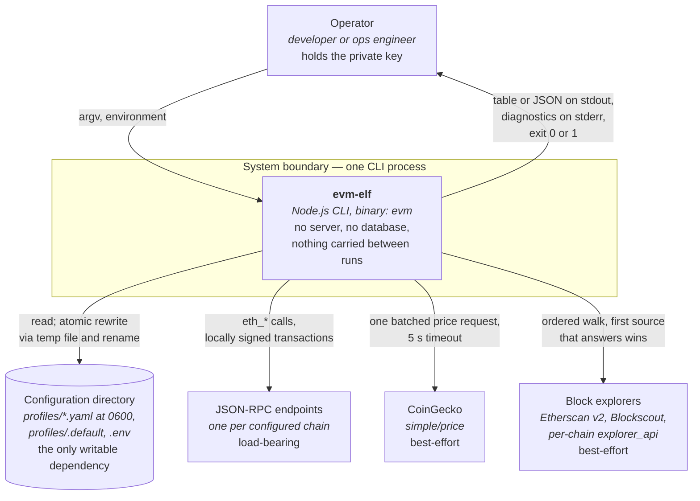

Two properties of this picture drive most of what follows. The configuration directory is both
the tool's configuration and its chain list, so the same file determines the breadth of every
read. And three of the four outbound arrows are optional — only the RPC arrow is load-bearing.

### 3.3 The boundaries, measured

**Observed**, by mechanical analysis of all 42 source files rather than by reading the module
comments. The narrowness here is the reason several later sections can make categorical claims.

| Boundary | Where it is crossed | Count |
| --- | --- | --- |
| Outbound HTTP (`fetch`) | `src/lib/explorer/client.ts:44`, `src/lib/prices/coingecko.ts:17` | **2 files** |
| Outbound JSON-RPC | Provider construction is confined to `src/lib/rpc.ts`; nine handler files consume it | **1 constructing file** |
| Filesystem writes | `src/lib/profiles.ts`, `src/lib/profile-file.ts` | **2 files** |
| `process.env` reads | `src/lib/env.ts`, `src/lib/wallet.ts`, `src/lib/mask.ts`, `src/lib/prices/index.ts`, `src/lib/prices/coingecko.ts` | **5 files** |
| Provider construction, then destruction in `finally` | Nine handlers construct one; nine destroy it | **9 of 9** |

**Inferred.** Nothing enforces these boundaries — no lint rule, no import restriction, no
architectural test. They hold today because the codebase is small and consistent, and a single
`fetch` added to a handler would widen the network surface without anything objecting.

---

## 4. Solution strategy

**Observed** structure; the rationale column carries only what the repository records, cited.
Where no rationale is recorded, the cell says so rather than supplying one.

| Strategy | How it shows up | Recorded rationale |
| --- | --- | --- |
| **Layered, with a shared-library core** | `index.ts` / `src/cli/` / `src/commands/` / `src/lib/` / `src/types.ts`. Not hexagonal: no port or adapter abstraction over the filesystem or RPC, and no dependency-injection container | None recorded |
| **Two integrations abstracted, the rest called directly** | `PriceSource` is an interface with two implementations; explorers are an ordered walk over one client. Filesystem and RPC are called directly | The `PriceSource` comment states the shape is keyed by chain id so an on-chain price feed would fit the same interface (`src/lib/prices/types.ts:1-8`) |
| **One decision point for "which chains"** | `src/lib/chains.ts` at fan-in 19 holds path resolution, parsing, validation, selection and chain resolution | None recorded for the consolidation itself |
| **Errors split by whether the run can continue** | `loadProfile` throws; `resolveChain` never does | `src/lib/chains.ts:272-275` states the never-throws contract and its purpose: fan-out commands report per chain |
| **Plan by default, `--exec` sends** | Two code paths through the body of each of the four signing commands | [`docs/wallet-commands.md:117-120`](../wallet-commands.md) states the operator procedure the absence of a prompt creates |
| **Verify before writing** | `chain set` reads `eth_chainId` from the endpoint; `explorer set` probes the key | `src/commands/chain/set.ts:4-5` states the chain id is read from the endpoint rather than a built-in table, so any chain works and the id is verified rather than assumed. `src/lib/explorer/client.ts:137-141` states a rejected key otherwise surfaces later only as fields quietly going missing |
| **Everything human-first, `--json` always available** | All 21 subcommands accept `--json`; diagnostics never touch stdout | `src/lib/prices/index.ts:20-26` and `src/commands/contract/proxy-info.ts:710-714` both state stderr is chosen so `--json` stays parseable |
| **Stateless between invocations** | No cache, no memoisation, no history | None recorded. The `envLoaded` flag guards repeated work inside one process and is not a cache |

---

## 5. Building block view

### 5.1 Level 1 — the whole system as containers

Canonical source: [`diagrams/c4-02-container.puml`](diagrams/c4-02-container.puml).

**A deliberate deviation from C4, stated so it is not mistaken for an error.** `evm-elf` has one
deployable and one process. Nothing below is separately deployable or independently runnable, so
the standard container definition would produce a single box. The boxes are instead the layers
inside the process, which is the decomposition the import graph actually enforces and the one a
maintainer needs.

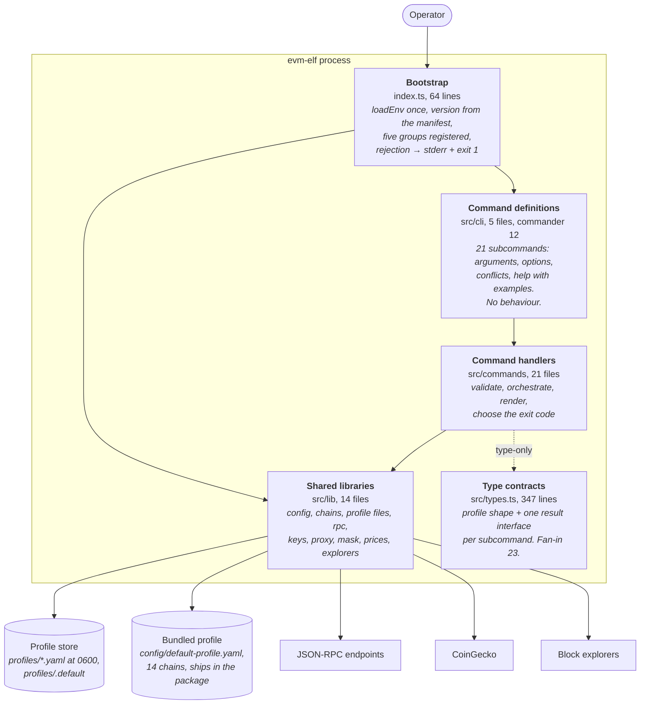

| Building block | Responsibility | Interface |
| --- | --- | --- |
| **Bootstrap** | Load the environment before anything reads it; register the groups; turn a rejected handler promise into one red line and exit `1` | `argv` and the process environment in; a process exit code out |
| **Command definitions** | Declare the surface. Option exclusivity is declared to the parser where it can be — `-c`/`-xc`, `--value`/`--all`, `--fee-buffer`/`--value` are `.conflicts()` declarations rather than hand-written checks | `buildWalletCommand()` and four siblings, each returning a commander `Command` |
| **Command handlers** | One per subcommand. All validation, orchestration and rendering | An async action function per subcommand |
| **Shared libraries** | Everything reusable, and every boundary crossing | Named function exports; no classes except `ExplorerChain` and the two `PriceSource` implementations |
| **Type contracts** | The shapes the layers agree on | Types only; erased at compile time |

### 5.2 Level 2 — configuration and profile subsystem

Canonical source: [`diagrams/c4-03-component-configuration.puml`](diagrams/c4-03-component-configuration.puml).
Per-component detail is in the
[design document](../reverse-engineer/design-doc.md#components) and is not repeated here.

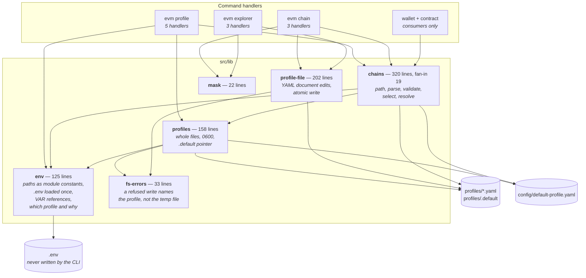

Three properties are worth knowing before changing anything here, all **Observed**:

- **`env` is the bottom of the graph and computes its paths at module evaluation.** That is why
  `EVM_ELF_CONFIG_DIR` and `XDG_CONFIG_HOME` cannot come from a `.env` file: the path of the user
  `.env` is derived from them, so the dependency is circular. Verification-report conflict C2
  established this, and it was resolved in the documentation rather than in code for that reason.
- **Two write mechanisms coexist, and the split is intentional.** Whole-file operations use
  `copyFile`, which preserves comments for free but carries the source's permission bits across —
  and the bundled profile is `0644`. Every copy is therefore followed by `chmod 0600`
  (`src/lib/profiles.ts:25-30` records exactly this). Entry-level edits go through the `yaml`
  `Document` API instead, so `evm chain set` can rewrite one chain in a hand-written profile
  without reformatting the rest.
- **`readProfileDocument` starts a fresh document when the file is missing.** Its comment
  (`src/lib/profile-file.ts:19-26`) states that callers must therefore check existence first, and
  both `set` commands do. This is the shape of verification-report conflict C4.

### 5.3 Level 2 — chain access and outbound integrations

Canonical source: [`diagrams/c4-04-component-chain-access.puml`](diagrams/c4-04-component-chain-access.puml).

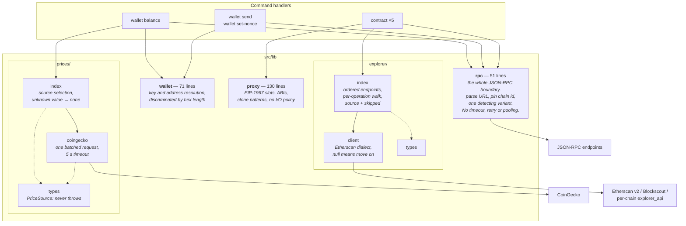

The two adapters look similar and are not, which matters when adding a third:

| | Prices | Explorers |
| --- | --- | --- |
| Abstraction | An interface, `PriceSource`, with two implementations | No interface. One client, and an ordered list of endpoints that differ only in base URL, key and how the chain is selected |
| Extension point | Add a class and a `case`. **Intended** — the interface comment states the shape was chosen so an on-chain price feed would fit | Add a name to `EXPLORER_NAMES` and a base URL. Every source already speaks the Etherscan dialect (`src/lib/explorer/types.ts:1-8`) |
| Failure contract | "Never throws" is written into the interface, so it is a contract rather than a convention | A call returning `null` means "could not answer", which is what advances the walk. A valid negative answer comes back as data |
| Internal dependencies | **None.** The most cleanly isolated component in the system | One: `tryResolveEnvRefs`, used to drop a source whose reference is unset before any request goes out |

Note the ordering asymmetry in `resolveEndpoints` (`src/lib/explorer/index.ts:64-87`): a chain's
own `explorer_api` is pushed unconditionally and carries no key, while the two multichain sources
are dropped unless their key resolves. That is why zkSync Era works out of the box in the bundled
profile and Etherscan does not.

### 5.4 Level 2 — contract inspection

Canonical source: [`diagrams/c4-05-component-contract-inspection.puml`](diagrams/c4-05-component-contract-inspection.puml).

This level exists because `src/commands/contract/proxy-info.ts` is 753 lines — 14.6% of the
codebase and more than twice the next largest file. Its internal structure is not visible in the
file tree, and it is the clearest refactoring candidate in the system (§11, debt D2).

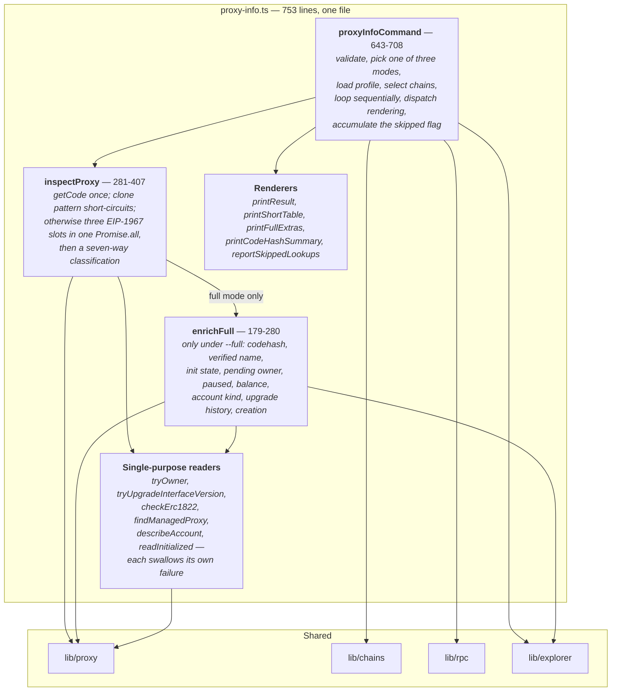

Two design points, both **Observed** with **Intended** rationale in the source:

- **Depth is set by the mode, not by the detected case.** `short`, `normal` and `full` each cut a
  different set of follow-up reads out of the same detection path. The seven cases — `minimal`,
  `beacon`, `transparent`, `uups`, `proxy-admin`, `beacon-contract`, `none` — differ in what is
  read, not in how deeply.
- **`proxy-upgrade` takes the proxy, not the ProxyAdmin**, and reads the admin from the EIP-1967
  slot. Three conditions are therefore errors in either mode rather than warnings: no code at the
  proxy, an empty admin slot, and an EOA admin. All three mean the address is not the kind of
  proxy this command upgrades, so there is nothing to plan either.

### 5.5 The dependency rule, and how far it actually holds

**Observed**, by extracting every relative import from all 42 files and classifying it by layer.
The numbers below are that analysis's output rather than an estimate — but the script was a
one-off and is not committed, so re-deriving them means writing it again. Debt item D7 is the
suggestion to replace it with a lint rule that fails instead.

| Property | Result |
| --- | --- |
| Internal import edges | 122 |
| Import cycles | **None** |
| `src/lib/` importing from `src/commands/` or `src/cli/` | **0 edges** |
| `src/commands/` importing from `src/cli/` | **0 edges** |
| Upward imports at run time | **0.** One type-only edge exists: `src/types.ts:9` imports `ExplorerSettings` from `src/lib/explorer/types.ts`, which TypeScript erases |
| Intra-layer edges | 12, all inside `src/lib/`, all acyclic |

The most-depended-on modules, by fan-in:

| Fan-in | Module | Role |
| --- | --- | --- |
| 23 | `src/types.ts` | Every handler imports its own result shape |
| 19 | `src/lib/chains.ts` | The hub: which profile, which chains, can this chain be reached |
| 10 | `src/lib/rpc.ts` | Every command that reaches a chain |
| 8 | `src/lib/env.ts` | Paths, `.env`, references, default-profile resolution |
| 6 | `src/lib/wallet.ts` | The four signing commands, plus `balance` and `address` |
| 6 | `src/lib/profiles.ts` | Whole-file operations |

**Inferred.** The rule holds perfectly and nothing enforces it. There is no `eslint-plugin-import`
boundary rule, no `dependency-cruiser` configuration and no architectural test, so the 0 in each
row above is a property of the current code rather than a guarantee about the next commit.

---

## 6. Runtime view

Four scenarios, chosen because between them they cover every path a change is likely to touch.
All **Observed** from the handler sources; branches reachable only with a live endpoint or a real
broadcast are *code-only* and marked in place.

### 6.1 Fan-out read

Canonical source: [`diagrams/runtime-01-fanout-read.puml`](diagrams/runtime-01-fanout-read.puml).
The dominant path: `wallet balance`, `contract owner`, `contract code` and `contract proxy-info`
differ only in what happens inside the loop.

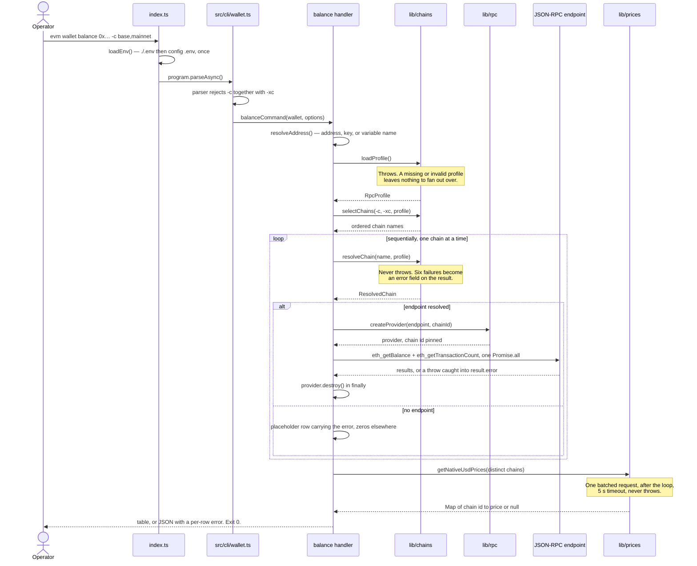

The last line carries the trap the design does not hide: a failed row still carries `balance`,
`balanceEth` and `nonce` as zeros, so a script summing `balanceEth` without checking `error`
under-counts silently.

### 6.2 Signing write and the `--exec` gate

Canonical source: [`diagrams/runtime-02-signing-write.puml`](diagrams/runtime-02-signing-write.puml).
Shape shared by `wallet send`, `wallet set-nonce`, `contract transfer-ownership` and
`contract proxy-upgrade`.

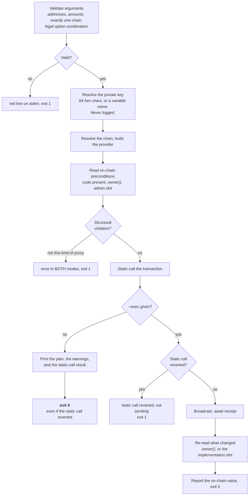

Three asymmetries are deliberate and each is documented:

- **A dry run whose static call reverted still exits `0`** ([`docs/contract-commands.md:230`](../contract-commands.md)),
  so a script must read the output rather than the exit code.
- **Under `--exec`, two of the three dry-run warnings become refusals** — an implementation with
  no code, and a reverting static call. "Signer is not the admin owner" does not, because the
  static call catches it if it matters and the operator may legitimately be simulating for someone
  else.
- **`--value` and `--all` do different amounts of work before `--exec`.** A `--value` dry run
  never reads a balance, so it can report `will send` on a chain that cannot afford it. An `--all`
  dry run reads balance, fee data and an estimated gas limit, then pins all three when it sends,
  so the fee cannot exceed the reserve the plan held back (`src/commands/wallet/send.ts:157-164`).

The broadcast branches are *code-only*: verification could not reach them without spending real
funds.

### 6.3 Verify before write

Canonical source: [`diagrams/runtime-03-chain-set.puml`](diagrams/runtime-03-chain-set.puml).
`evm chain set` is a local edit that takes a network round trip in order to be correct.
`evm explorer set` has the same shape with a key probe in place of the chain-id check.

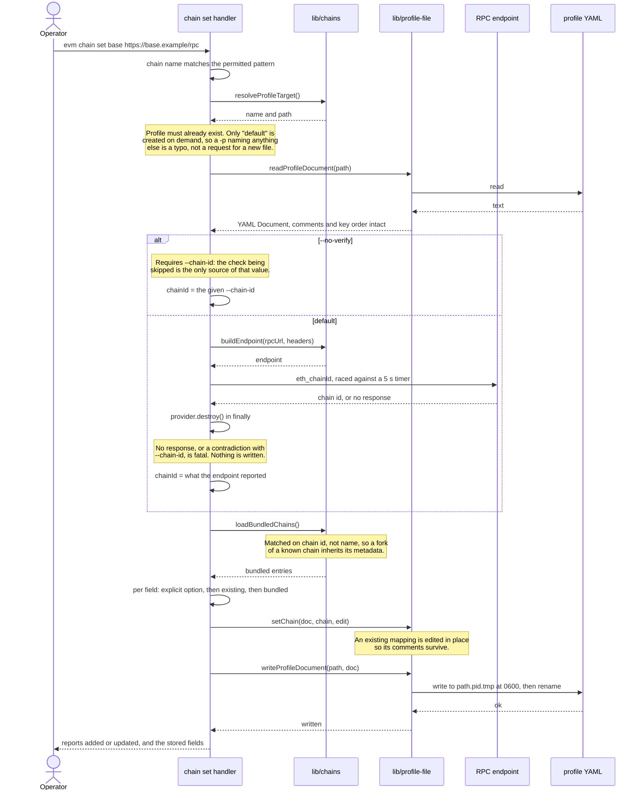

### 6.4 First run and profile resolution

Canonical source: [`diagrams/runtime-04-first-run.puml`](diagrams/runtime-04-first-run.puml).
Every command shares this path before it does anything specific, and it is what decides the chain
list the rest of the invocation fans out across.

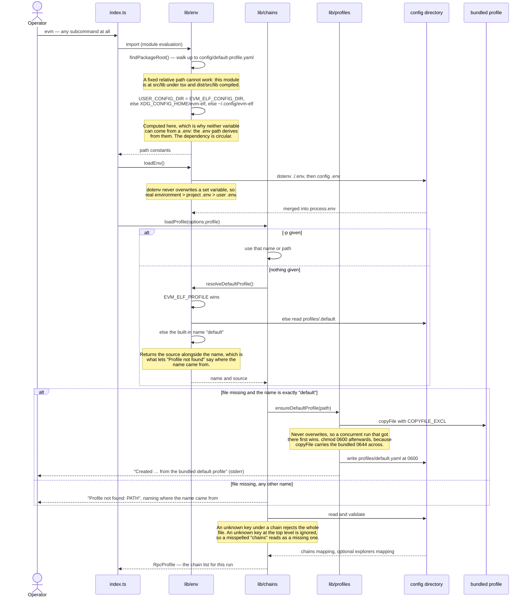

---

## 7. Deployment view

Canonical source: [`diagrams/c4-06-deployment.puml`](diagrams/c4-06-deployment.puml).
All **Observed**.

### 7.1 Infrastructure

There is none, and the absence is the design. No Dockerfile, no compose file, no Kubernetes
manifest, no Terraform and no cloud resource exists in the repository. The only machines involved
are a GitHub Actions runner at release time and the operator's own workstation at run time.

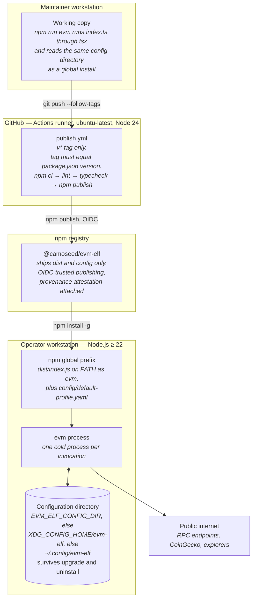

### 7.2 Distribution

| Concern | Mechanism |
| --- | --- |
| Package | `@camoseed/evm-elf`, `bin` maps `evm` to `dist/index.js`, `files` ships `dist` and `config` |
| Why `config` must ship | The bundled profile is copied on first run. Its absence produces the documented `Could not locate bundled config/default-profile.yaml` |
| Install from the registry | `npm install -g @camoseed/evm-elf` — compiled JavaScript, so npm only links the binary |
| Install from source | `npm install -g github:galekseev/evm-elf` — compiles during the install, because `prepare` runs on `npm install` |
| Run from a checkout | `npm run evm -- <args>`, which runs `index.ts` through `tsx` and reads the same profiles as a global install |
| Upgrade | Replaces the package. Profiles live outside it and are never touched — which also means new chains in a later bundled profile never reach an existing `default.yaml` |
| Uninstall | Leaves the configuration directory in place |
| Environment isolation | No tiers exist. `EVM_ELF_CONFIG_DIR` relocates the whole configuration directory, which is the documented way to keep an experiment separate |

### 7.3 Release pipeline

The script set and the workflow interact in a way worth spelling out, because reading either
alone gives the wrong answer.

| Script | Command | Runs when |
| --- | --- | --- |
| `prepare` | `tsc` | On `npm install` and `npm ci`, and again during `npm publish` |
| `prepublishOnly` | `npm run clean && npm run lint && npm run typecheck` | First step of `npm publish` |
| `build` | `tsc` | Manually |
| `typecheck` | `tsc --noEmit` | Manually, and in the workflow |
| `lint` | `eslint .` | Manually, and in the workflow |
| `release` | `npm version patch && git push --follow-tags` | Manually — this is what starts a release |

`prepublishOnly` deletes `dist`, and `prepare` rebuilds it. That works because of npm's ordering,
which was **verified empirically** on npm 11.8.0 for this document rather than taken from memory:
`npm publish` runs `prepublishOnly` → `prepack` → `prepare` → `postpack`. The clean therefore
always precedes the compile, and a publish cannot ship a stale `dist`.

**Observed gap.** There is no CI on pull requests and no test job, though there is now something
for one to run: `npm test`, `npm run typecheck`, `npm run typecheck:test`, `npm run lint`,
`npm run check:docs` and `npm run check:features` all pass in the working tree. The workflow runs
two of the six, at release time, when the tag has already been pushed. Debt D8.

---

## 8. Cross-cutting concepts

### 8.1 Configuration and environment

**Observed.** Environment variables are read at two different times, and the difference is not
cosmetic.

| Variable | Read at | Purpose |
| --- | --- | --- |
| `EVM_ELF_CONFIG_DIR` | Module evaluation | Relocates the whole configuration directory |
| `XDG_CONFIG_HOME` | Module evaluation | Base for the default location |
| `EVM_ELF_PROFILE` | Run time | Names the profile in use, above the `.default` pointer |
| `EVM_PRICE_SOURCE` | Run time | Selects the price source; an unrecognised value falls back to `none` |
| `COINGECKO_API_KEY` | Run time | Sent as `x-cg-demo-api-key` when set |
| Any name in a `${VAR}` reference, or passed in place of a private key | Run time | Resolved at the last moment before use |

The two module-evaluation variables cannot be supplied from a `.env` file, because the path of the
user `.env` is derived from them. That is a fixed consequence of the design, not a bug awaiting a
reorder.

`loadEnv()` sits at `index.ts:24` rather than in each handler. The source comment
(`index.ts:20-23`) records why: nearly every command resolves something from the environment, and
a handler that omitted the call used to see a different environment from its neighbours. Thirteen
of twenty-one handlers called it and eight did not — the cause of verification-report conflicts C1
and C8 and of four user-visible defects. The current placement makes omitting it impossible rather
than merely unlikely.

### 8.2 Error handling and fault isolation

**Observed.** Four shapes exist, of which only the last is semantically distinct.

| Shape | Mechanism | Sites |
| --- | --- | --- |
| 1. Library throw | `throw new Error(...)`, caught by the global handler at `index.ts:61-64`, printed red on stderr, exit `1` | 38 across 11 files |
| 2. Local `fail()` helper | `console.error(chalk.red(m)); process.exit(1)` as a `never`-returning function | 3 files |
| 3. Inline exit | The same two statements written inline at a validation point | 38 `process.exit` sites across 15 files |
| 4. Per-chain capture | The error is stored in the result object's `error` field and never thrown | Every fan-out command, and `resolveChain` |

Shapes 1 through 3 all produce a red line and exit `1`; which one a site uses is local
convenience. Shape 4 carries the product rule, and it is the one the fan-out model rests on:
`resolveChain` never throws (`src/lib/chains.ts:272-275`), so six distinct per-chain failures —
not in profile, no `chain_id`, no `rpc_url`, unresolved reference, malformed URL, unreachable
endpoint — become rows.

There are no custom error classes anywhere. Every throw is a plain `Error`, and the message is the
entire contract — which is why [`docs/troubleshooting.md`](../troubleshooting.md) catalogues
messages verbatim.

**Inferred.** Having three ways to fail fatally means there is no single seam at which to change
how a fatal error is presented, should that ever be wanted. It is a mild inconsistency rather than
a defect, and it is listed as debt in §11.

### 8.3 Secrets and key material

**Observed**, with the guarantee stated at
[spec REQ-144](../reverse-engineer/requirements-specification.md#371-security) (**Intended**).

| Credential | Supplied by | Stored? | Handling |
| --- | --- | --- | --- |
| Private key | `--private-key <hex\|VARNAME>`, or the argument of `wallet address` / `wallet balance` | **Never** | Discriminated by shape: 64 hex characters is a key, 40 is an address, anything else is a variable name. Exists only in process memory, and leaves only as a signature |
| Explorer API key | The `explorers` section of a profile | Yes, or as a reference | Probed against the explorer before it is written. Masked in tables, verbatim in `--json` |
| RPC auth header | A chain's `headers`, or the URL-with-auth-key shorthand | Yes, or as a reference | Attached to every request for that chain. Masked in tables, verbatim in `--json` |

Masking has one property that looks like a bug and is not: `--reveal` never reveals what a
reference points at, because the reference branch runs before `reveal` is consulted
(`src/lib/mask.ts:14-17`). The reference is not the secret. That was verification-report drift D3,
resolved by rewording the option descriptions rather than changing the code.

Masking applies to table output only. `--json` prints stored values verbatim, deliberately,
because it is the machine path and must round-trip. Every documentation page that describes it
carries a caution.

The CLI authenticates nobody. Authorisation, where it exists, belongs to the chain:
`transfer-ownership` and `proxy-upgrade` compare the signer against the on-chain owner and report
a mismatch, but the contract enforces it.

### 8.4 Output, logging and exit codes

**Observed.** 209 `console.log` and 40 `console.error` calls, written at the point of output. No
logging library, no level system, no structured format, no correlation id — one process, one
operator, one invocation.

The distinctions that exist are by stream and by colour. Results go to stdout; diagnostics,
warnings and errors go to stderr, so `--json` stays parseable. Red is an error, yellow a warning,
dim a supplementary note, cyan and green values and success. `--json` suppresses progress lines
rather than rerouting them — `wallet send` computes `const quiet = Boolean(options.json)` and
guards each progress line with it.

Exit codes carry less information than a script writer expects, and the shape is documented rather
than designed away:

| Situation | Exit code |
| --- | --- |
| Fan-out read where every chain failed | `0` — the failures are in the rows |
| Dry run whose static call reverted | `0` |
| `wallet send` where every chain errored | `1` |
| Validation failure before any chain is reached | `1` |
| Any uncaught rejection from a handler | `1`, via the global catch |

### 8.5 Persistence and atomic writes

**Observed.** Filesystem writes are confined to two files, `src/lib/profiles.ts` and
`src/lib/profile-file.ts`, verified by searching every write primitive across the tree. Both write
to `<file>.<pid>.tmp` at mode `0600` and then `rename`, and both unlink the temporary file if the
write fails. An interrupted edit cannot truncate a working profile.

That unlink has a consequence for what the operator is told, which is why a third file joins the
two. A write refused on permissions fails on the temporary file, and reporting it names a path
that no longer exists; `src/lib/fs-errors.ts` restates the failure in terms of the profile and the
directory that refused it (REQ-147), and passes anything that is not a permission failure through
as the system reported it.

Three artefacts exist, all plain text, all under one directory:

| Artefact | Format | Written by |
| --- | --- | --- |
| `profiles/<name>.yaml` | YAML, mode `0600` | `profile create/clone`, `chain set/remove`, `explorer set/remove`, first-run seeding |
| `profiles/.default` | One line, mode `0600` | `profile set-default`; cleared by `profile remove --force` |
| `.env` | dotenv | **Never written by the CLI** — operator-authored |

Entry-level edits go through the `yaml` `Document` API rather than a parse-and-re-serialise cycle,
so comments and key order in a hand-written profile survive an automated edit. The cost is
`src/lib/profile-file.ts` at 202 lines, with its own field-ordering rules.

### 8.6 Graceful degradation

**Observed**, and it is a contract rather than a convention in one of the two cases.

| Optional dependency | Failure behaviour | Where the contract lives |
| --- | --- | --- |
| Price source | A non-OK response, a fetch exception and a malformed body all resolve to `null` for the affected chain. The USD column is left empty and the command exits `0`. Bounded by a 5-second `AbortSignal.timeout` | `PriceSource` documents "never throws" as part of the interface (`src/lib/prices/types.ts:16-23`) |
| Block explorers | A source with no key, or an unresolvable reference, is dropped before any request goes out. A source that answers with an error is skipped silently and the walk continues. When no source remains and a lookup was wanted, one note is printed per run, on stderr | Convention, enforced by every client function returning `null` on failure (`src/lib/explorer/client.ts:1-7`) |

The explorer walk is per operation, not per chain, so a source that is down or out of quota costs
one request rather than the whole field. The silent skip on a rejected key is what the pre-write
probe in `evm explorer set` compensates for: without it, a bad key would surface much later and
only as `proxy-info --full` quietly printing fewer fields.

### 8.7 Concurrency and resource management

**Observed.**

| Aspect | Design |
| --- | --- |
| Across chains | **Sequential.** Every fan-out awaits inside the loop. A 14-chain read costs the sum of its endpoints |
| Within one chain | Limited parallelism where the calls are independent — `wallet balance` issues `eth_getBalance` and `eth_getTransactionCount` under one `Promise.all`; `inspectProxy` reads the three EIP-1967 slots under another |
| Price lookup | One batched request per invocation, after the loop |
| Explorer lookups | Sequential within a chain, stopping at the first source that answers |
| Connection pooling | None. A provider is constructed per chain and destroyed in a `finally` block, in all nine commands that build one |
| Retry, backoff, rate limiting | **None anywhere** |
| Timeouts | Only where a caller adds one: 5 s for `chain set`'s chain-id race, 5 s for the explorer key probe, 5 s for the price request. Fan-out reads have none, so an unresponsive endpoint costs whatever the operating system's TCP behaviour costs |

### 8.8 Concepts that are absent

Stating these matters as much as the ones that exist, because each absence is load-bearing
somewhere. All **Observed** by exhaustive search.

| Concept | Status | Consequence |
| --- | --- | --- |
| Caching | None. No cache module, no memoisation, no TTL, no store | Every invocation re-reads the profile and re-fetches every price and explorer response. For balances and nonces that is the right trade against staleness |
| Observability | None. No metrics, no tracing, no health check, no telemetry, no crash reporting | The set of outbound destinations is enumerable and short, which is itself a security property for a tool that handles signing keys |
| Authentication and authorisation | None in the CLI | It holds credentials rather than checking them |
| Interactive prompts | None. No `readline`, no stdin read anywhere | The plan is the only confirmation step before an irreversible operation |

A fifth entry has since been struck. Unit tests were absent when this was written: the suite was
end-to-end without exception, every test spawning `dist/index.js` and reading stdout, stderr and
the exit code back, so a behaviour was pinned only where the CLI could be made to show it. It now
has an in-process half — 140 unit tests over pure functions and 182 integration tests driving the
same Commander tree the binary does. The 216 tests under
[`test/characterization/`](../../test/characterization) still reach the code only through the
built binary, and so still survive a refactor of anything below the command boundary.

---

## 9. Architecture decisions

**No architecture decision records exist.** There is no `docs/decisions/` directory, no ADR
template and no decision log anywhere in the repository. The table below is therefore a
*reconstruction of decisions from their consequences*, not an index of records — and per the
constraint on this document, the rationale column carries only what the repository states
somewhere. A cell reading "not recorded" means exactly that: the decision is visible in the code
and its reason is not written down. Nothing has been supplied to fill the gap.

| # | Decision | Bought | Cost paid elsewhere | Recorded rationale |
| --- | --- | --- | --- | --- |
| D1 | **Load the environment once, at the entry point** | Every command sees the same environment; the class of bug where a handler forgets is impossible | Two `.env` reads on every invocation, `--help` included. Negligible: dotenv on a missing file is a no-op | `index.ts:20-23` |
| D2 | **`resolveChain()` never throws; `loadProfile()` does** | Fan-out reads report six distinct per-chain failures as rows and still exit `0` | Callers must check the `error` field. Forgetting yields a silent wrong answer — exactly the trap the zeroed JSON placeholder creates | `src/lib/chains.ts:272-275` |
| D3 | **Write to a temporary file, `chmod`, then rename** | An interrupted edit cannot truncate a working profile; a profile cannot be left world-readable | Two write mechanisms coexist, and the `chmod` after `copyFile` is easy to omit — which is how verification-report conflict C3 happened | `src/lib/profiles.ts:25-30`, `src/lib/profile-file.ts:187-190` |
| D4 | **Edit YAML through the document API, not by re-serialising** | Comments and key order survive an automated edit of a hand-written profile | `src/lib/profile-file.ts` is 202 lines with its own field-ordering rules, and which comments survive an edit depends on the YAML comment model rather than on a choice (REQ-037) | `src/lib/profile-file.ts:1-7` |
| D5 | **Pin the provider to the configured chain id with `staticNetwork`** | One fewer round trip per request, and an endpoint answering for the wrong network cannot silently substitute its data | The correctness half is ethers' guarantee rather than this project's, asserted by no test — [OQ-4](../reverse-engineer/requirements-specification.md#5-open-questions) | `src/lib/rpc.ts:29-32` states the performance reason only. The correctness consequence is documented at [`docs/configuration.md:87`](../configuration.md) |
| D6 | **Verify before writing** — the chain id for `chain set`, the key for `explorer set` | A typo or a dead credential fails when it is introduced rather than weeks later as missing output | Two commands need a network round trip to do a local edit, hence `--no-verify` on both, hence a second code path on both | `src/commands/chain/set.ts:4-5`, `src/lib/explorer/client.ts:137-141` |
| D7 | **Plan by default; `--exec` sends** | The only confirmation step in a CLI with no prompts, for four irreversible operations | Every signing command carries two paths through its whole body, and a dry run's exit code cannot signal a would-be failure | [`docs/wallet-commands.md:117-120`](../wallet-commands.md) states the operator procedure this creates |
| D8 | **An unrecognised `EVM_PRICE_SOURCE` falls back to `none`, not to the default** | Someone who set the variable at all meant to control the lookup | A misspelling silently disables pricing rather than failing loudly, mitigated by a stderr warning | `src/lib/prices/index.ts:20-26` |
| D9 | **One deployable, no container, no infrastructure** | Nothing to operate; install is one npm command | No environment tiers; isolation is a relocated config directory | Not recorded |
| D10 | **Five runtime dependencies and no more** | A small, enumerable supply chain for a tool that handles signing keys | Table rendering, argument shapes and HTTP are all hand-rolled | [spec REQ-142](../reverse-engineer/requirements-specification.md#36-design-constraints) |
| D11 | **Layered directories with a strict downward dependency rule** | No cycles, and a predictable place for everything | Nothing enforces it (§5.5) | Not recorded |
| D12 | **Sequential fan-out** | Simplicity: no concurrency limit, no partial-failure aggregation, no interleaved output | A 14-chain read costs the sum of its endpoints | Not recorded as a decision. [`docs/troubleshooting.md:268-270`](../troubleshooting.md) treats the cost as known and names the mitigations |

**Inferred, and the recommendation this section exists to make.** Twelve decisions with five
lacking any recorded reason is the gap worth closing first, because a reason that lives only in a
maintainer's head is the one that gets reversed by accident. D2, D5, D7 and D12 are the four whose
reversal would be most expensive, and D12 is the only one of those with no record at all.

---

## 10. Quality requirements

### 10.1 Quality tree

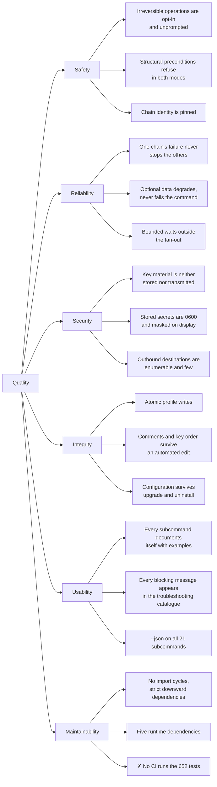

The tree is **Intended** — every leaf but one traces to a requirement in
[§3.7](../reverse-engineer/requirements-specification.md#37-software-system-attributes) or to a
numbered requirement it names. The marked leaf, M3, is the one goal the system does not meet.

### 10.2 Quality scenarios

Written so each can be executed against a built binary. **Inferred**: the repository states the
qualities but not these scenarios, and the wording is this document's.

| # | Scenario | Stimulus | Expected response |
| --- | --- | --- | --- |
| **Q1** | *Safety.* An operator runs `wallet send --all --exec` with no `-c` or `-xc` | The command sweeps every chain in the profile | Every chain is swept. This is correct behaviour and the reason the plan exists: the same command without `--exec` must have printed the full chain list and the per-chain amount first |
| **Q2** | *Fault isolation.* One of 14 configured endpoints is unreachable, one names an unset `${VAR}`, and one is absent from the profile | A fan-out read is issued | Eleven rows carry results, three carry distinct error strings, and the exit code is `0`. No exception escapes |
| **Q3** | *Security.* A private key is passed as a variable name, and the command fails midway | Any signing command | The key appears in no output stream, no file, and no outbound request other than as a signature. `wallet generate` is the sole deliberate exception |
| **Q4** | *Integrity.* `evm chain set` is interrupted between the temporary write and the rename | SIGINT during a profile edit | The original profile is byte-unchanged. A `.tmp` file may remain |
| **Q5** | *Degradation.* CoinGecko returns 429, and no explorer key is configured | `wallet balance`, then `contract proxy-info --full` | The USD column is empty and the balance table is otherwise complete, exit `0`. Explorer-backed fields are absent and one note appears on stderr, once |
| **Q6** | *Chain identity.* A profile entry names chain `base` but its `rpc_url` points at an endpoint serving chain 1 | Any read on that chain | The chain reports an error rather than returning mainnet data. **Delegated to ethers' `staticNetwork` and asserted by no test** — this is [OQ-4](../reverse-engineer/requirements-specification.md#5-open-questions). The pin is under test, in that a read is asserted to ask the endpoint for nothing but the balance and the nonce; what the mismatch does is still unobserved, and writable against a stub |
| **Q7** | *Maintainability.* A new price source is added | A class implementing `PriceSource`, plus a `case` in `resolvePriceSource` | No other file changes. The interface is keyed by chain id precisely so a non-CoinGecko implementation fits |

### 10.3 Performance figures

**Observed**, and there are only three, all of them timeouts:

| Bound | Value | Where |
| --- | --- | --- |
| Chain-id check in `chain set` | 5 s, raced against `getNetwork()` | `src/commands/chain/set.ts:21,47-55` |
| Explorer key probe | 5 s `AbortSignal.timeout` | `src/lib/explorer/client.ts:19` |
| Price request | 5 s `AbortSignal.timeout` | `src/lib/prices/coingecko.ts:9,19` |
| Nonce confirmation polling | 2 s interval, 60 s ceiling | `src/commands/wallet/set-nonce.ts:13-14,97-104` |

No throughput, latency or resource target is stated anywhere in the repository, and none is
implied here.

---

## 11. Risks and technical debt

Ranked by what would cost most to discover late. Each is **Observed**; the ranking is
**Inferred**. It followed the ordering the
[verification report](../reverse-engineer/verification-report.md) established until the working
tree acquired a test suite, which paid the head of that list — D1 is now what the suite does not
reach, and D8 has gained the fact that nothing runs what it does.

| # | Risk or debt | Evidence | What it threatens | Suggested first move |
| --- | --- | --- | --- | --- |
| **D1** | **The two commands that move money are the largest thing the suite does not reach.** It covers 94 of the 147 requirements, and 2 of the 24 that belong to wallet operations — the amount forms, the six per-chain outcomes, and the fee reserve an `--all` sweep holds back are all unasserted | [spec §4.4](../reverse-engineer/requirements-specification.md#44-traceability-to-the-test-suite) — wallet operations at 2 of 24, against 15 of 21 for the contract group now that both contract dry runs are exercised. The tests that do invoke `wallet send` and `wallet set-nonce` stop at argument validation and key resolution | `wallet send` and `wallet set-nonce`, two of the four irreversible operations. A change to the reserve arithmetic or to what `--value` accepts fails nothing | Answer `eth_estimateGas` in the stub the suite already starts: that is what both plans need, and it is most of the gap. Only three requirements — REQ-092, REQ-099, REQ-100 — need a chain that will accept a transaction |
| **D2** | **`proxy-info.ts` is 753 lines**, 14.6% of the codebase and more than twice the next largest file | Detection, three enrichment levels, three render modes, cross-chain summary and skip accounting in one file | Change safety, though less than it did: all seven detection branches are now exercised against a local stub, and it is the render modes and the `--full` enrichment that a split would move blind | Split detection from rendering first; the renderers have no dependencies on the readers, and detection has the tests |
| **D3** | **Invariants held by convention rather than by type.** `resolveChain` never throwing, and `PriceSource` never throwing | Both stated in comments. The second is at least on an interface; the first is not expressible in the current shape | Every fan-out command depends on the first | A `Result`-shaped return would make the first checkable, at the cost of touching every call site |
| **D4** | **`src/lib/chains.ts` at fan-in 19** holds path resolution, parsing, validation, selection and chain resolution | Five concerns sharing a file because they share a subject | Every change risks the module every command depends on | Not urgent. The concerns are cohesive; note it before a sixth arrives |
| **D5** | **The destructive path with the weakest guard is not a broadcast.** `evm profile remove` has no plan mode, no prompt and no undo | Its only protection is a check against `resolveDefaultProfile()`. The refusal now has tests, reached through the `.default` pointer and through stdin | An operator's whole chain list | The case those tests miss is the one conflict C8 found: `EVM_ELF_PROFILE` supplied from a `.env` file, which is where the guard's safety actually rests — [spec §4.3](../reverse-engineer/requirements-specification.md#43-verification-gaps), gap 5 |
| **D6** | **Three ways to fail fatally** | 38 `throw` sites, 38 `process.exit` sites, one `fail()` helper in three files | No single seam at which to change how a fatal error is presented | Only worth fixing if the presentation needs to change |
| **D7** | **Nothing enforces the layering** that §5.5 measures as perfect | No import-boundary lint rule, no architectural test | The property is true of this commit, not guaranteed of the next | One `eslint-plugin-import` `no-restricted-paths` rule would pin it |
| **D8** | **Nothing runs the checks.** Six pass in the working tree — `test`, `typecheck`, `typecheck:test`, `lint`, `check:docs`, `check:features` — and the only workflow runs two of them | `.github/workflows/publish.yml` triggers on `v*` tags and runs `lint` and `typecheck`. No workflow triggers on `push` or `pull_request` | The 652 tests and the two document checks, which protect nothing they are not run against. A broken commit is discoverable when someone tags a release, by which point the tag is pushed | The six on `pull_request`. The suite rebuilds `dist/` itself, so the test job needs no extra step |
| **D9** | **No architecture decision records.** Five of the twelve decisions in §9 have no recorded reason | No `docs/decisions/` directory exists | A reason that lives only in a maintainer's head gets reversed by accident | Start with D12 (sequential fan-out), the highest-cost reversal with no record at all |
| **D10** | **Chain-identity enforcement is delegated, and the part that matters is untested** | `staticNetwork: true`, with the guarantee belonging to ethers. A read is asserted to make no chain-id request, so the pin itself is under test; what a mismatch does is not | The one correctness property the documentation states most confidently ([`docs/configuration.md:87`](../configuration.md)) | Scenario Q6 against a stub endpoint, which is now a test that can be written rather than a scenario that cannot |

### Open questions carried forward

Four, all inherited from the approved verification report and restated here only so this document
does not appear to have settled them. Two have concrete fixes and two are claims about the world
outside the repository. See
[requirements specification §5](../reverse-engineer/requirements-specification.md#5-open-questions).

---

## 12. Glossary

| Term | Meaning |
| --- | --- |
| **Bundled profile** | `config/default-profile.yaml`, shipped inside the package. 14 chains and one `explorers` entry. Read on exactly three occasions — the first-run copy, `evm profile create`, and the metadata `evm chain set` fills in by chain id — and never merged into a live profile |
| **Detecting provider** | The one provider built without a pinned chain id, so ethers discovers the network. Exists for a single caller, `evm chain set` |
| **Dry run / plan** | The default mode of a command that can send: it reports what it would do and sends nothing |
| **Environment reference** | A `${VAR}` value in a profile, resolved from the process environment at the moment of use. Not itself a secret, which is why masking prints it as written |
| **Fan-out** | Executing one operation against every selected chain, sequentially |
| **Literal** | A profile value that is not a reference, and therefore may itself be a secret |
| **Profile** | A YAML file naming a set of chains and their configuration. Also the chain list every read fans out across |
| **Profile in use** | The profile resolved for a command: `-p`, else `$EVM_ELF_PROFILE`, else the `.default` pointer, else the built-in name `default` |
| **Signing command** | One of the four that can broadcast: `wallet send`, `wallet set-nonce`, `contract transfer-ownership`, `contract proxy-upgrade` |
| **The walk** | The per-operation traversal of a chain's ordered explorer endpoints, stopping at the first source that answers |
| **Code-only** | A behaviour established by reading the implementation, because reaching it needs a live public endpoint, a real explorer key, or a broadcast transaction |

---

## Maintaining this document

### When to update which section

| Change | Update |
| --- | --- |
| A new external service is integrated | §3, and `c4-01-context.puml` |
| A layer, module or major file is added or removed | §5, and the affected container or component diagram |
| A command's control flow changes | §6, and the affected runtime diagram |
| Packaging, the workflow, or the script set changes | §7, and `c4-06-deployment.puml` |
| A new cross-cutting pattern is established | §8 |
| A decision is made or reversed | §9 — and write the ADR this repository does not yet have anywhere to put |
| A risk is found or debt is paid | §11 |

Out-of-date architecture documentation is worse than none, because it misleads the person least
able to detect it.

### The diagrams

The `.puml` files under [`diagrams/`](diagrams/) are canonical. The Mermaid in this document
mirrors them so the page reads without a PlantUML renderer, at slightly lower fidelity — the
PlantUML carries technology and description annotations that Mermaid has nowhere to put. **When
they disagree, the `.puml` file is right.** Change it first, then the mirror.

Rendering needs PlantUML 1.2021.x or newer, which bundles C4-PlantUML in its standard library, so
the `!include <C4/...>` lines resolve offline:

```bash
plantuml -tsvg docs/architecture/diagrams/*.puml
```

> [!NOTE]
> The `.puml` sources in this commit have **not been rendered**. The machine they were written on
> has no Java runtime, so their syntax is checked by eye only. Render them once before relying on
> them, and correct anything that fails.
