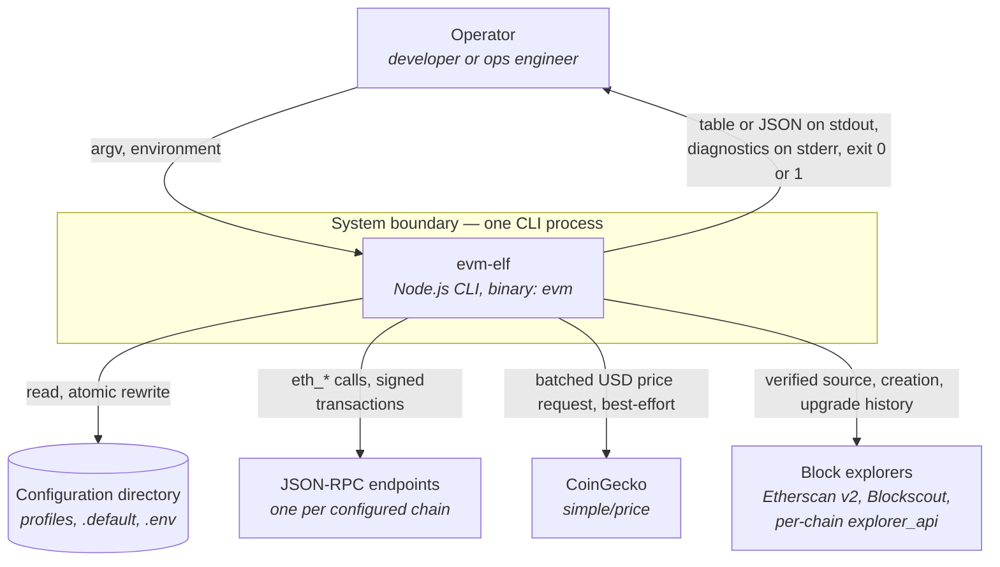
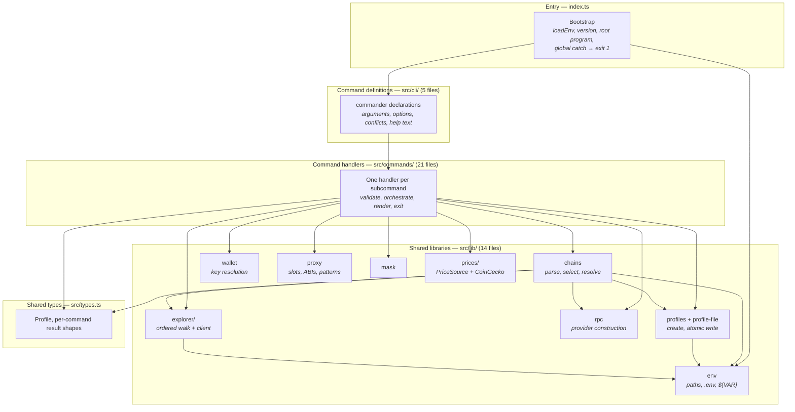
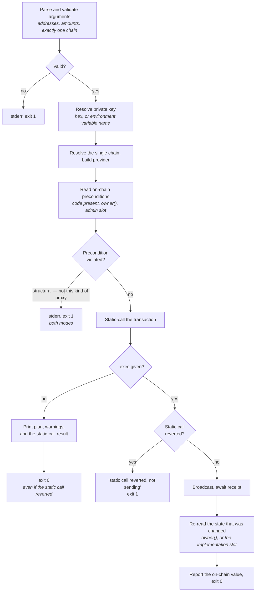
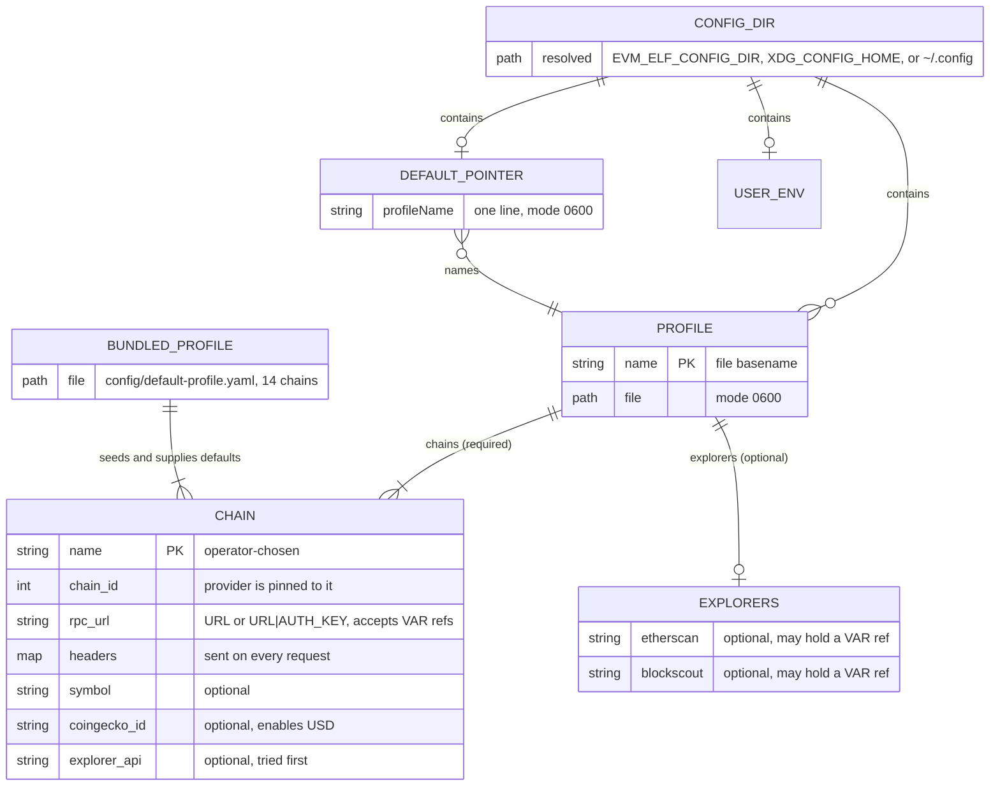

# Technical Design Document: evm-elf

| | |
| --- | --- |
| **Version** | 1.0, reverse-engineered |
| **Date** | 2026-08-01 |
| **Source** | Repository `galekseev/evm-elf`, commit `5b3ec31`, package version `1.0.0`. Aggregate counts are that commit's and are labelled where they appear; the components, the release pipeline and the known risks describe the working tree, which has since gained `src/lib/fs-errors.ts` and the test suite |
| **Related specification** | [Requirements specification](requirements-specification.md) — 147 requirements |
| **Related documents** | [Scope report](scope-report.md), [Verification report](verification-report.md) |
| **Status** | Draft — requires human review |

This document describes the system as it is. Every decision recorded here is one that was
already made and is visible in the code; nothing below is a proposal. Where a decision has a
consequence the code pays for, the consequence is recorded next to it.

---

## System Overview

### What It Is

A single-binary command-line client for operating on many EVM-compatible blockchains at once.
It has no server, no database, and no state shared between invocations beyond the configuration
files it owns. Every run is cold: read configuration, fan out over chains, print, exit.

### What It Does

- **Reads wallet and contract state across every configured chain in one command** — native
  balances with USD valuation, nonces, `owner()`, deployed bytecode, and proxy structure.
- **Detects and follows proxies** without an ABI or a verified source, by reading EIP-1967
  storage slots and matching bytecode patterns, across seven distinguishable cases.
- **Performs four write operations, each dry-run by default** — native transfers, nonce
  alignment, ownership transfer, and transparent-proxy upgrade. `--exec` is what sends.
- **Manages the chain list itself** — profiles are created, cloned, and edited in place by the
  CLI, with the endpoint verified before an entry is written.
- **Speaks JSON on every subcommand**, because per-chain failures do not change the exit code
  of a read, so a script needs a channel that carries the failure as data.

### Key Technologies

| Layer | Technology | Evidence |
| --- | --- | --- |
| Language | TypeScript 5.7, `strict`, ES2022 target, ESNext modules, `bundler` resolution | `package.json`, `tsconfig.json` |
| Runtime | Node.js >= 22, ES modules (`"type": "module"`) | `package.json` |
| CLI framework | commander 12 — imported by 6 files, all of them command definitions | `src/cli/wallet.ts`, `index.ts` |
| Chain access | ethers 6 — `JsonRpcProvider`, `Contract`, `Wallet`, `HDNodeWallet`, `Mnemonic` | `src/lib/rpc.ts`, `src/lib/wallet.ts` |
| Configuration format | YAML, read and written through the `yaml` document API | `src/lib/profile-file.ts`, `src/lib/chains.ts` |
| Environment loading | dotenv — imported by exactly one file | `src/lib/env.ts` |
| Terminal output | chalk — imported by 25 of 42 files | throughout `src/commands/` |
| Database | **None** | No driver, no migrations, no schema anywhere in the tree |
| Cache | **None** | No cache module, no TTL logic, no store |
| Message queue | **None** | No broker client, no consumer, no producer |
| Authentication | **None for the CLI itself.** It holds credentials rather than checking them | See [Cross-Cutting Concerns](#authentication-and-authorization) |
| Deployment | npm package, no container | `package.json`, `.github/workflows/publish.yml` |
| Tests | Vitest, 652 tests across 39 files in four projects: 140 unit, 182 integration, 114 acceptance, and 216 characterization tests, the last two end-to-end through the built binary | [`test/`](../../test), run by `npm test` |

Scale at the baseline commit: 42 TypeScript files, 5,145 lines, five runtime dependencies.

---

## Architecture

The `/c4-architecture` skill is not available in this workspace, so the C4 Context and Container
levels below are inline mermaid, which is the fallback the `reverse-engineer` skill specifies.

### High-Level Structure — C4 Context

The system boundary is one process. Everything outside it is either the operator's filesystem or
a third-party HTTP service.



Two properties of this picture drive most of the design. The configuration directory is the only
writable dependency, and it holds the chain list — so the same file both configures the tool and
determines the breadth of every read. And three of the four outbound arrows are optional: prices
degrade to an empty column, explorers degrade to absent fields, and only the RPC arrow is load-
bearing.

### High-Level Structure — C4 Container

There is one deployable. The "containers" below are the layers inside the process, which is the
useful decomposition at this level.



### Architectural Style

- **Pattern**: a layered CLI with a shared-library core. Not hexagonal — there is no port or
  adapter abstraction over the filesystem or the RPC layer, and no dependency injection
  container. Two integrations are abstracted behind an interface (prices) or a walk (explorers);
  everything else is called directly.
- **Evidence**: the directory split `index.ts` / `src/cli/` / `src/commands/` / `src/lib/` /
  `src/types.ts`, and the import graph below, which respects it without exception.
- **Key characteristics**: stateless between invocations; no in-process cache; one handler per
  subcommand with no shared mutable state; rendering done inline in the handler rather than by a
  view layer.

### Layering and the dependency rule

The import graph was extracted mechanically from all 42 files. Three properties hold:

| Property | Result |
| --- | --- |
| Import cycles | **None** |
| Upward imports (a lower layer importing a higher one) | **None at run time.** One type-only edge exists: `src/types.ts:9` imports `ExplorerSettings` from `src/lib/explorer/types.ts`, which TypeScript erases at compile time |
| `src/lib/` importing from `src/commands/` or `src/cli/` | **Never** |
| `src/commands/` importing from `src/cli/` | **Never** |

Dependency flows strictly downward: `index.ts` → `src/cli/` → `src/commands/` → `src/lib/` →
`src/types.ts`. Twelve intra-layer imports exist, all within `src/lib/`, and they are acyclic.

The most-depended-on modules, by fan-in:

| Fan-in | Module | Role |
| --- | --- | --- |
| 23 | `src/types.ts` | Every handler imports its own result shape from here |
| 19 | `src/lib/chains.ts` | The hub: profile resolution, parsing, chain selection, chain resolution |
| 10 | `src/lib/rpc.ts` | Every command that reaches a chain |
| 8 | `src/lib/env.ts` | Paths, `.env`, `${VAR}` resolution, default-profile resolution |
| 6 | `src/lib/wallet.ts` | The four signing commands plus `balance` and `address` |
| 6 | `src/lib/profiles.ts` | Whole-file operations |

`src/lib/chains.ts` at fan-in 19 is the architectural centre of the system, and deliberately so:
it is where "which profile, which chains, and can this chain be reached" is decided, once, for
every command that needs it.

### Request Lifecycle — a fan-out read

The dominant path. `evm wallet balance` is the example; `contract owner`, `contract code`, and
`contract proxy-info` differ only in what they do per chain.

```mermaid
sequenceDiagram
    actor Operator
    participant Boot as index.ts
    participant Def as src/cli/wallet.ts
    participant H as balance handler
    participant Ch as lib/chains
    participant Rpc as lib/rpc
    participant Node as JSON-RPC endpoint
    participant Px as lib/prices

    Operator->>Boot: evm wallet balance 0x… -c base,mainnet
    Boot->>Boot: loadEnv() — ./.env then <config>/.env, once
    Boot->>Def: program.parseAsync()
    Def->>Def: parser rejects conflicting options (-c with -xc)
    Def->>H: balanceCommand(wallet, options)
    H->>H: resolveAddress() — address, key, or variable name
    H->>Ch: resolveProfileTarget() → loadProfile()
    Ch-->>H: RpcProfile (throws only if the profile is missing or invalid)
    H->>Ch: selectChains(-c, -xc, profile)
    Ch-->>H: ordered chain names

    loop sequentially, one chain at a time
        H->>Ch: resolveChain(name, profile)
        Note over Ch: never throws — an unusable chain<br/>returns an error field instead
        Ch-->>H: ResolvedChain {chainId, endpoint | null, symbol, error?}
        alt endpoint resolved
            H->>Rpc: createProvider(endpoint, chainId)
            Rpc-->>H: JsonRpcProvider, chain id pinned
            H->>Node: eth_getBalance + eth_getTransactionCount (pending), in parallel
            Node-->>H: result, or a thrown error caught into result.error
            H->>H: provider.destroy() in finally
        else no endpoint
            H->>H: push placeholder row carrying error, zeros for balance and nonce
        end
    end

    H->>Px: resolvePriceSource().getNativeUsdPrices(chains)
    Note over Px: never throws; a failure yields no prices
    Px-->>H: Map<chainId, price | null>
    H-->>Operator: table on stdout, or JSON with per-row error, exit 0
```

Three decisions are visible in that sequence and are examined in
[Design Decisions](#design-decisions-and-their-consequences): the environment is loaded once at
the top, chain resolution cannot throw, and pricing happens after the loop as a single batch.

### Request Lifecycle — a write

The four signing commands share a shape: validate everything cheap, then simulate, then stop.
`--exec` converts the simulation from a report into a gate.



The asymmetry at the bottom left is deliberate and documented: a dry run whose static call
reverted still exits `0`, so a script must read the output rather than the exit code
(`docs/contract-commands.md:230`).

### Concurrency model

| Aspect | Design |
| --- | --- |
| Across chains | **Sequential.** Every fan-out awaits inside the loop. A 14-chain read costs the sum of its endpoints |
| Within one chain | **Limited parallelism where the calls are independent.** `wallet balance` issues `eth_getBalance` and `eth_getTransactionCount` under one `Promise.all` (`src/commands/wallet/balance.ts:93-96`) |
| Price lookup | **One batched request per invocation**, after the loop, naming every distinct `coingecko_id` |
| Explorer lookups | Sequential within a chain, and the walk stops at the first source that answers |
| Connection pooling | None. A provider is constructed per chain and destroyed in a `finally` block, in all nine commands that build one |
| Retry, backoff, rate limiting | **None anywhere.** A failed RPC call becomes that chain's error; a failed price request yields no prices |

Sequential fan-out is the single largest performance decision in the system, and the
documentation treats it as a known cost with a known mitigation rather than as a defect: narrow
with `-c`, and replace the bundled public endpoints with a private provider
(`docs/troubleshooting.md:268-270`).

---

## Components

Thirteen components, over the eleven functional units of the [scope report](scope-report.md).
The correspondence is not one-to-one, and the numbering does not track it: read it off the
[component mapping](#component-mapping) at the end of this section rather than off the numbers.

Three units do not become one component each. U2 names three separate files as its entry points,
and each of them is a component here — C2, C3 and C5. U11 groups the two independent adapters
that appear below as C11 and C12, separated because their designs have nothing in common. U7's
entry point is a line range inside the file C3 already owns, so it gets no component of its own.

The other eight units have exactly one component apiece, and only two of those carry the matching
number: C1 is U1 and C10 is U10, while C4 is U3, C6 is U4, C7 is U5, C8 is U6, C9 is U8 and C13
is U9. No offset or rule accounts for the difference, so a shared number is a coincidence rather
than a cross-reference — U9 is C13, and C9 is wallet operations.

### Component: C1 — CLI shell and dispatch

*Responsibilities*:
- Load the environment exactly once, before anything reads `process.env`.
- Read the version from the installed manifest rather than from a compiled constant.
- Register the five command groups and the root help text, including the resolved profiles path.
- Declare every subcommand's arguments, options, defaults, conflicts, and examples.
- Convert a rejected handler promise into a one-line stderr message and exit `1`.

*Interfaces*:
- **Inbound**: `argv` and the process environment.
- **Outbound**: `buildWalletCommand()`, `buildContractCommand()`, `buildChainCommand()`,
  `buildExplorerCommand()`, `buildProfileCommand()`, each returning a commander `Command`; and
  `loadEnv()` from C2.

*Dependencies*:
- C2 — for `loadEnv()`, `PACKAGE_ROOT`, and `PROFILES_DIR` in the help text.
- commander — for parsing and for the option-conflict declarations.

*Key files*:

```
index.ts              # bootstrap, loadEnv, root program, global catch
src/cli/wallet.ts     # 5 subcommand declarations
src/cli/contract.ts   # 5 subcommand declarations
src/cli/chain.ts      # 3 subcommand declarations
src/cli/explorer.ts   # 3 subcommand declarations
src/cli/profile.ts    # 5 subcommand declarations
```

*Notes*: `loadEnv()` sits at `index.ts:24` because it used to sit in each handler. Thirteen of
twenty-one handlers called it and eight did not, so a variable that existed only in a `.env` file
was visible to some commands and invisible to others — the cause of conflicts C1 and C8 in the
verification report, and of four distinct user-visible defects. The current placement makes
omitting the call impossible rather than merely unlikely, and the source comment at
`index.ts:20-23` records that reasoning.

Option exclusivity is declared to the parser rather than checked by hand wherever it can be:
`-c`/`-xc`, `--value`/`--all`, and `--fee-buffer`/`--value` are all `.conflicts()` declarations.
`--no-wait` cannot be expressed that way, because what it needs is the *presence* of `--exec`, so
the `send` handler checks it directly.

---

### Component: C2 — Environment and configuration resolution

*Responsibilities*:
- Resolve the configuration directory, profiles directory, pointer path, and package root.
- Load `./.env` then `<config dir>/.env`, once, without overwriting an existing variable.
- Resolve `${VAR}` references in profile values, in a throwing and a non-throwing variant.
- Answer which profile is in use and which of the four sources chose it.

*Interfaces*:
- **Inbound**: `loadEnv()`, `resolveDefaultProfile()`, `resolveEnvRefs()`,
  `tryResolveEnvRefs()`, and the exported path constants.
- **Outbound**: dotenv, `fs`, `os.homedir()`.

*Dependencies*:
- None internal. This is the bottom of the graph, which is what allows everything else to
  depend on it.

*Key files*:

```
src/lib/env.ts        # paths, .env loading, ${VAR}, default-profile resolution
```

*Notes*: the paths are module-evaluation constants, computed at import time. That is why
`EVM_ELF_CONFIG_DIR` and `XDG_CONFIG_HOME` cannot be read from a `.env` file — the path of the
user `.env` is itself derived from them, so the dependency is circular and cannot be fixed by
reordering. Verification-report conflict C2 established this, and it was resolved in the
documentation rather than in code for that reason.

`resolveDefaultProfile()` returns `{ name, source }` rather than a bare name. Carrying the
provenance is what lets `Profile not found` name where the name came from, and lets
`evm profile list` explain its own answer.

---

### Component: C3 — Profile parsing and chain resolution

*Responsibilities*:
- Turn a name or a path into a profile file path, enforcing the bare-name pattern and the
  `.yml` fallback.
- Seed the `default` profile on demand, however that name was reached.
- Parse and validate a profile: top-level structure, the six chain fields, the explorers section.
- Turn `-c` / `-xc` / neither into an ordered chain list.
- Turn a chain name into a usable endpoint, or into an error that does not throw.

*Interfaces*:
- **Inbound**: `resolveProfilePath()`, `resolveProfileTarget()`, `loadProfile()`,
  `selectChains()`, `resolveChain()`, `buildEndpoint()`, `loadBundledChains()`.
- **Outbound**: C2 for `${VAR}` and paths, C4 for seeding, C10 for URL parsing, C12 for the
  known explorer names.

*Dependencies*:
- C2, C4, C10, C12 — see above. This is the only `src/lib` module with four internal
  dependencies, which is the cost of being the hub.

*Key files*:

```
src/lib/chains.ts     # 320 lines: paths, parsing, validation, selection, resolution
src/types.ts          # Profile and chain entry shapes
```

*Notes*: `resolveChain()` is documented in its own source comment as never throwing
(`src/lib/chains.ts:274-275`), and that is the invariant the entire fan-out model rests on. Six
distinct failures — chain not in profile, no `chain_id`, no `rpc_url`, unresolved `${VAR}`,
malformed URL, and endpoint unreachable — all become a populated `error` field on a
`ResolvedChain` rather than an exception. The handler decides whether that is a row or a fatal
error, and for reads it is always a row.

By contrast `loadProfile()` does throw, because a missing or malformed profile leaves nothing to
fan out over. The split between the two is the clearest expression of the system's error policy.

---

### Component: C4 — Profile file lifecycle

*Responsibilities*:
- Create profiles by copying the bundled one, or empty; clone byte for byte; remove.
- Read, edit, and write the YAML document while preserving comments and key order.
- Write atomically, and set owner-only permissions on everything it creates.
- Maintain the `.default` pointer.

*Interfaces*:
- **Inbound**: `ensureDefaultProfile()`, `createProfile()`, `copyProfile()`,
  `listProfileFiles()`, `readDefaultPointer()`, `writeDefaultPointer()`,
  `clearDefaultPointer()`, `assertProfileName()`; and from the document side
  `readProfileDocument()`, `setChain()`, `removeChain()`, `getExplorers()`, `setExplorer()`,
  `removeExplorer()`, `writeProfileDocument()`.
- **Outbound**: `fs/promises`, the `yaml` document API.

*Dependencies*:
- C2 — for the profiles directory and the pointer path.

*Key files*:

```
src/lib/profiles.ts       # whole-file operations, 0600, .default pointer
src/lib/profile-file.ts   # YAML document edits, atomic write
src/lib/fs-errors.ts      # a refused write names the profile, not the temp file
```

*Notes*: two write mechanisms coexist, for a reason. Whole-file operations use `copyFile`, which
preserves comments for free but carries the *source's* permission bits across — and the bundled
profile is `0644`. That is verification-report conflict C3: three of four creation paths produced
world-readable profiles. The fix was a `chmod` to `0600` after each copy rather than a switch to
read-and-rewrite, which would have lost the comments.

Entry-level edits go through the `yaml` `Document` API instead, which is what lets
`evm chain set` rewrite one chain in a hand-written profile without reformatting the rest. Both
paths write to `<file>.<pid>.tmp` and rename, and both unlink the temporary file if the write
fails.

That unlink is why the third file exists. A refused write fails on the temporary file, which is
gone by the time the error reaches the operator, so `permissionFailure` restates it in terms of
the profile and the directory that refused it (REQ-147). A failure that is not about permissions
passes through as the system reported it.

`readProfileDocument()` starts a fresh document when the file is missing. That fallback is what
allowed the two `set` commands to create a profile that should not have existed
(verification-report conflict C4); its comment now records that callers must check for existence
first, and both `set` commands do.

---

### Component: C5 — Secret masking

*Responsibilities*:
- Reduce a literal value to `****` plus its last four characters for display.
- Print a `${VAR}` reference as written, appending `(unset)` when the variable has no value.
- Ignore `--reveal` for a reference, because the reference is not the secret.

*Interfaces*:
- **Inbound**: `maskValue(value, reveal)`.
- **Outbound**: `process.env`, chalk.

*Dependencies*:
- None internal.

*Key files*:

```
src/lib/mask.ts       # 22 lines, one exported function
```

*Notes*: the smallest component in the system and the one with the sharpest boundary. The
reference branch runs before `reveal` is consulted, which is the whole of verification-report
drift D3: `--reveal` never reveals what a reference points at. That turned out to be the correct
behaviour with incorrect documentation, so the option descriptions in `src/cli/chain.ts:21` and
`src/cli/explorer.ts:19` were reworded rather than the code changed.

Masking is applied to table output only. `--json` prints stored values verbatim, deliberately,
because it is the machine path and must round-trip — every documentation site that describes it
carries a caution to that effect.

---

### Component: C6 — Profile management commands

*Responsibilities*:
- List profiles with chain counts, marking the one in use and naming the source of that choice.
- Create, clone, remove, and set the default, refusing each operation that would change nothing.
- Guard removal of the profile in use.

*Interfaces*:
- **Inbound**: five handlers, invoked by C1.
- **Outbound**: C3 for path resolution and chain counts, C4 for file operations, C2 for
  provenance.

*Dependencies*:
- C2, C3, C4.

*Key files*:

```
src/commands/profile/list.ts
src/commands/profile/create.ts
src/commands/profile/clone.ts
src/commands/profile/remove.ts
src/commands/profile/set-default.ts
```

*Notes*: `remove` holds the only destructive operation in the CLI that is not a broadcast — and
unlike a broadcast, it has no plan mode. Its safety rests entirely on
`resolveDefaultProfile()` seeing the same environment every other command sees, which was false
until `loadEnv()` moved to `index.ts`. The verification report made this guard its top
recommendation for a first test, and the refusal now has two — reached through the `.default`
pointer and through stdin. Neither takes the route the conflict took, which is
`EVM_ELF_PROFILE` supplied from a `.env` file: see gap 5 of
[the specification's §4.3](requirements-specification.md#43-verification-gaps).

`list` is the only command in the system designed to explain the system's own behaviour, and its
correctness therefore has second-order value: when it was blind to a `.env`-supplied
`EVM_ELF_PROFILE`, it confirmed the operator's wrong hypothesis rather than correcting it.

---

### Component: C7 — Chain configuration commands

*Responsibilities*:
- List the chains a profile configures, masking header values and truncating long URLs.
- Add or modify a chain entry, verifying the chain ID against the endpoint before writing.
- Inherit metadata from the bundled profile by chain ID, and let explicit options override it.
- Remove a chain, reporting what is configured when the name is not.

*Interfaces*:
- **Inbound**: three handlers, invoked by C1.
- **Outbound**: C3 for profile resolution, C4 for document edits, C10 for the detecting
  provider, C5 for masking.

*Dependencies*:
- C3, C4, C5, C10.

*Key files*:

```
src/commands/chain/list.ts
src/commands/chain/set.ts      # 196 lines — the most complex write path
src/commands/chain/remove.ts
```

*Notes*: `chain set` is where the system's "verify before you write" principle is most
elaborate. It asks the endpoint for its chain ID with a 5-second timeout rather than inferring it
from the name, which is what makes an arbitrary chain work and makes a copied RPC URL fail
immediately instead of silently returning another chain's balances later. `--no-verify` is the
escape hatch for a node that is not running yet, and it requires `--chain-id` precisely because
the check it skips is the only source of that value.

Metadata inheritance matches on chain ID rather than on chain name, which is what makes it work
for a fork of a known chain.

---

### Component: C8 — Explorer configuration commands

*Responsibilities*:
- List both known explorers with their endpoints and one of three key states.
- Store a key after confirming the explorer accepts it.
- Remove a key, reporting what is configured when there is none.

*Interfaces*:
- **Inbound**: three handlers, invoked by C1.
- **Outbound**: C3 for profile resolution, C4 for document edits, C12 for the probe and the
  base URLs, C5 for masking, C2 for `${VAR}`.

*Dependencies*:
- C2, C3, C4, C5, C12.

*Key files*:

```
src/commands/explorer/list.ts
src/commands/explorer/set.ts
src/commands/explorer/remove.ts
```

*Notes*: the pre-write probe exists because of an asymmetry elsewhere in the design. At query
time a rejected key is silent — the walk in C12 simply moves to the next source and no note is
printed — so without this check a bad key would surface much later and only as `proxy-info
--full` quietly printing fewer fields. `evm explorer set` is the one place the operator can learn
the explorer's own answer, which is also why the failure message quotes it verbatim.

`list` iterates the known source names rather than the configured ones, so an unconfigured source
appears as `not set` rather than not appearing. That makes "no key configured" and "key
configured but unresolvable" visibly different states.

---

### Component: C9 — Wallet operations

*Responsibilities*:
- Resolve a private key or a wallet argument from hex or an environment variable name.
- Report balances, USD values, and pending nonces across chains, with a total.
- Send the native token by fixed amount or full sweep, planning first.
- Raise a nonce to a target by sending zero-value self-transactions.
- Generate a wallet and derive an address, both locally.

*Interfaces*:
- **Inbound**: five handlers, invoked by C1.
- **Outbound**: C3 for chain selection and resolution, C10 for providers, C11 for prices,
  ethers for signing.

*Dependencies*:
- C3, C10, C11, and `src/lib/wallet.ts` for key resolution.

*Key files*:

```
src/commands/wallet/balance.ts     # fan-out read, USD valuation, totals
src/commands/wallet/send.ts        # 252 lines — --value and --all, plan and exec
src/commands/wallet/set-nonce.ts   # nonce alignment, confirmation polling
src/commands/wallet/generate.ts    # local, no network
src/commands/wallet/address.ts     # local, no network
src/lib/wallet.ts                  # key and address resolution, 64-hex discrimination
```

*Notes*: `send` carries the system's most dangerous operation and the most design work per line.
`--all --exec` empties every selected chain, and with no `-c` or `-xc` that is the whole profile.
There is no confirmation prompt anywhere in the CLI, so the plan is the only gate — which is why
`--fee-buffer` was made a parser-level conflict with `--value` rather than a silently ignored
option, and why `--no-wait` without `--exec` is now refused rather than accepted and ignored
(verification-report finding X5).

The two modes do genuinely different amounts of work before `--exec`, and the documentation says
so because it surprises people: a `--value` dry run never reads a balance, so it can report
`will send` on a chain that cannot afford it. An `--all` dry run reads balance, fee data, and an
estimated gas limit, then pins all of them when it sends, so the fee cannot exceed the reserve
the plan held back.

Amounts take their symbol from the chain's profile entry. Two cases resolve to a bare number and
have no better answer: the opening line can name only one token, so it drops the symbol when the
selected chains disagree, and a chain with no `symbol` has nothing to name.

---

### Component: C10 — RPC access layer

*Responsibilities*:
- Parse an `rpc_url` in either accepted form, turning `<URL>|<AUTH_KEY>` into a header.
- Construct a provider with the configured chain ID pinned and the profile's headers attached.
- Construct a detecting provider for the one case where the chain ID is not yet known.

*Interfaces*:
- **Inbound**: `parseRpcUrl()`, `createProvider(endpoint, chainId)`,
  `createDetectingProvider(endpoint)`.
- **Outbound**: ethers `JsonRpcProvider` and `FetchRequest`.

*Dependencies*:
- None internal.

*Key files*:

```
src/lib/rpc.ts        # 51 lines, three exported functions
```

*Notes*: `createProvider` passes `staticNetwork: true` with an explicit chain ID. The stated
reason in the source comment is performance — it avoids an extra `eth_chainId` round trip per
request — but the documented user-facing consequence is correctness: an endpoint answering for
the wrong network fails rather than returning another chain's data. That guarantee currently
belongs to ethers rather than to this codebase, and is
[OQ-4](requirements-specification.md#oq-4-chain-identity-enforcement-is-delegated-to-ethers).

`createDetectingProvider` exists for exactly one caller, `evm chain set`, which needs the chain
ID it does not yet have. It is the only place in the system where the network is discovered
rather than declared.

There is no timeout, no retry, and no pooling here. Timeouts are applied by callers that want one
(`chain set` races a 5-second promise); the fan-out commands have none, which is why an
unresponsive endpoint costs whatever the operating system's TCP behaviour costs.

---

### Component: C11 — USD price valuation

*Responsibilities*:
- Select a price source from `EVM_PRICE_SOURCE`, falling back safely on an unrecognised value.
- Fetch USD prices for a batch of chains in one request.
- Never throw, and never fail the command that asked.

*Interfaces*:
- **Inbound**: `resolvePriceSource(name?)` returning a `PriceSource`;
  `PriceSource.getNativeUsdPrices(chains)` returning `Map<chainId, number | null>`.
- **Outbound**: `https://api.coingecko.com/api/v3/simple/price`, with `COINGECKO_API_KEY` sent
  as `x-cg-demo-api-key` when set.

*Dependencies*:
- None internal. This is the most cleanly isolated component in the system.

*Key files*:

```
src/lib/prices/types.ts      # the PriceSource interface and its contract
src/lib/prices/index.ts      # source selection, NonePriceSource
src/lib/prices/coingecko.ts  # the one network-backed implementation
```

*Notes*: the only true extension point in the codebase. `PriceSource` is keyed by chain ID rather
than by coin symbol, and the interface comment states why: an implementation backed by an
on-chain price feed would fit the same shape as one backed by a coin list. Adding a source means
adding a class and a `case`.

The interface documents "never throws" as part of the contract, and both implementations honour
it — a failed fetch, a non-OK response, and a malformed body all resolve to `null` for the
affected chain. That is what makes pricing best-effort at the architectural level rather than by
convention at each call site.

The fallback direction for an unrecognised `EVM_PRICE_SOURCE` is the interesting decision: it
selects `none`, not the default. The source comment argues it — someone who set the variable at
all meant to control the lookup, so reaching for the network because they misspelled `none` is
the wrong way to be wrong. The warning goes to stderr so `--json` stays parseable.

---

### Component: C12 — Block explorer access

*Responsibilities*:
- Build the ordered endpoint list for a chain, dropping any source that could only fail.
- Walk that list per operation, stopping at the first source that answers.
- Record which source answered, and whether a lookup was skipped for want of any source.
- Probe a key before `evm explorer set` writes it.

*Interfaces*:
- **Inbound**: `resolveEndpoints()`, the `ExplorerChain` class with `getContractCreation()`,
  `getContractInfo()`, `getLogsByTopic()`, plus `verifyExplorerKey()`, `isExplorerName()`,
  `explorerBaseUrl()`.
- **Outbound**: Etherscan v2, Blockscout, and any Etherscan-compatible `explorer_api`.

*Dependencies*:
- C2 — for `tryResolveEnvRefs()`, used to drop a source whose `${VAR}` is unset.

*Key files*:

```
src/lib/explorer/types.ts    # source names, endpoint and response shapes
src/lib/explorer/index.ts    # endpoint resolution, the walk, the probe entry point
src/lib/explorer/client.ts   # the Etherscan-compatible HTTP calls
```

*Notes*: the walk is per-operation, not per-chain. Its comment states the property that buys: a
source that is down or out of quota costs one request rather than the whole field. `source` is
recorded on first answer so a surprising result can be traced back to which explorer produced it.

`skipped` is set only when a lookup was actually wanted and no endpoint existed. That distinction
is what lets the "Skipped explorer lookups" note appear at most once per run, and stay silent
under `proxy-info -s`, which wants no explorer data in the first place.

Note the ordering asymmetry: a chain's own `explorer_api` is pushed unconditionally and carries
no key, while the two multichain sources are dropped unless their key resolves. That is why
zkSync Era works out of the box in the bundled profile and Etherscan does not.

---

### Component: C13 — Contract inspection and upgrades

*Responsibilities*:
- Detect which of seven proxy cases an address represents, from storage slots and bytecode.
- Report the fields relevant to the detected case, across every selected chain.
- Add chain-read and explorer-read diagnostics under `--full`, and compare codehashes across
  chains.
- Transfer ownership and upgrade a transparent proxy, each dry-run by default.

*Interfaces*:
- **Inbound**: five handlers, invoked by C1.
- **Outbound**: C3 for chain resolution, C10 for providers, C12 for explorer data, ethers for
  calls and signing.

*Dependencies*:
- C3, C10, C12, and `src/lib/proxy.ts` for slots, ABIs, and bytecode patterns.

*Key files*:

```
src/commands/contract/proxy-info.ts           # 753 lines — detection, enrichment, three render modes
src/commands/contract/owner.ts
src/commands/contract/code.ts
src/commands/contract/transfer-ownership.ts
src/commands/contract/proxy-upgrade.ts
src/lib/proxy.ts                              # EIP-1967 slots, ABIs, EIP-1167/7511 patterns
```

*Notes*: `src/commands/contract/proxy-info.ts` is 753 lines, 14.6% of the codebase and more than
twice the next largest file. It carries detection, three levels of enrichment, three render
modes, a cross-chain summary, and the explorer-skip accounting. It is the clearest refactoring
candidate in the system, and a split is now safer on one side than the other: all seven detection
branches are exercised against a local JSON-RPC stub, while the three render modes and the
`--full` enrichment are the part that would move unwatched.

`proxy-upgrade` takes the **proxy**, not the ProxyAdmin, and reads the admin from the EIP-1967
slot. That is a deliberate removal of the most common way to point an upgrade at the wrong
contract, and it is why three conditions are errors in either mode rather than warnings: no code
at the proxy, an empty admin slot, and an EOA admin all mean the address is not the kind of proxy
this command upgrades.

Under `--exec` two of the three dry-run warnings become refusals — an implementation with no code
and a reverting static call — while "signer is not the admin owner" does not, because the static
call will catch it if it matters and the operator may legitimately be simulating for someone
else.

The ProxyAdmin trace runs in the default mode as well as under `--full`, and only `-s` skips it.
That was verification-report drift D1: the documentation had placed it among the `--full`
explorer fields, which made the resulting "Skipped explorer lookups" note look unexplained.

---

### Component mapping

| Component | Scope-report unit | Requirements |
| --- | --- | --- |
| C1 CLI shell and dispatch | U1 | REQ-001 – REQ-009, REQ-134 |
| C2 Environment and configuration resolution | U2 (part) | REQ-010 – REQ-012, REQ-022, REQ-026, REQ-031 |
| C3 Profile parsing and chain resolution | U2 (part), U7 | REQ-023 – REQ-025, REQ-028 – REQ-034, REQ-068 – REQ-072 |
| C4 Profile file lifecycle | U3 | REQ-013 – REQ-016, REQ-035 – REQ-037, REQ-138, REQ-147 |
| C5 Secret masking | U2 (part) | REQ-048, REQ-049 |
| C6 Profile management commands | U4 | REQ-027, REQ-038 – REQ-046 |
| C7 Chain configuration commands | U5 | REQ-047, REQ-050 – REQ-059 |
| C8 Explorer configuration commands | U6 | REQ-060 – REQ-067 |
| C9 Wallet operations | U8 | REQ-074 – REQ-103, REQ-137, REQ-144 |
| C10 RPC access layer | U10 | REQ-017, REQ-018 |
| C11 USD price valuation | U11 (part) | REQ-019, REQ-125 – REQ-128 |
| C12 Block explorer access | U11 (part) | REQ-020, REQ-129 – REQ-132 |
| C13 Contract inspection and upgrades | U9 | REQ-073, REQ-104 – REQ-124 |
| Cross-cutting — not a component | — | REQ-021, REQ-133, REQ-135, REQ-136, REQ-139 – REQ-143, REQ-145, REQ-146 |

Every requirement appears above, and the rows account for all 147. REQ-031 is the only one
listed twice: C2 resolves `${VAR}` and C3 applies it while resolving a chain, and neither half
of that is the whole requirement.

The last row exists because eleven requirements are properties of the system rather than of any
part of it, and in a per-component table their absence would otherwise read as an oversight.
Each can be broken by a change in any of several components: the absence of an outbound
destination beyond the three (REQ-021), the troubleshooting catalogue that has to carry every
message which stops a command (REQ-133), the absence of prompts (REQ-135), the three
five-second bounds, which sit in C7, C11 and C12 (REQ-136), and configuration surviving an
upgrade, which follows from C2's paths and C4's copy-only-when-missing (REQ-146). The five
design constraints (REQ-139 – REQ-143) are properties of `package.json` and `LICENSE`, which no
component owns. Fault isolation (REQ-145) is the one that most looks like it has an owner and
does not: C3's never-throwing `resolveChain()` turns everything it can see into a row rather
than an exception, but it makes no request, so the two failure modes that need one — an
unreachable endpoint and a contract-level failure — are caught by each fan-out handler itself.
C9 and C13 can each break the invariant without C3 changing.

That makes this row the same size as the Cross-cutting row of the specification's
[Appendix B](requirements-specification.md#traceability-to-functional-units) but not the same
row: it drops REQ-137 and gains REQ-145. Appendix B indexes scope-report units, which are
capability areas, so a performance bound falls outside all of them; this table indexes code,
where the nonce polling window is two constants in a C9 file.

---

## Data Model

### Database Technology

**None.** There is no database, no ORM, no migration directory, and no driver in the dependency
list. All persistent state is plain text under one configuration directory, and the CLI is the
only writer.

### Schema Overview

Three artefact kinds, all under `$EVM_ELF_CONFIG_DIR`, else `$XDG_CONFIG_HOME/evm-elf`, else
`~/.config/evm-elf`.

| Artefact | Format | Purpose | Written by |
| --- | --- | --- | --- |
| `profiles/<name>.yaml` | YAML, mode `0600` | The chain list: endpoints, headers, token metadata, and explorer API keys | `evm profile create/clone`, `evm chain set/remove`, `evm explorer set/remove`, first-run seeding |
| `profiles/.default` | One line, mode `0600` | The profile name chosen by `evm profile set-default` | `evm profile set-default`; cleared by `evm profile remove --force` |
| `.env` | dotenv | Values for `${VAR}` references, and environment-variable-named private keys | **Never written by the CLI** — operator-authored |

The profile schema, as validated by `src/lib/chains.ts`:

| Key | Level | Required | Type | Notes |
| --- | --- | --- | --- | --- |
| `chains` | top | Yes | mapping | Each key is an operator-chosen chain name |
| `explorers` | top | No | mapping | Only `etherscan` and `blockscout` accepted |
| `chain_id` | chain | Semantically | positive integer | Optional at parse time so a half-written entry reports a row error instead of failing the file |
| `rpc_url` | chain | Semantically | string | Accepts `${VAR}` and the `<URL>\|<AUTH_KEY>` form |
| `headers` | chain | No | mapping of string to string | Values accept `${VAR}` |
| `symbol` | chain | No | string | Native token symbol, used for the `Token` column and amount labelling |
| `coingecko_id` | chain | No | string | Without it the chain is unpriceable |
| `explorer_api` | chain | No | string | Etherscan-compatible base URL, tried before the shared sources |

Any other key **under a chain** rejects the whole file. Any other key **at the top level** is
silently ignored — an asymmetry the troubleshooting page calls out, because it means a misspelled
`chains` reads as a missing one.

### Key Relationships



The relationship worth noting is the dashed one in practice: `BUNDLED_PROFILE` supplies defaults
but is never merged. It is read on exactly three occasions — the first-run copy,
`evm profile create`, and the metadata `evm chain set` fills in by chain ID. The operator's
profile is the only chain list any command reads, so a chain removed stays removed and a chain
added to the bundle in a later release does not appear until asked for.

### Data Flow

Ingress, transformation, and egress, for the dominant path:

1. **Ingress** — `argv` from commander; the process environment, augmented once by `./.env` and
   `<config dir>/.env` without overwriting; and one profile file read from disk.
2. **Parse and validate** — YAML to a `RpcProfile`, rejecting the file on a structural error or
   an unknown chain field. Nothing is coerced silently.
3. **Select** — `selectChains()` reduces the profile's chains to an ordered list using `-c`,
   `-xc`, or neither.
4. **Resolve** — per chain, `resolveChain()` produces a `ResolvedChain` carrying either an
   endpoint or an error. `${VAR}` references resolve here, at the last moment before use.
5. **Execute** — per chain, sequentially: build a provider, call, capture the outcome or the
   error into a typed result object, destroy the provider.
6. **Enrich** — optionally, once per run: one batched price request, or per-chain explorer
   walks.
7. **Egress** — either a rendered table with colour on stdout, or `JSON.stringify(results, null, 2)`
   on stdout. Diagnostics, warnings, and errors go to stderr throughout, so `--json` stays
   parseable.

Writes fold back into step 2: read the YAML *document* rather than the parsed object, mutate one
entry, write to a temporary file, `chmod`/rename into place.

---

## API Surface

The external contract is the command surface. There is no HTTP API, no RPC server, and no
library entry point — `package.json` declares `bin` and no `main` or `exports`.

### Command surface

All 21 subcommands accept `--json`. All except `wallet generate` and `wallet address` accept
`-p, --profile`.

| Group | Subcommand | Arguments | Chains | Key | Writes |
| --- | --- | --- | --- | --- | --- |
| `wallet` | `balance` | `<wallet>` | Many | Optional, local only | No |
| `wallet` | `send` | `<to>` | Many | Required | Chain, with `--exec` |
| `wallet` | `set-nonce` | `<target>` | Many | Required | Chain, with `--exec` |
| `wallet` | `generate` | — | None | Generates one | No |
| `wallet` | `address` | `<private-key>` | None | Required, local only | No |
| `contract` | `owner` | `<address>` | Many | No | No |
| `contract` | `proxy-info` | `<address>` | Many | No | No |
| `contract` | `code` | `<address>` | Many | No | No |
| `contract` | `transfer-ownership` | `<address> <newOwner>` | Exactly one | Required | Chain, with `--exec` |
| `contract` | `proxy-upgrade` | `<proxy> <newImplementation>` | Exactly one | Required | Chain, with `--exec` |
| `chain` | `list` | — | — | No | No |
| `chain` | `set` | `<chain> [rpcUrl]` | — | No | Profile |
| `chain` | `remove` | `<chain>` | — | No | Profile |
| `explorer` | `list` | — | — | No | No |
| `explorer` | `set` | `<explorer> <apiKey>` | — | No | Profile |
| `explorer` | `remove` | `<explorer>` | — | No | Profile |
| `profile` | `list` | — | — | No | No |
| `profile` | `create` | `<name>` | — | No | Profile |
| `profile` | `clone` | `<source> <name>` | — | No | Profile |
| `profile` | `remove` | `<name>` | — | No | Profile |
| `profile` | `set-default` | `<name>` | — | No | Pointer |

### Authentication

The CLI authenticates nobody. It is a single-user local tool with no session, no role, and no
permission model. What it does hold is three kinds of credential, each with a different design:

| Credential | Supplied by | Stored? | Design |
| --- | --- | --- | --- |
| Private key | `--private-key <hex\|VARNAME>`, or the argument of `wallet address` / `wallet balance` | Never | Discriminated by shape: 64 hex characters is a key, anything else is an environment variable name |
| Explorer API key | The `explorers` section of a profile | Yes, or as a `${VAR}` reference | Verified against the explorer before it is written; masked in tables, verbatim in `--json` |
| RPC auth header | A chain's `headers`, or the `<URL>\|<AUTH_KEY>` shorthand | Yes, or as a `${VAR}` reference | Attached to every request for that chain; masked in tables, verbatim in `--json` |

Authorisation, where it exists, belongs to the chain: `transfer-ownership` and `proxy-upgrade`
compare the signer against the on-chain owner and report the mismatch, but the contract enforces
it, not the CLI.

### Error response format

Two shapes, chosen by `--json`.

Human form — the message alone, in red, on stderr, with no stack trace:

```text
Profile not found: /Users/you/.config/evm-elf/profiles/myproject.yaml ('myproject' comes from $EVM_ELF_PROFILE)
```

Machine form — per-chain, an `error` key on the object for the chain that failed, with the
command still exiting `0`:

```json
[
  { "chain": "base", "chainId": 8453, "balance": "8921096499920447", "nonce": 34 },
  { "chain": "ok", "chainId": 31337, "balance": "0", "balanceEth": "0", "nonce": 0,
    "error": "connect ECONNREFUSED 127.0.0.1:9" }
]
```

The trap in that shape is documented rather than designed away: a failed row still carries
`balance`, `balanceEth`, and `nonce` as zeros, so a script summing `balanceEth` without checking
`error` under-counts silently.

Evidence: `index.ts:61-64` for the human form; `src/commands/wallet/balance.ts:77-91` and
`src/commands/wallet/balance.ts:106-119` for the machine form.

---

## Integration Points

| Integration | Type | Direction | Purpose | Evidence |
| --- | --- | --- | --- | --- |
| JSON-RPC endpoints | HTTP JSON-RPC | Outbound | Every chain read and every broadcast | `src/lib/rpc.ts` |
| CoinGecko | HTTP REST | Outbound | USD valuation for `wallet balance` | `src/lib/prices/coingecko.ts` |
| Etherscan v2 | HTTP REST | Outbound | Verified source, creation, upgrade history, ProxyAdmin trace | `src/lib/explorer/client.ts` |
| Blockscout | HTTP REST | Outbound | The same, as a fallback source | `src/lib/explorer/index.ts` |
| Per-chain `explorer_api` | HTTP REST | Outbound | The same, for chains the shared sources do not index | `src/lib/explorer/index.ts` |
| Local filesystem | POSIX | Both | Profiles, pointer, `.env` | `src/lib/profiles.ts`, `src/lib/profile-file.ts` |

### Integration: JSON-RPC endpoints

- **Protocol**: HTTP JSON-RPC via ethers `JsonRpcProvider`.
- **Authentication**: none, an `auth-key` header from the `<URL>|<AUTH_KEY>` shorthand, or
  arbitrary headers from the chain's `headers` mapping. Values may be `${VAR}` references
  resolved at call time.
- **Failure handling**: no retry, no backoff, no circuit breaker. A failure becomes that chain's
  `error` field and the fan-out continues. No timeout except in `evm chain set`, which races a
  5-second promise against `getNetwork()`.
- **Configuration**: per chain, from the profile.
- **Key files**: `src/lib/rpc.ts`, `src/lib/chains.ts`.

### Integration: CoinGecko

- **Protocol**: HTTP GET to `https://api.coingecko.com/api/v3/simple/price`, with a comma-joined
  `ids` parameter and `vs_currencies=usd`.
- **Authentication**: none required. `COINGECKO_API_KEY`, when set, is sent as the
  `x-cg-demo-api-key` header.
- **Failure handling**: **best-effort by contract, not by convention.** The `PriceSource`
  interface documents that it never throws; a non-OK response, a fetch exception, and a malformed
  body all resolve to no price. The USD column is left empty and the command still exits `0`.
  Bounded by a 5-second `AbortSignal.timeout`.
- **Configuration**: `EVM_PRICE_SOURCE` selects the source; `--no-usd` skips the request
  entirely.
- **Key files**: `src/lib/prices/coingecko.ts`, `src/lib/prices/index.ts`.

### Integration: block explorers

- **Protocol**: the Etherscan-compatible query API — `module`/`action` query parameters, a JSON
  body with a `status` field.
- **Authentication**: an API key per source, held in the profile's `explorers` section, commonly
  as a `${VAR}` reference. A chain's own `explorer_api` carries no key.
- **Failure handling**: an ordered walk that stops at the first source returning a non-null
  answer. A source with no key, or whose reference does not resolve, is dropped before any
  request goes out. A source that answers with an error is skipped silently and the walk
  continues — deliberately, which is what the pre-write probe in `evm explorer set` compensates
  for. When no source remains and a lookup was wanted, one note is printed per run, on stderr.
- **Configuration**: profile-wide rather than per chain, because one key covers every chain a
  source supports.
- **Key files**: `src/lib/explorer/index.ts`, `src/lib/explorer/client.ts`.

---

## Deployment

### Infrastructure

There is none to document, and the absence is the design. No Dockerfile, no compose file, no
Kubernetes manifest, no Terraform, and no cloud resource exists in the repository.

| Component | Type | Configuration | Evidence |
| --- | --- | --- | --- |
| The CLI | npm package, installed globally | `bin` maps `evm` to `dist/index.js`; `files` ships `dist` and `config` | `package.json` |
| Runtime | The operator's own Node.js >= 22 | `engines` | `package.json` |
| State | The operator's own filesystem | Configuration directory, outside the installed package | `src/lib/env.ts` |

### Environments

No environment tiers exist — no `.env.development`, no `.env.production`, no environment
switching in code. The nearest equivalent is `EVM_ELF_CONFIG_DIR`, which relocates the whole
configuration directory and is documented as the way to keep an experiment separate from a
working setup.

| Concern | Mechanism |
| --- | --- |
| Isolating an experiment | `EVM_ELF_CONFIG_DIR=/tmp/scratch evm chain list` |
| Switching chain sets per project | A profile per project, selected by `-p` or `EVM_ELF_PROFILE` |
| Running from source | `npm run evm -- <args>`, which runs `index.ts` through `tsx` and reads the same profiles as a global install |

### Release pipeline

One GitHub Actions workflow, `.github/workflows/publish.yml`, publishing to npm from a `v*` tag.
`prepublishOnly` runs `clean`, `lint`, and `typecheck` before a publish; `prepare` runs `tsc`, so
`npm install` builds and installing from git compiles from source.

There is no CI on pull requests and no test job, though there is now something for one to run:
`npm test`, `npm run typecheck`, `npm run typecheck:test`, `npm run lint`,
`npm run check:docs` and `npm run check:features` all pass in the working tree, and the workflow
runs two of the six.

### Configuration management

- **Mechanism**: environment variables plus YAML profile files. No secrets manager integration,
  though the documented workflow is to read a key out of one into an environment variable and
  pass the variable's *name*.
- **Variables read**: `EVM_ELF_CONFIG_DIR` and `XDG_CONFIG_HOME` at module evaluation;
  `EVM_ELF_PROFILE`, `EVM_PRICE_SOURCE`, `COINGECKO_API_KEY`, and any name appearing in a
  `${VAR}` reference or passed in place of a private key, at run time.
- **Evidence**: `src/lib/env.ts`, `src/lib/prices/index.ts`, `src/lib/wallet.ts`.

---

## Cross-Cutting Concerns

### Logging

- **Format**: human-readable text with ANSI colour via chalk. Not structured.
- **Library**: none. 209 `console.log` and 40 `console.error` calls, written directly at the
  point of output.
- **Levels**: no level system. The distinction that exists is by stream — results on stdout,
  diagnostics on stderr — and by colour: red for errors, yellow for warnings, dim for
  supplementary notes, cyan and green for values and success.
- **Correlation**: not applicable. One process, one operator, one invocation.
- **Suppression**: `--json` suppresses progress lines rather than rerouting them. `wallet send`
  computes `const quiet = Boolean(options.json)` and guards each progress line with it.
- **Evidence**: `src/commands/wallet/send.ts:79`, and every command's render function.

### Error Handling

Four shapes, three of which are the same behaviour written differently.

| Shape | Mechanism | Where | Count |
| --- | --- | --- | --- |
| 1. Library throw | `throw new Error(...)`, caught by the global handler at `index.ts:61-64`, printed red on stderr, exit `1` | `src/lib/**` and some handlers | 38 sites across 11 files |
| 2. Local `fail()` helper | `console.error(chalk.red(message)); process.exit(1)` as a `never`-returning function | 3 files | `src/commands/chain/set.ts:24`, `src/commands/explorer/set.ts:29`, `src/commands/explorer/remove.ts:17` |
| 3. Inline exit | The same two statements written inline at a validation point | Most handlers | 38 `process.exit` sites across 15 files |
| 4. Per-chain capture | The error is stored in the result object's `error` field and never thrown | Every fan-out command, and `resolveChain()` | — |

Only shape 4 is semantically distinct, and it is the one that carries the product rule. Shapes 1
through 3 all produce a red line on stderr and exit `1`; which one a given site uses is a matter
of local convenience rather than of meaning. That is a mild inconsistency, not a defect —
though it does mean there is no single place to change how a fatal error is presented.

There are no custom error classes anywhere. Every throw is a plain `Error`, and the message is
the entire contract — which is why the troubleshooting page catalogues messages verbatim, and why
verification-report finding X3 (eight messages missing from that catalogue) mattered.

Resource cleanup is consistent: all nine commands that construct a provider destroy it in a
`finally` block.

### Authentication and Authorization

Not applicable in the usual sense; see [API Surface](#authentication). The CLI holds credentials
rather than verifying them, and the relevant design properties are:

- A private key exists only in process memory, is never written to any file, and is never printed
  except by `wallet generate`, which prints both a mnemonic and a key by design and says so.
- Signing is local, through ethers; the endpoint receives a signed transaction.
- No profile field accepts a key, and the documentation states that as a guarantee rather than as
  a convention.

### Caching

**None.** No cache module, no memoisation, no TTL, no persistent store. Every invocation re-reads
the profile from disk and re-fetches every price and explorer response.

The nearest thing to caching is the `envLoaded` flag in `loadEnv()`, which makes a second call
free — a guard against repeated work within one process, not a cache of anything.

The consequence is worth stating plainly, since it is a design choice rather than an oversight:
`evm wallet balance` run twice in a row issues every RPC call twice and one price request each
time. For a tool invoked interactively a few times an hour, that is the right trade against the
staleness a cache would introduce for balances and nonces.

### Observability

**None.** No metrics, no tracing, no health check, no telemetry, and no crash reporting. The only
outbound requests are the three documented integrations, which is itself a security property for
a tool that handles signing keys — the set of destinations is enumerable and short.

The system's observability story is its output: per-chain status columns, `--json` for scripts,
and a troubleshooting page that maps every message to a cause and a fix.

---

## Design Decisions and Their Consequences

Seven decisions shape most of what the code looks like. Each is recorded in a source comment or
in the documentation, and each has a cost the system pays somewhere else.

| # | Decision | Bought | Cost |
| --- | --- | --- | --- |
| 1 | **Load the environment once, at the entry point** (`index.ts:24`) | Every command sees the same environment; the class of bug where a handler forgets is impossible | Two `.env` reads on every invocation, `--help` included. Negligible: dotenv on a missing file is a no-op |
| 2 | **`resolveChain()` never throws** (`src/lib/chains.ts:274-275`) | Fan-out reads can report six distinct per-chain failures as rows and still exit `0` | Callers must check the `error` field; forgetting yields a silent wrong answer, which is exactly the trap the zeroed JSON placeholder creates |
| 3 | **Write to a temporary file, `chmod`, then rename** | An interrupted edit cannot truncate a working profile; a profile cannot be left world-readable | Two write mechanisms coexist — `copyFile` for whole files, the YAML document API for entries — and the `chmod` after `copyFile` is easy to omit, which is how conflict C3 happened |
| 4 | **Edit YAML through the document API, not by re-serialising** | Comments and key order survive an automated edit of a hand-written profile | `src/lib/profile-file.ts` is 202 lines to do what `js-yaml` round-tripping would do in 20, it has its own field-ordering rules, and which comments survive is the YAML comment model's answer rather than a choice (REQ-037) |
| 5 | **Pin the provider to the configured chain ID with `staticNetwork`** | One fewer round trip per request, and an endpoint answering for the wrong network cannot silently substitute its data | The correctness half is ethers' guarantee rather than this project's, asserted by no test — [OQ-4](requirements-specification.md#oq-4-chain-identity-enforcement-is-delegated-to-ethers) |
| 6 | **Verify before writing** — the chain ID for `chain set`, the key for `explorer set` | A typo or a dead credential fails at the moment it is introduced rather than weeks later as missing output | Two commands need a network round trip to do a local edit, hence `--no-verify` on both, hence a second code path on both |
| 7 | **Plan by default; `--exec` sends** | The only confirmation step in a CLI with no prompts, for four irreversible operations | Every signing command carries two code paths through its whole body, and the dry run's exit code cannot signal a would-be failure — hence a reverting dry run exiting `0` |

---

## Known Design Risks

Observed, not speculative. Each is something a maintainer would want to know before changing the
system.

1. **The two commands that move money are the largest thing the test suite does not reach.** It
   covers 94 of the specification's 147 requirements, and 2 of the 24 that belong to wallet
   operations. The amount forms, the six per-chain outcomes, and the fee reserve an `--all` sweep
   holds back are all unasserted, and the tests that do invoke `wallet send` and
   `wallet set-nonce` stop at argument validation and key resolution. Most of it needs
   `eth_estimateGas` from the stub the suite already starts rather than a real chain; only
   REQ-092, REQ-099 and REQ-100 need a transaction to exist. See
   [the specification's §4.4](requirements-specification.md#44-traceability-to-the-test-suite).
2. **`src/commands/contract/proxy-info.ts` is 753 lines.** More than twice the next largest file
   and 14.6% of the codebase, carrying detection, three enrichment levels, three render modes,
   cross-chain summarisation, and explorer-skip accounting. Its detection half is now under test
   for all seven branches; the render modes and the `--full` enrichment are not.
3. **Invariants held by convention rather than by type.** `resolveChain()` never throwing and
   `PriceSource` never throwing are both contracts stated in comments. The `PriceSource` one is
   at least an interface; the `resolveChain()` one is not expressible in the current shape and is
   relied on by every fan-out command.
4. **`src/lib/chains.ts` at fan-in 19** is the module every change risks. It holds path
   resolution, parsing, validation, selection, and resolution — five concerns that happen to
   share a file because they share a subject.
5. **Three ways to fail fatally** (shapes 1–3 above) mean there is no single seam at which to
   change how errors are presented, should that ever be wanted.
6. **The destructive path with the weakest guard is not a broadcast.** `evm profile remove` has
   no plan mode, no prompt, and no undo, and its only protection is a check against
   `resolveDefaultProfile()`.
7. **Nothing runs the checks.** Six pass in the working tree — `test`, `typecheck`,
   `typecheck:test`, `lint`, `check:docs`, `check:features` — and the only workflow triggers on a
   `v*` tag and runs two of them. A regression in any of the 652 tests is discoverable when
   someone tags a release, by which point the tag is pushed.

---

## Appendix: File Map

```
Entry (C1):
  index.ts                                    # bootstrap, loadEnv, root program, global catch
  src/cli/wallet.ts                           # 5 subcommand declarations
  src/cli/contract.ts                         # 5 subcommand declarations
  src/cli/chain.ts                            # 3 subcommand declarations
  src/cli/explorer.ts                         # 3 subcommand declarations
  src/cli/profile.ts                          # 5 subcommand declarations

Configuration and resolution (C2, C3, C5):
  src/lib/env.ts                              # paths, .env, ${VAR}, default-profile resolution
  src/lib/chains.ts                           # parse, validate, select, resolve — fan-in 19
  src/lib/mask.ts                             # display masking, 22 lines
  src/types.ts                                # profile and result shapes — fan-in 23

Profile file lifecycle (C4):
  src/lib/profiles.ts                         # whole-file operations, 0600, .default pointer
  src/lib/profile-file.ts                     # YAML document edits, atomic write
  src/lib/fs-errors.ts                        # a refused write names the profile, not the temp file

Command handlers (C6, C7, C8, C9, C13):
  src/commands/profile/list.ts
  src/commands/profile/create.ts
  src/commands/profile/clone.ts
  src/commands/profile/remove.ts
  src/commands/profile/set-default.ts
  src/commands/chain/list.ts
  src/commands/chain/set.ts                   # most complex write path
  src/commands/chain/remove.ts
  src/commands/explorer/list.ts
  src/commands/explorer/set.ts
  src/commands/explorer/remove.ts
  src/commands/wallet/balance.ts
  src/commands/wallet/send.ts
  src/commands/wallet/set-nonce.ts
  src/commands/wallet/generate.ts
  src/commands/wallet/address.ts
  src/commands/contract/owner.ts
  src/commands/contract/proxy-info.ts         # 753 lines, largest file
  src/commands/contract/code.ts
  src/commands/contract/transfer-ownership.ts
  src/commands/contract/proxy-upgrade.ts

Chain and key access (C9, C10, C13):
  src/lib/rpc.ts                              # provider construction, URL|auth-key parsing
  src/lib/wallet.ts                           # key and address resolution
  src/lib/proxy.ts                            # EIP-1967 slots, ABIs, clone patterns

Outbound integrations (C11, C12):
  src/lib/prices/types.ts                     # the PriceSource interface
  src/lib/prices/index.ts                     # source selection
  src/lib/prices/coingecko.ts                 # the network-backed implementation
  src/lib/explorer/types.ts                   # source names and response shapes
  src/lib/explorer/index.ts                   # endpoint resolution and the walk
  src/lib/explorer/client.ts                  # Etherscan-compatible HTTP calls

Shipped configuration:
  config/default-profile.yaml                 # 14 chains, one explorers entry

Build and release:
  package.json                                # bin, files, engines, scripts, 5 runtime deps
  tsconfig.json                               # strict, ES2022, ESNext modules, declaration
  eslint.config.js
  .github/workflows/publish.yml               # publish to npm from a v* tag

Tests:
  vitest.config.ts                            # four projects, coverage thresholds
  test/unit/                                  # 9 files, 140 tests, pure functions
  test/integration/                           # 10 files, 182 tests, in process, loopback only
  test/acceptance/                            # 6 files, 114 tests, dist/ as a child process
  test/characterization/                      # 14 files, 216 tests, end-to-end through dist/
  test/helpers/cli.ts                         # workspace, constructed environment, child process
  test/helpers/inprocess.ts                   # the same Commander tree, driven in process
  test/helpers/rpc-stub.ts                    # JSON-RPC stub: code, slots, calls, reverts
  test/helpers/explorer-stub.ts               # Etherscan-dialect stub
  test/setup/build-cli.ts                     # global setup: dist/ current before a spawn
  test/setup/offline.ts                       # loopback-only guard for the in-process layers
  test/tsconfig.json                          # npm run typecheck:test
```

---

## Appendix: Conformance Notes

**Diagram generation.** The `/c4-architecture` skill is not available in this workspace, so the
Context and Container levels are inline mermaid `graph TD`, which is the documented fallback in
the `reverse-engineer` skill. Five diagrams in total: the C4 Context and Container structure
graphs, two lifecycle diagrams, and one ER diagram.

**Component subsection markup.** Component attribute labels use single-asterisk emphasis
(`*Responsibilities*:`) rather than the bold form shown in `references/design-doc-template.md`.
This is not a style preference. `validate_design_doc.py` builds its detection pattern with an
f-string, `rf"...\s*\*{required_sub}\*\s*:|^#{2,5}\s+..."`, in which `{2,5}` is interpreted as a
format field and expands to the literal `(2, 5)`. The result matches `*Responsibilities*:` and
does not match `**Responsibilities**:` or a `#### Responsibilities` heading. Bold labels would
cost 3 points per label across 13 components. Anyone reformatting these to bold should expect the
validator score to drop, and should fix the validator instead.

**Validator result.** `validate_design_doc.py` reports **100/100 — PASS** against a threshold of
70, with no errors and no warnings.

Running it needs one workaround on this machine, worth recording so the next person does not
conclude the document is at fault. The script annotates a parameter `repo_root: Path | None`,
which is PEP 604 syntax requiring Python 3.10, and the Python on this machine is 3.9.6 — so it
raises `TypeError: unsupported operand type(s) for |` at import, before it reads anything. Its
logic runs unchanged under 3.9 with `from __future__ import annotations` prepended, which is how
the result above was produced. `validate_prd.py` is unaffected, because it never writes a union
annotation.

**Independent checks run on this document**: all 27 backticked source paths exist; every path in
the file map exists; every `file:line` citation is within its file; all relative links resolve;
all 13 component blocks carry Responsibilities, Interfaces, Dependencies, Key files, and Notes;
all five mermaid fences are balanced and declare a recognised diagram type; no placeholder
markers remain.
