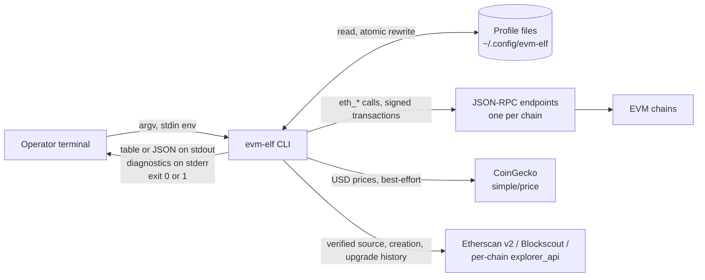

# Software Requirements Specification: evm-elf

| | |
| --- | --- |
| **Document** | Software Requirements Specification (SRS), ISO/IEC/IEEE 29148-style structure |
| **System** | `evm-elf` — multi-chain EVM wallet and contract CLI, binary `evm` |
| **Version** | 1.0, reverse-engineered |
| **Date** | 2026-08-01 |
| **Baseline** | Repository `galekseev/evm-elf`, commit `5b3ec31`, package version `1.0.0`. The requirements were recovered and verified against that commit; [§4](#4-verification) and the amendments in [Appendix D](#appendix-d-conformance-notes) describe the working tree, which has since gained the test suite, the behaviour specifications, and the code changes recorded there |
| **Derived from** | [Verification report](verification-report.md), third revision, score 99/100 — PASS (approved). [Scope report](scope-report.md). |
| **Status** | Draft — requires human review before use as a contractual baseline |

---

## 1 Introduction

### 1.1 Purpose

This document specifies the requirements that `evm-elf` already satisfies. It is a
*descriptive* specification produced by reverse-engineering, not a *prescriptive* one
written ahead of implementation, and that inversion changes how it should be read.

Requirements here were not chosen. They were recovered, from two sources that had already
been reconciled against each other: the user documentation (`README.md` and `docs/*.md`),
which states what the system promises, and the implementation (`index.ts`, `src/**`,
`config/**`), which states what it does. The
[verification report](verification-report.md) is the record of that reconciliation — 152
behavioural claims checked across three rounds, ending with 148 matches, no conflicts, no
drift, no undocumented behaviour, and four items left open.

The specification exists to serve three purposes:

1. **A regression baseline.** For 94 of the 147 requirements the behaviour stated here is now
   enforced mechanically, by the characterization suite in
   [`test/characterization/`](../../test/characterization), whose tests name the requirement
   each one exercises ([§4.4](#44-traceability-to-the-test-suite)). For the remaining 53 —
   chiefly the paths that need a live chain — this document is still the only written
   statement of intended behaviour precise enough to write a test against
   ([§4.3](#43-verification-gaps)).
2. **A change-control reference.** A future change that violates a requirement here is a
   behavioural break, and the traceability of each requirement identifies both the
   documentation page and the source lines that would have to change with it.
3. **An audit trail.** Every requirement carries its evidence and a confidence level, so a
   reader can tell a behaviour observed at runtime from one established by reading code
   alone.

### 1.2 Scope

**The product.** `evm-elf` is a command-line tool, distributed on npm as
`@camoseed/evm-elf` and installed as `evm`. It performs read and write operations against
EVM-compatible blockchains, across many chains in a single invocation.

**In scope for this specification.** The complete externally observable behaviour of the
`evm` binary: its 5 command groups and 21 subcommands, their arguments, options, output
formats, exit codes, and error messages; the profile configuration format and the commands
that edit it; the environment variables the tool reads; its three classes of outbound
network interaction; and its file-system and security behaviour.

**Out of scope, by absence of implementation.** The following capabilities have no code and
no documented intent, and are stated here so their absence is deliberate rather than
overlooked: token (ERC-20/721/1155) balances or transfers; contract deployment; ABI
encoding or arbitrary contract calls; access-control schemes other than `Ownable` and
`Ownable2Step`; transaction history; any persistent cache; any interactive prompt or
confirmation dialogue; any daemon, server, or scheduled execution; any telemetry.

**Out of scope, by delegation.** Transaction signing, ABI encoding, and chain-identity
enforcement are performed by ethers v6. Requirements that depend on a library guarantee are
marked with verification method *Analysis* and identified in [§4.2](#42-verification-status).

### 1.3 Product Overview

#### 1.3.1 Product perspective

The system is a standalone client. It has no server component, no database, and no shared
state between invocations beyond three files it owns: profile YAML files, a `.default`
pointer, and optionally a `.env` file, all under one configuration directory outside the
installed package.

It sits between an operator's terminal and three kinds of external service:

The organising idea, stated in `docs/configuration.md:7` and load-bearing throughout: **a
profile is the chain list.** The chains a profile names are the chains every read fans out
across, so switching profiles switches the endpoints and the set of chains together.

#### 1.3.2 Product functions

| Group | Subcommands | Function |
| --- | --- | --- |
| `evm wallet` | `balance`, `send`, `set-nonce`, `generate`, `address` | Native-token balances with USD valuation, native transfers by fixed amount or sweep, nonce alignment across chains, local key generation and address derivation |
| `evm contract` | `owner`, `proxy-info`, `code`, `transfer-ownership`, `proxy-upgrade` | Ownership reads, proxy detection and inspection, bytecode presence, and the two write operations that follow from them |
| `evm chain` | `list`, `set`, `remove` | Editing the `chains` section of one profile |
| `evm explorer` | `list`, `set`, `remove` | Editing the `explorers` section of one profile |
| `evm profile` | `list`, `create`, `clone`, `remove`, `set-default` | Managing whole profile files and choosing which one is in use |

Two behavioural rules cut across the whole surface, and most requirements in
[§3.2](#32-functional-requirements) are instances of one of them:

- **Reads fan out.** A read reaches every chain in the profile unless narrowed with `-c` or
  `-xc`, and a chain that fails contributes a row rather than failing the run.
- **Writes are dry-run.** A command that can send a transaction prints its plan and stops;
  `--exec` is what sends.

#### 1.3.3 User characteristics

One user class, inferred from the entry points: there is no authentication, no
authorisation, no role model, and no multi-user state anywhere in the codebase.

**The operator.** A developer or operations engineer working on a deployment that exists at
the same address on several EVM chains. Assumed competent with a shell, with EVM concepts
(addresses, nonces, gas, proxies, EIP-1967), and with the custody of a private key. Reaches
the system exclusively through the `evm` binary in an interactive terminal or a script.
Two consequences run through the requirements: output is designed to be read by a human
first (`--json` is the machine path, always available), and the destructive operations rely
on the operator reading a plan rather than on a confirmation prompt, because no prompt
exists.

#### 1.3.4 Limitations

Constraints on the system that are not requirements but bound them.

- **Verification stops at the network boundary.** A test reaches whatever a terminal and a
  local stub can reach, which is 94 of the 147 requirements. The rest need a live chain, a
  live price source, or a real explorer key, and the broadcast paths of the four signing
  commands are the largest part of what is left; see [§4.3](#43-verification-gaps).
- **Sequential fan-out.** Chains are queried one after another. A 14-chain read costs the
  sum of its endpoints (REQ-071).
- **Best-effort valuation.** USD prices never fail a command; they go missing instead
  (REQ-128).
- **Explorer coverage is not universal.** Explorer-backed fields are absent for a chain no
  configured source indexes, and the tool cannot distinguish that from a key problem
  without the operator checking.
- **No undo.** `evm profile remove` and every `--exec` operation are irreversible and
  unconfirmed.

### 1.4 Definitions and conventions

#### 1.4.1 Normative keywords

**shall** — a mandatory requirement. **shall not** — a mandatory prohibition. Every
numbered requirement below uses one of the two. Non-normative explanation appears in the
attribute list beneath each requirement, never in the requirement statement itself.

#### 1.4.2 Requirement attributes

Each requirement carries seven attributes, in this order.

| Attribute | Meaning |
| --- | --- |
| **Source** | Where the requirement comes from — the documentation section that states it, and where relevant the verification-report finding that established or corrected it |
| **Rationale** | Why the behaviour is as it is, where the reason is recorded in the documentation, a source comment, or a verification-report finding. Omitted where no reason is recorded; it is never reconstructed |
| **Acceptance** | An observable pass/fail criterion. Written so it can be executed against a built binary without reading the source |
| **Verification** | The method ([§1.4.4](#144-verification-methods)) and the evidence grade ([§4.2](#42-verification-status)) |
| **Trace** | Forward to the user documentation, backward to the implementation, both with line references |
| **Confidence** | `[Verified]` or `[Inferred: rationale]` ([§1.4.5](#145-confidence-levels)) |

#### 1.4.3 Requirement identifiers and their stability

Identifiers are `REQ-NNN`, assigned in document order at first issue.

**Stability policy.** An identifier is permanent. It is bound to a requirement for the life
of the document and is never reassigned, never renumbered when neighbouring requirements
change, and never reused after retirement. A requirement that is withdrawn keeps its number
and is marked withdrawn in place. A new requirement takes the next unused number regardless
of which clause it belongs to, so identifiers will stop being contiguous within a clause
after the first amendment — that is the intended cost of stability, and clause membership is
carried by position and by [Appendix B](#appendix-b-requirement-index), not by the number.

#### 1.4.4 Verification methods

| Method | Definition | When it is assigned |
| --- | --- | --- |
| **Test (T)** | Execution against an automated, repeatable procedure with instrumented pass/fail | Assigned to no requirement, though a suite now covers 94 of them; [§4.1](#41-method-assignment) states why, and what the suite's evidence is recorded as instead |
| **Demonstration (D)** | Operating the built binary and observing output against the criterion | Behaviour reachable from a terminal without a live public network |
| **Inspection (I)** | Examining source, configuration, or the package manifest without executing it | Structural and packaging properties |
| **Analysis (A)** | Reasoning over code paths, or over a guarantee delegated to a dependency | Behaviour requiring a live public endpoint, and library-delegated guarantees |

#### 1.4.5 Confidence levels

Per the confidence-gating rules of the `reverse-engineer` skill:

- **`[Verified]`** — the implementation and the user documentation agree, and the agreement
  was checked in the verification report. 144 of 147 requirements.
- **`[Inferred: rationale]`** — a single source, or a negative claim that cannot be
  positively observed. 3 of 147 requirements (2.0%), against a 15% ceiling.
- Claims that could not be settled appear only in [§5 Open Questions](#5-open-questions) and
  are not stated as requirements anywhere.

#### 1.4.6 Terms

| Term | Meaning |
| --- | --- |
| **Profile** | A YAML file naming a set of chains and their configuration. Also the chain list every read fans out across |
| **Profile in use** | The profile resolved for a command by REQ-022 |
| **Bundled profile** | `config/default-profile.yaml`, shipped inside the package, 14 chains |
| **Fan-out** | Executing one operation against every selected chain |
| **Plan / dry run** | The default mode of a command that can send: it reports what it would do and sends nothing |
| **Reference** | A `${VAR}` value in a profile, resolved from the environment at run time |
| **Literal** | A profile value that is not a reference, and therefore may itself be a secret |
| **Signing command** | One of the four commands that can broadcast a transaction: `wallet send`, `wallet set-nonce`, `contract transfer-ownership`, `contract proxy-upgrade` |

---

## 2 References

| Ref | Document |
| --- | --- |
| R1 | ISO/IEC/IEEE 29148:2018, *Systems and software engineering — Life cycle processes — Requirements engineering* (structural model for this document) |
| R2 | [`docs/reverse-engineer/verification-report.md`](verification-report.md) — approved doc-vs-implementation verification, 152 claims, score 99/100 |
| R3 | [`docs/reverse-engineer/scope-report.md`](scope-report.md) — functional decomposition, 11 units |
| R4 | [`README.md`](../../README.md) — product overview and option summary |
| R5 | [`docs/configuration.md`](../configuration.md) — profiles, chain fields, environment, prices, explorer access |
| R6 | [`docs/wallet-commands.md`](../wallet-commands.md) |
| R7 | [`docs/contract-commands.md`](../contract-commands.md) |
| R8 | [`docs/chain-commands.md`](../chain-commands.md) |
| R9 | [`docs/explorer-commands.md`](../explorer-commands.md) |
| R10 | [`docs/profile-commands.md`](../profile-commands.md) |
| R11 | [`docs/private-keys.md`](../private-keys.md) |
| R12 | [`docs/troubleshooting.md`](../troubleshooting.md) — message catalogue with causes and fixes |
| R13 | [`docs/installation.md`](../installation.md) |
| R14 | EIP-1967, EIP-1167, EIP-7511, ERC-1822, ERC-7201 — proxy storage-slot and clone standards implemented in `src/lib/proxy.ts` |

---

## 3 Specific Requirements

### 3.1 External Interface Requirements

#### 3.1.1 Command-line interface

##### REQ-001: Command surface

The CLI **shall** expose exactly five command groups — `wallet`, `contract`, `chain`,
`explorer`, `profile` — comprising exactly 21 subcommands, under the binary name `evm`.

- **Source** — R4:55-57; R6:10-16; R7:9-15; R8:7-11; R9:9-13; R10:7-13. Acceptance amended
  2026-08-01: it previously read "lists the five groups and no others", which the argument
  parser's own `help [command]` entry contradicts. The implementation is the source of truth;
  the entry belongs to commander rather than to this CLI's command surface, and the normative
  statement — five groups, 21 subcommands — is unchanged.
- **Acceptance** — `evm --help` lists the five groups under `Commands:`, alongside the
  parser's built-in `help [command]` entry, and no further group. `wallet` has
  `balance`, `send`, `set-nonce`, `generate`, `address`; `contract` has `owner`,
  `proxy-info`, `code`, `transfer-ownership`, `proxy-upgrade`; `chain` and `explorer` each
  have `list`, `set`, `remove`; `profile` has `list`, `create`, `clone`, `remove`,
  `set-default`.
- **Verification** — Demonstration; runtime-observed.
- **Trace** — Docs: R4:55-57. Impl: `index.ts:33,53-57`, `src/cli/wallet.ts:18,39,59,73,86`,
  `src/cli/contract.ts:18,36,53,75,93`, `src/cli/chain.ts:18,33,62`,
  `src/cli/explorer.ts:16,31,52`, `src/cli/profile.ts:17,30,44,59,73`.
- **Confidence** — [Verified]

##### REQ-002: Version reporting

The CLI **shall** print the version recorded in the installed package's `package.json` when
invoked with `--version`.

- **Source** — R13:33-40.
- **Rationale** — Reading the manifest rather than a compiled constant means the published
  version and the reported version cannot diverge.
- **Acceptance** — `evm --version` prints `1.0.0` for the current baseline and exits `0`.
- **Verification** — Demonstration; runtime-observed.
- **Trace** — Docs: R13:39. Impl: `index.ts:26-28,35`, `package.json:3`.
- **Confidence** — [Verified]

##### REQ-003: Self-documentation

The CLI **shall** provide `--help` at the root, at each group, and at each subcommand; root
help **shall** additionally print the resolved profiles directory and the profile-selection
precedence.

- **Source** — R4:73; R5:21; R12:320.
- **Rationale** — The resolved path is the one piece of state a reader cannot deduce from
  the documentation, because it depends on their environment.
- **Acceptance** — `evm --help` names the five groups and prints a `Configuration:` block
  containing the absolute profiles path and the four-source precedence.
  `evm <group> <command> --help` prints that subcommand's own options and examples.
- **Verification** — Demonstration; runtime-observed.
- **Trace** — Docs: R4:73, R5:21. Impl: `index.ts:36-51`; per-command help text in
  `src/cli/*.ts` (for example `src/cli/chain.ts:26-28,47-57`).
- **Confidence** — [Verified]

##### REQ-004: Machine-readable output on every subcommand

Every subcommand **shall** accept `--json` and, when given, **shall** write structured JSON
to standard output carrying the same per-chain data as the table form.

- **Source** — R4:17,70.
- **Rationale** — Per-chain failures do not change the exit code for reads (REQ-007), so a
  script needs a channel that carries the failure as data. `--json` is that channel.
- **Acceptance** — All 21 subcommands accept `--json` without error, and the output parses
  as JSON. For a fan-out command the output is an array with one object per selected chain.
- **Verification** — Demonstration; runtime-observed.
- **Trace** — Docs: R4:17. Impl: `--json` declared in every subcommand of `src/cli/*.ts`;
  emitted for example at `src/commands/wallet/balance.ts:126-128`,
  `src/commands/chain/list.ts:26-28`, `src/commands/profile/list.ts:57-62`.
- **Confidence** — [Verified]

##### REQ-005: Exit-code convention

On normal termination the CLI **shall** exit `0` on success and `1` on failure, and **shall
not** use any other exit code. The CLI **shall not** install a signal handler, so a run ended
by a signal terminates by that signal and reports no exit code of its own.

- **Source** — R6:254-256; R7:274-276; R8:128-130; R9:157-159; R10:130-132; R12:9-19.
  Amended 2026-08-01: the statement previously admitted `0` and `1` with no qualification,
  which a run ended by `SIGINT` or `SIGTERM` contradicts — the process is terminated rather
  than exiting, so there is no exit code to constrain. The implementation is the source of
  truth; the scope limitation is now stated rather than implied.
- **Rationale** — Two codes are enough because a per-chain failure is data rather than
  failure (REQ-007), so the exit code carries only whether the command itself ran. Declining
  to handle signals costs nothing that matters: an interrupted edit cannot leave a partial
  profile, because the write goes through a temporary file and a rename (REQ-035).
- **Acceptance** — No invocation that runs to completion produces an exit code other than
  `0` or `1`. A run ended by `SIGINT` or `SIGTERM` is reported by `waitpid` as terminated by
  that signal, which a shell renders as `130` and `143`, and leaves no partial profile.
- **Verification** — Inspection; runtime-observed. `process.exit` is called with `1` only,
  success paths return normally, and no `process.on('SIGINT' | 'SIGTERM', …)` handler exists.
- **Trace** — Docs: R6:256. Impl: `index.ts:61-64`; per-command `process.exit(1)` sites, for
  example `src/commands/wallet/send.ts:213-216`, `src/commands/chain/set.ts:24-27`.
- **Confidence** — [Verified]

##### REQ-006: Stream discipline

The CLI **shall** write command results to standard output and diagnostics, warnings, and
error messages to standard error.

- **Source** — R5:234; R12:244-248; R7:162-163.
- **Rationale** — Stated at R5:234: diagnostics go to stderr so that `--json` output stays
  parseable when piped.
- **Acceptance** — With `--json`, `evm contract proxy-info … 2>/dev/null` produces output
  that parses as JSON even when the run emits the skipped-explorer note (REQ-131), the
  first-run seeding notice (REQ-015), the excluded-chain warning (REQ-069), or the unknown
  price-source warning (REQ-126).
- **Verification** — Demonstration; runtime-observed.
- **Trace** — Docs: R5:234. Impl: `index.ts:62`, `src/lib/profiles.ts:76`,
  `src/lib/chains.ts:249`, `src/lib/prices/index.ts:38-42`,
  `src/commands/contract/proxy-info.ts:719-722`.
- **Confidence** — [Verified]

##### REQ-007: Per-chain failure is data, not command failure

A read command that fans out **shall** report a per-chain failure in that chain's row and
**shall** exit `0`, including when every selected chain failed.

- **Source** — R12:7-19; R6:268; R7:276-282.
- **Rationale** — Stated at R12:9: for a fan-out read, one chain being unreachable is a
  result rather than an error. R12:19 records the consequence — a script must parse `--json`
  and look for `error`, not check the exit code.
- **Acceptance** — `evm contract owner <addr> -c <nonexistent-chain>` prints a row reading
  `Not in profile '<profile>' (evm chain set <chain> <rpc-url>)` and exits `0`. The same
  holds for `wallet balance`, `contract proxy-info`, and `contract code`.
- **Verification** — Demonstration; runtime-observed.
- **Trace** — Docs: R12:11, R6:268. Impl: `src/commands/contract/owner.ts:43,65`,
  `src/commands/wallet/balance.ts:106-116`, `src/lib/chains.ts:277-319`.
- **Confidence** — [Verified]

##### REQ-008: Parser-level option exclusivity

The CLI **shall** reject three option pairs at the argument parser, with the parser's own
wording, before any command body runs: `-c` with `-xc`, `--value` with `--all`, and
`--fee-buffer` with `--value`.

- **Source** — R12:312; R6:110-111; R5:132.
- **Rationale** — R12:312 distinguishes the three: `-c`/`-xc` and `--value`/`--all` each
  describe the same thing two ways, while `--fee-buffer` with `--value` scales a gas reserve
  that only `--all` computes, so passing both means one of the two was not intended. The
  `--fee-buffer` conflict is the fix for verification-report finding X5, which previously
  validated the option on a code path where it had no effect.
- **Acceptance** — Each pair produces `error: option 'x' cannot be used with option 'y'` and
  exit `1`, with no side effect.
- **Verification** — Demonstration; runtime-observed.
- **Trace** — Docs: R12:312, R6:111. Impl: `src/cli/wallet.ts:22,43,88-104`,
  `src/cli/contract.ts:22,57,97`.
- **Confidence** — [Verified]

##### REQ-009: Error presentation

On a failure that reaches the top level, the CLI **shall** print the error message alone to
standard error and **shall not** print a stack trace.

- **Source** — R12, which catalogues messages rather than traces.
- **Rationale** — Recorded in a source comment at `index.ts:59-60`: handlers are async, so
  without the catch a rejection would surface as an unhandled rejection with a Node stack
  trace.
- **Acceptance** — `evm chain list -p neverexisted` prints one line,
  `Profile not found: <path>`, and exits `1`, with no `at ...` frames.
- **Verification** — Demonstration; runtime-observed.
- **Trace** — Docs: R12:58-60. Impl: `index.ts:59-64`.
- **Confidence** — [Verified]

#### 3.1.2 File-system interfaces

##### REQ-010: Configuration directory resolution

The CLI **shall** resolve its configuration directory as `$EVM_ELF_CONFIG_DIR` when set,
otherwise `$XDG_CONFIG_HOME/evm-elf`, otherwise `~/.config/evm-elf`.

- **Source** — R5:21,158-162; R4:387.
- **Acceptance** — With `EVM_ELF_CONFIG_DIR=/tmp/scratch` exported, `evm --help` reports
  `/tmp/scratch/profiles/<name>.yaml`, and profiles are read from and written to that tree.
- **Verification** — Demonstration; runtime-observed.
- **Trace** — Docs: R5:21, R5:161-162. Impl: `src/lib/env.ts:41-48`.
- **Confidence** — [Verified]

##### REQ-011: Configuration-directory variables are environment-only

`EVM_ELF_CONFIG_DIR` and `XDG_CONFIG_HOME` **shall** be read from the process environment
only, and **shall not** be read from any `.env` file.

- **Source** — R5:21,156-162; R4:387. Verification-report conflict C2, resolved in the
  documentation.
- **Rationale** — R5:21 and R5:156 state it: the location these variables choose is where
  one of the `.env` files lives, so the dependency is circular and cannot be resolved by
  ordering. C2 records that the code resolves them at module-evaluation time, before any
  command body and therefore before `.env` is read.
- **Acceptance** — With `EVM_ELF_CONFIG_DIR` set in `./.env` and unset in the shell, the run
  resolves profiles under the default location, not the one named in the file. With the same
  value exported, it resolves under the named location.
- **Verification** — Demonstration; runtime-observed.
- **Trace** — Docs: R5:21,156,161-162; R4:387. Impl: `src/lib/env.ts:41-48` (module
  constants) against `src/lib/env.ts:93-100` (`loadEnv`, called from `index.ts:24`).
- **Confidence** — [Verified]

##### REQ-012: Environment file loading

The CLI **shall** load `./.env` and then `<config dir>/.env` exactly once per invocation,
before argument parsing, and **shall not** overwrite a variable already present in the
process environment.

- **Source** — R5:154; R4:392; R11:42-60. Verification-report conflicts C1 and C8, resolved
  in code.
- **Rationale** — Recorded at `index.ts:20-23`: loading was previously per-command, and a
  handler that omitted the call saw a different environment from its neighbours. C1 and C8
  are the four documented behaviours that broke as a result — `wallet address` could not
  read a key from `.env`, `profile list` named the wrong profile and the wrong reason,
  `profile set-default` dropped its override warning, `profile remove` deleted the profile
  in use without its guard, and `chain remove` edited a different profile from the one every
  read used. Loading centrally is what makes omitting the call impossible.
- **Acceptance** — With a variable present only in `./.env`, every command that consumes it
  behaves identically to one where it was exported. A variable exported in the shell wins
  over both files.
- **Verification** — Demonstration; runtime-observed.
- **Trace** — Docs: R5:154, R11:60. Impl: `index.ts:18-24`, `src/lib/env.ts:88-100`.
- **Confidence** — [Verified]

##### REQ-013: Configuration file layout

The CLI **shall** store profiles as `<config dir>/profiles/<name>.yaml` and the chosen
default profile name as `<config dir>/profiles/.default`.

- **Source** — R5:13-19; R10:112.
- **Acceptance** — `evm profile create myproject` produces
  `<config dir>/profiles/myproject.yaml`; `evm profile set-default myproject` produces
  `<config dir>/profiles/.default` containing `myproject`.
- **Verification** — Demonstration; runtime-observed.
- **Trace** — Docs: R5:15-16. Impl: `src/lib/env.ts:48,51`, `src/lib/profiles.ts:144-153`.
- **Confidence** — [Verified]

##### REQ-014: Role of the bundled profile

The bundled profile `config/default-profile.yaml` **shall** be read only when a default is
required — on the first-run copy, by `evm profile create`, and by `evm chain set` when
filling in metadata by chain ID — and **shall not** be merged into a live profile at run
time.

- **Source** — R5:19,79. Verification-report conflict C7, resolved in the documentation.
- **Rationale** — R5:79 states the operator-visible consequence: the operator's profile is
  the only chain list any command reads, so a chain removed stays removed and a chain added
  to the bundle in a later release does not appear until asked for. C7 records that the
  earlier wording, "never read again", was wrong about the mechanism while right about the
  boundary.
- **Acceptance** — Removing a chain from `default.yaml` and re-running any read does not
  restore it. `evm chain set <name> <url>` on a chain ID present in the bundle writes
  `symbol` and `coingecko_id` that were not given on the command line.
- **Verification** — Demonstration; runtime-observed.
- **Trace** — Docs: R5:19,79; R8:88. Impl: `src/lib/profiles.ts:75,97`,
  `src/commands/chain/set.ts:136-141`, `src/lib/chains.ts:203-205`.
- **Confidence** — [Verified]

##### REQ-015: First-run seeding

The CLI **shall** create `default.yaml` from the bundled profile when it is missing and the
resolved profile name is `default`, however that name was reached, and **shall** report the
creation on standard error.

- **Source** — R5:23; R13:48-54; R4:35. Verification-report conflict C4, resolved in code.
- **Rationale** — C4 records the knock-on: seeding was previously conditional on `-p` being
  absent, so once the profile-existence check of REQ-057 was added, `evm chain set -p default`
  on a fresh machine would have failed. Seeding whenever the resolved name is `default` is
  what R5:23 already described.
- **Acceptance** — On an empty configuration directory, `evm chain list`,
  `evm chain list -p default`, and `evm chain set -p default …` each create a 14-chain
  `default.yaml` and print
  `Created <path> from the bundled default profile` on stderr. `-p neverexisted` creates
  nothing and exits `1`.
- **Verification** — Demonstration; runtime-observed.
- **Trace** — Docs: R5:23, R13:48-54. Impl: `src/lib/chains.ts:155-165`,
  `src/lib/profiles.ts:66-77`.
- **Confidence** — [Verified]

##### REQ-016: Configuration is external to the package

The CLI **shall** hold all operator configuration outside the installed package directory.

- **Source** — R5:11; R13:64,74.
- **Rationale** — R5:11 states the purpose: upgrades never overwrite it.
- **Acceptance** — No file under the npm install prefix is written by any command; every
  written path is under the resolved configuration directory.
- **Verification** — Inspection; runtime-observed. Every write site resolves from
  `USER_CONFIG_DIR` or from an explicit `-p` path.
- **Trace** — Docs: R5:11, R13:64. Impl: `src/lib/env.ts:44-51`,
  `src/lib/profiles.ts:66-153`, `src/lib/profile-file.ts:191-201`.
- **Confidence** — [Verified]

#### 3.1.3 Network interfaces

##### REQ-017: JSON-RPC provider construction

The CLI **shall** construct each JSON-RPC provider with the chain's configured `chain_id`
pinned and with the chain's configured HTTP headers attached to every request.

- **Source** — R5:87,89. Verification amended 2026-08-01: it previously read "Analysis;
  code-only. Requires a live endpoint to observe the pin taking effect", which the
  characterization suite contradicts. Both halves of the acceptance criterion are asserted
  against a local JSON-RPC stub in `test/characterization/chain-access.test.ts`: the configured
  headers on every request the stub received, and a fan-out read that calls nothing but
  `eth_getBalance` and `eth_getTransactionCount`. The second is the pin's observable effect
  rather than a coincidence of the fixture — the four constructions the pin could decay into,
  no network argument, a network argument without `staticNetwork`, `staticNetwork` without an
  id, and the detecting form `chain set` uses, all put `eth_chainId` on the wire, and the
  assertion fails on each. What a live endpoint would add is the mismatch
  [OQ-4](#oq-4-chain-identity-enforcement-is-delegated-to-ethers) asks about, which this
  requirement does not state.
- **Rationale** — R5:87 records the intent: pinning the provider to the configured chain ID
  is what prevents an endpoint answering for a different network from silently returning
  another chain's data. Whether the pin fails loudly is delegated to ethers and is
  unresolved — see [OQ-4](#oq-4-chain-identity-enforcement-is-delegated-to-ethers).
- **Acceptance** — A chain entry carrying `headers` sends those headers on every RPC
  request. The provider is created with the configured chain ID rather than discovering it.
- **Verification** — Demonstration; runtime-observed against a stub endpoint.
- **Trace** — Docs: R5:87,89. Impl: `src/lib/rpc.ts:31-35,45-50`.
- **Confidence** — [Verified]

##### REQ-018: RPC URL forms

The CLI **shall** accept `rpc_url` in exactly two forms, `<URL>` and `<URL>|<AUTH_KEY>`, the
second setting an `auth-key` header; a value containing more than one `|` **shall** be
rejected with `Invalid RPC URL: expected <URL> or <URL>|<AUTH_KEY>`.

- **Source** — R5:96-105; R12:139-141.
- **Rationale** — R5:98 records the reason for the second form: it matches the format used
  by `@1inch/solidity-utils`.
- **Acceptance** — `https://host/rpc|key` produces an `auth-key: key` header.
  `https://host/rpc|a|b` produces the quoted message and exit `1`. A `${VAR}` reference is
  resolved before the `|` is split, so `https://host/rpc|${KEY}` behaves as the literal form.
- **Verification** — Demonstration; runtime-observed. Reference-before-split is code-only.
- **Trace** — Docs: R5:98-105,108. Impl: `src/lib/rpc.ts:20-26`, `src/lib/chains.ts:265-270`.
- **Confidence** — [Verified]

##### REQ-019: Price service interface

The CLI **shall** obtain USD prices from the public CoinGecko `simple/price` endpoint in one
batched request per invocation, and **shall** send `COINGECKO_API_KEY` as a demo key when
that variable is set.

- **Source** — R5:187-190; R4:400.
- **Acceptance** — A `wallet balance` run over N chains with M distinct `coingecko_id`
  values issues exactly one outbound price request naming all M ids. No API key is required
  for the request to succeed.
- **Verification** — Analysis; code-only. The public endpoint is unreachable from the
  verification environment.
- **Trace** — Docs: R5:190, R4:400. Impl: `src/lib/prices/coingecko.ts:8,14-19,46-52`.
- **Confidence** — [Verified]

##### REQ-020: Block explorer interface

The CLI **shall** query block explorers through the Etherscan-compatible API shape, against
Etherscan v2 at `https://api.etherscan.io/v2/api`, Blockscout at
`https://api.blockscout.com/v2/api`, and any base URL a chain sets as `explorer_api`.

- **Source** — R5:212-224; R9:33-41.
- **Rationale** — R5:224 records why a per-chain override exists at all: zkSync Era is not
  on Etherscan v2 and its own endpoint answers without a key.
- **Acceptance** — `evm explorer list` prints both base URLs above. A chain whose entry sets
  `explorer_api` is queried at that URL.
- **Verification** — Demonstration for the listed endpoints; Analysis, code-only, for the
  requests themselves.
- **Trace** — Docs: R5:216-220, R9:38-39. Impl: `src/lib/explorer/index.ts:40-43,64-86`,
  `src/lib/explorer/client.ts`.
- **Confidence** — [Verified]

##### REQ-021: No other outbound network interaction

The CLI **shall not** make an outbound network request other than to a configured JSON-RPC
endpoint, the selected price source, or a configured block explorer.

- **Source** — R4:410, which states that nothing but the explorer fields needs an API key.
- **Rationale** — A CLI that holds signing keys should have an enumerable set of
  destinations.
- **Acceptance** — No telemetry, update check, or analytics request is issued by any
  command.
- **Verification** — Inspection; code-only. Established by absence: the only outbound call
  sites in `src/` are the RPC provider, `src/lib/prices/coingecko.ts`, and
  `src/lib/explorer/client.ts`.
- **Trace** — Docs: R4:410. Impl: `src/lib/rpc.ts`, `src/lib/prices/coingecko.ts:14-26`,
  `src/lib/explorer/client.ts`.
- **Confidence** — [Inferred: a negative claim, established by the absence of any other call
  site rather than by a positive observation; no test asserts it and no network-level
  observation was made]

### 3.2 Functional Requirements

#### 3.2.1 Profile selection

##### REQ-022: Four-source precedence

The CLI **shall** determine the profile in use from the first of four sources that yields a
name: the `-p, --profile` option, the `EVM_ELF_PROFILE` environment variable, the `.default`
pointer file, and the built-in name `default`.

- **Source** — R5:27-34; R4:273; R10:128; `evm --help`.
- **Acceptance** — With `.default` naming `A` and `EVM_ELF_PROFILE` naming `B`, a bare
  command uses `B`, and `-p C` uses `C`. With neither set and no pointer, `default` is used.
  The precedence holds whether `EVM_ELF_PROFILE` is exported or set in a `.env` file
  (REQ-012).
- **Verification** — Demonstration; runtime-observed.
- **Trace** — Docs: R5:27-34; R4:273; `index.ts:41-42`. Impl: `src/lib/chains.ts:155-165`,
  `src/lib/env.ts:67-80`.
- **Confidence** — [Verified]

##### REQ-023: Path form of `-p`

The CLI **shall** treat a `-p` argument containing `/`, or an absolute path, as a filesystem
path rather than a profile name.

- **Source** — R5:36-40; R10:79.
- **Rationale** — R5:36 records the purpose: a profile committed to a repository can be used
  without installing it.
- **Acceptance** — `-p ./ops/chains.yaml` reads that file. The bare-name pattern of REQ-024
  is not applied to it.
- **Verification** — Demonstration; runtime-observed.
- **Trace** — Docs: R5:36-40. Impl: `src/lib/chains.ts:36-39`.
- **Confidence** — [Verified]

##### REQ-024: Profile name validation

A bare profile name **shall** match `^[a-zA-Z0-9][a-zA-Z0-9._-]*$`, and the CLI **shall**
enforce this for every route by which a profile is named: `-p`, `$EVM_ELF_PROFILE`, the
`.default` pointer, and the `evm profile` subcommands.

- **Source** — R5:42; R10:15; R12:303. Verification-report finding U2, resolved in code.
- **Rationale** — R10:15 states the purpose: the pattern keeps a name from escaping the
  profiles directory. U2 records that the check previously covered only the `evm profile`
  commands, so an invalid `-p` failed with a path-shaped message instead of the documented
  one.
- **Acceptance** — `evm chain list -p 'bad name!'` and
  `EVM_ELF_PROFILE='bad name!' evm chain list` both print
  `Invalid profile name 'bad name!': use letters, digits, '.', '_' or '-'` and exit `1`.
- **Verification** — Demonstration; runtime-observed.
- **Trace** — Docs: R5:42, R10:15, R12:303. Impl: `src/lib/profiles.ts:16,36-39`,
  `src/lib/chains.ts:36-50`.
- **Confidence** — [Verified]

##### REQ-025: Extension fallback

The CLI **shall** resolve a bare name to `<name>.yaml` in the profiles directory, falling
back to `<name>.yml` when only that file exists.

- **Source** — R5:42.
- **Acceptance** — With only `myproject.yml` present, `-p myproject` reads it. With both
  present, `.yaml` wins.
- **Verification** — Demonstration; runtime-observed.
- **Trace** — Docs: R5:42. Impl: `src/lib/chains.ts:41-49`.
- **Confidence** — [Verified]

##### REQ-026: Missing-profile provenance

When the profile in use cannot be found and was not named by `-p`, the error **shall** name
the source of the name.

- **Source** — R12:58-60.
- **Rationale** — R12:60 states it: which name was used matters, so the message says where
  the name came from.
- **Acceptance** — With `EVM_ELF_PROFILE=myproject` and no such file, the message is
  `Profile not found: <path> ('myproject' comes from $EVM_ELF_PROFILE)`. With the `.default`
  pointer instead, it is
  `Profile not found: <path> ('myproject' is the default; change it with: evm profile set-default <name>)`.
  With an explicit `-p`, no hint is appended.
- **Verification** — Demonstration; runtime-observed.
- **Trace** — Docs: R12:58-60. Impl: `src/lib/chains.ts:172-184,193`.
- **Confidence** — [Verified]

##### REQ-027: Selection diagnostic

`evm profile list` **shall** report which profile is in use and which of the four sources
chose it.

- **Source** — R5:44-45; R10:35. Verification-report conflict C8 symptom 1, resolved in code.
- **Rationale** — R5:44 designates this command as the answer when a command reports an
  unexpected profile. C8 records why that matters: when the diagnostic itself was blind to a
  `.env`-supplied `EVM_ELF_PROFILE`, it confirmed the operator's wrong hypothesis, which is
  the hardest failure shape to notice.
- **Acceptance** — With `EVM_ELF_PROFILE=myproject` in `./.env` and nothing exported,
  `evm profile list` prints `* in use: myproject (from $EVM_ELF_PROFILE)` and marks that row
  with `*`. The other two legends are `(set by evm profile set-default)` and
  `(built-in default; change it with evm profile set-default <name>)`.
- **Verification** — Demonstration; runtime-observed.
- **Trace** — Docs: R5:44-45, R10:35. Impl: `src/commands/profile/list.ts:18-26,36-39`.
- **Confidence** — [Verified]

#### 3.2.2 Profile file format and parsing

##### REQ-028: Top-level structure

A profile **shall** be YAML with a required top-level `chains` mapping and an optional
top-level `explorers` mapping; any other top-level key **shall** be ignored rather than
rejected.

- **Source** — R5:49; R12:72-76. Verification-report conflict C6, resolved in the
  documentation.
- **Rationale** — R12:76 records the operator-visible consequence of the leniency: because
  an unrecognised top-level key is ignored, a misspelled `chains` reads as a missing one.
- **Acceptance** — A profile carrying `rpc_timeout: 30` alongside `chains` loads without
  complaint. A profile whose top-level key is `chainz` fails with
  `Invalid profile <path>: expected a top-level 'chains' mapping` and exit `1`.
- **Verification** — Demonstration; runtime-observed.
- **Trace** — Docs: R5:49, R12:72-76. Impl: `src/lib/chains.ts:130-145`.
- **Confidence** — [Verified]

##### REQ-029: Chain entry fields

A chain entry **shall** accept exactly six fields — `chain_id`, `rpc_url`, `headers`,
`symbol`, `coingecko_id`, `explorer_api` — and the CLI **shall** reject the whole profile
when an entry carries any other field.

- **Source** — R5:85-94; R12:78-82.
- **Rationale** — R5:94 and R12:80 state it: the parser rejects the file rather than ignoring
  a typo like `rpc_urls` and querying the wrong endpoint.
- **Acceptance** — An entry with `rpc_urls` produces
  `Invalid profile: chain '<name>' in <path> has unknown field 'rpc_urls'` and exit `1`. A
  quoted or fractional `chain_id` produces `has a non-numeric chain_id`; a chain name with no
  mapping beneath it produces `must be a mapping with chain_id and rpc_url`.
- **Verification** — Demonstration; runtime-observed.
- **Trace** — Docs: R5:85-94, R12:78-82. Impl: `src/lib/chains.ts:52,57,66-90`.
- **Confidence** — [Verified]

##### REQ-030: Incomplete entries are per-chain errors

A chain entry missing `chain_id` or `rpc_url` **shall** produce an error in that chain's row
and **shall not** fail the command for the other chains.

- **Source** — R5:94; R12:117-123.
- **Rationale** — Recorded at `src/types.ts:17-21`: both fields are optional at parse time so
  that a half-written entry still lists and reports a useful error instead of failing the
  whole profile.
- **Acceptance** — On a profile where one chain lacks `rpc_url`, that row reads
  `No RPC URL configured (evm chain set <chain> <rpc-url>)`, a chain lacking `chain_id` reads
  `No chain_id set (…)`, and the remaining chains still return results.
- **Verification** — Demonstration; runtime-observed.
- **Trace** — Docs: R5:94, R12:117-119. Impl: `src/lib/chains.ts:295-306`, `src/types.ts:17-21`.
- **Confidence** — [Verified]

##### REQ-031: Environment references in profile values

`rpc_url` and every header value **shall** accept `${VAR}` references resolved from the
environment at run time; an unresolved reference **shall** be an error for that chain only.

- **Source** — R5:110-122; R12:107-115.
- **Rationale** — R5:112 states the purpose: it keeps provider keys out of a file that might
  be committed or shared.
- **Acceptance** — With `ARBITRUM_RPC_URL` unset, the arbitrum row reads
  `Environment variable ARBITRUM_RPC_URL not set` and other chains still answer.
  `evm chain list` shows `(unset)` beside every reference it cannot resolve.
- **Verification** — Demonstration; runtime-observed.
- **Trace** — Docs: R5:112-122, R12:107-115. Impl: `src/lib/env.ts:103-110`,
  `src/lib/chains.ts:255-270,308-319`.
- **Confidence** — [Verified]

##### REQ-032: Explorers section

The `explorers` section **shall** map a known source name to one API key string, **shall**
accept only `etherscan` and `blockscout`, and **shall** reject an unknown source.

- **Source** — R5:202-210; R9:7,73; R12:310.
- **Rationale** — R9:7 states why it is profile-wide rather than per chain: one key covers
  every chain a source supports.
- **Acceptance** — A hand-edited section naming `etherscn` fails with
  `Invalid profile <path>: unknown explorer 'etherscn' (known: etherscan, blockscout)` and
  exit `1`.
- **Verification** — Demonstration; runtime-observed.
- **Trace** — Docs: R5:202-210, R12:310. Impl: `src/lib/chains.ts:101-125`,
  `src/lib/explorer/types.ts:11`.
- **Confidence** — [Verified]

##### REQ-033: Chain names are operator-chosen keys

The CLI **shall** treat each key under `chains` as an opaque name chosen by the operator,
**shall not** require it to match any registry, and **shall** allow two entries with the
same `chain_id`.

- **Source** — R5:77; R8:72; R12:99-105.
- **Rationale** — R5:77 gives the use: two entries for the same chain ID pointing at
  different providers. R12:105 records the practical trap, that the bundled profile calls
  Ethereum `mainnet`, Polygon `matic`, Optimism `optimistic`, and Gnosis `xdai`.
- **Acceptance** — `evm chain set base-backup https://mainnet.base.org` creates a second
  entry alongside `base` with the same `chain_id`, and both appear in a fan-out.
- **Verification** — Demonstration; runtime-observed.
- **Trace** — Docs: R5:77, R8:72. Impl: `src/lib/chains.ts:130-145`,
  `src/commands/chain/set.ts:70-72`.
- **Confidence** — [Verified]

##### REQ-034: No profile field accepts a signing key

The profile format **shall not** define any field that holds a private key.

- **Source** — R11:99; R5:108.
- **Rationale** — R5:108 states the surrounding reasoning: profiles get committed to
  repositories, copied into backups, and shown on screen shares.
- **Acceptance** — The six chain fields of REQ-029 and the `explorers` section are the whole
  writable surface; none is read as key material by any command.
- **Verification** — Inspection; runtime-observed. Key material reaches the CLI only through
  `--private-key`, the `wallet address` argument, and the `wallet balance` argument.
- **Trace** — Docs: R11:99, R5:108. Impl: `src/lib/chains.ts:52`, `src/lib/wallet.ts:19-34`.
- **Confidence** — [Verified]

#### 3.2.3 Profile file writing

##### REQ-035: Atomic writes

The CLI **shall** write every profile file and the `.default` pointer by writing a temporary
file and renaming it into place.

- **Source** — R5:238-240; R8:13.
- **Rationale** — R5:240 states it: an interrupted edit cannot truncate a working profile.
- **Acceptance** — No partially written profile is observable; a failed write removes the
  temporary file and leaves the target untouched.
- **Verification** — Inspection; runtime-observed.
- **Trace** — Docs: R5:240, R8:13. Impl: `src/lib/profile-file.ts:191-201`,
  `src/lib/profiles.ts:144-153`.
- **Confidence** — [Verified]

##### REQ-036: Owner-only permissions

Every profile file the CLI creates, every profile file it rewrites, and the `.default`
pointer **shall** have mode `0600`.

- **Source** — R5:240; R8:13. Verification-report conflict C3, resolved in code.
- **Rationale** — R5:240 states it: a profile can hold a literal API key in a header or in
  `explorers`. C3 records the defect this closes — three of the four creation paths used
  `copyFile`, which carries the source's mode across, and the bundled profile is `0644`.
- **Acceptance** — On a fresh configuration directory, the first-run seed,
  `evm profile create`, `evm profile create --empty`, `evm profile clone`,
  `evm profile clone --force`, `evm chain set`, and `evm explorer set` all leave the target
  at `-rw-------`, as does the `.default` pointer.
- **Verification** — Demonstration; runtime-observed.
- **Trace** — Docs: R5:240, R8:13. Impl: `src/lib/profiles.ts:30,75,90,97,121,148`,
  `src/lib/profile-file.ts:196`.
- **Confidence** — [Verified]

##### REQ-037: Edits preserve what they do not change

`evm chain set` and `evm explorer set` **shall** rewrite one entry through the YAML document
API, preserving standalone comments and every part of the file they do not touch; a comment
trailing a field the command rewrites, and the position of a field that is cleared and set
again, **shall not** be preserved. `evm explorer set` **shall** create a missing `explorers`
section above `chains`, and a comment that a blank line separates from everything below it
**shall** remain at the top of the file when it does. `evm profile clone` **shall** copy a
file byte for byte.

- **Source** — R5:242; R8:49; R10:73. Amended 2026-08-01: the statement previously promised
  the file's comments and key order without qualification, which two observed behaviours
  contradict. The implementation is the source of truth for both, and the two exceptions are
  now stated as prohibitions so that neither reads as an accident.
- **Rationale** — Recorded at `src/lib/profile-file.ts:4-5`: editing through the YAML
  document API is what lets a hand-written profile survive an automated edit. The two
  exceptions follow from how that API works rather than from a choice. A field is replaced
  rather than patched, and a trailing comment belongs to the value being replaced; a cleared
  field is deleted from the mapping, so setting it again appends it. Neither costs anything a
  standalone comment above the entry does not solve. The `explorers` placement is deliberate
  — the section is two lines and should not sit below fourteen chains — and which comments
  survive it is the YAML comment model rather than a choice: a comment flush against a key
  belongs to that key and travels with it, while one a blank line separates from everything
  below belongs to the document.
- **Acceptance** — A profile with comments between chain entries retains them, in position,
  after `evm chain set`, and every entry the command did not name is byte-unchanged. A
  comment trailing `rpc_url` is dropped when `evm chain set` rewrites that field.
  `--symbol ''` followed by `--symbol ETH` leaves `symbol` after the keys that had followed
  it. A profile written by `evm profile create --empty` still opens with its header comment
  after `evm explorer set`, while a comment flush against `chains:` moves down with `chains`.
  A cloned profile is byte-identical to its source.
- **Verification** — Demonstration; runtime-observed.
- **Trace** — Docs: R5:242, R8:49, R10:73. Impl: `src/lib/profile-file.ts:4-5,81-82,138-161`,
  `src/lib/profiles.ts:17-23,100-131`.
- **Confidence** — [Verified]

##### REQ-147: A refused write names the profile and the directory

When a profile operation fails because the filesystem refused it, the CLI **shall** report the
profile file it was working on and the directory to inspect, and **shall not** report the
temporary file an atomic write was using.

- **Source** — Raised 2026-08-01 while example-mapping the filesystem-failure scenarios
  ([features/example-map.md](../../features/example-map.md), story 7). REQ-035 promised the
  target survives and said nothing about what the operator is told.
- **Rationale** — The atomic write of REQ-035 fails on its temporary file, whose name carries
  the process id and which is unlinked before the error reaches the operator. Reporting that
  path sends them to a file that no longer exists and names nothing they can act on, while
  the directory that refused the write is the thing to look at.
- **Acceptance** — With the profiles directory at mode `0500`, `evm chain set`,
  `evm profile create`, `evm profile clone`, and `evm profile set-default` each print
  `Could not write <path>: permission denied. Nothing written.` followed by
  `Check the directory: ls -ld <dir>`, exit `1`, and leave every existing profile
  byte-unchanged; no message names a `.tmp` path. `evm profile remove` substitutes `remove`
  and `removed`. A failure that is not a permission failure is passed through as the system
  reported it.
- **Verification** — Demonstration; runtime-observed.
- **Trace** — Docs: R12 "Fix profile errors". Impl: `src/lib/fs-errors.ts`,
  `src/lib/profile-file.ts` (`writeProfileDocument`), `src/lib/profiles.ts`
  (`ensureDefaultProfile`, `createProfile`, `copyProfile`, `deleteProfile`,
  `writeDefaultPointer`).
- **Confidence** — [Verified]

#### 3.2.4 Profile management commands

##### REQ-038: `evm profile list` contents

`evm profile list` **shall** list every profile in the profiles directory with its name,
chain count, and absolute path.

- **Source** — R10:17-33.
- **Acceptance** — Each profile appears once with a numeric chain count and its resolved
  path. An empty profiles directory prints
  `No profiles yet. Create one: evm profile create myproject`.
- **Verification** — Demonstration; runtime-observed.
- **Trace** — Docs: R10:19-33. Impl: `src/commands/profile/list.ts:42-93`.
- **Confidence** — [Verified]

##### REQ-039: `evm profile list` marks the profile in use

`evm profile list` **shall** mark the profile in use with `*` and **shall** name the source
of that choice in a closing legend consistent with the marker.

- **Source** — R10:35; R5:44-45.
- **Acceptance** — Exactly one row carries `*`, and the legend names the same profile. In
  `--json`, the `default` and `source` keys carry the same answer as the table.
- **Verification** — Demonstration; runtime-observed.
- **Trace** — Docs: R10:35. Impl: `src/commands/profile/list.ts:18-26,36-39,57-62,82`.
- **Confidence** — [Verified]

##### REQ-040: `evm profile list` tolerates an unparseable profile

`evm profile list` **shall** show a profile it cannot parse with `error` in the chain-count
column and the parse error beneath its row, and **shall** still list the others.

- **Source** — R10:37,136.
- **Rationale** — R10:37 states it: one broken file does not hide the others.
- **Acceptance** — With one malformed profile present, the command lists every profile,
  marks the malformed one `error`, prints its parse message, and exits `0`.
- **Verification** — Demonstration; runtime-observed.
- **Trace** — Docs: R10:37,136. Impl: `src/commands/profile/list.ts:42-53,87,91`.
- **Confidence** — [Verified]

##### REQ-041: `evm profile create`

`evm profile create <name>` **shall** create a profile by copying the bundled profile, or an
empty one when `--empty` is given, and **shall** report the chain names it wrote.

- **Source** — R10:39-67.
- **Rationale** — R10:41 records the purpose beyond creation: it is also how an operator
  picks up chains added to the bundle since their `default.yaml` was written.
- **Acceptance** — `evm profile create myproject` reports
  `14 chains from the bundled profile: arbitrum, avax, base, bsc, xdai, linea, mainnet, optimistic, matic, sepolia, sonic, unichain, zksync, robinhood`
  in that order. `--empty` reports
  `empty — add chains with: evm chain set <chain> <rpc-url>`.
- **Verification** — Demonstration; runtime-observed.
- **Trace** — Docs: R10:39-67. Impl: `src/commands/profile/create.ts:14-31`,
  `src/lib/profiles.ts:80-97`, `config/default-profile.yaml:29-102`.
- **Confidence** — [Verified]

##### REQ-042: `evm profile create` refuses to overwrite

`evm profile create` **shall** fail when the target file already exists and **shall not**
modify it.

- **Source** — R10:69,138.
- **Acceptance** — Creating an existing profile prints `Profile already exists: <path>`,
  exits `1`, and leaves the file unchanged.
- **Verification** — Demonstration; runtime-observed.
- **Trace** — Docs: R10:69. Impl: `src/lib/profiles.ts:84-90`.
- **Confidence** — [Verified]

##### REQ-043: `evm profile clone`

`evm profile clone <source> <name>` **shall** copy a profile from a name or a path under a
new name, **shall** refuse an existing target unless `--force` is given, and **shall** refuse
a source and target that are the same file.

- **Source** — R10:71-88,138.
- **Rationale** — R10:79 states the use: a chain list committed to a repository becomes a
  local profile in one command.
- **Acceptance** — `evm profile clone ./ops/chains.yaml team` produces a byte-identical
  `team.yaml`. A missing source produces `Profile not found: <path>`; an existing target
  produces `Profile already exists: <path> (pass --force to overwrite)`; identical paths
  produce `Source and target are the same file`. Each exits `1`.
- **Verification** — Demonstration; runtime-observed.
- **Trace** — Docs: R10:71-88. Impl: `src/commands/profile/clone.ts:15-27`,
  `src/lib/profiles.ts:100-121`.
- **Confidence** — [Verified]

##### REQ-044: `evm profile remove` and its in-use guard

`evm profile remove <name>` **shall** delete a profile file, **shall** refuse to delete the
profile in use unless `--force` is given, and **shall** clear the `.default` pointer when it
removes the profile that pointer names.

- **Source** — R10:90-108; R12:84-91. Verification-report conflict C8 symptom 3, resolved in
  code.
- **Rationale** — R10:102 states the guard's purpose: the next command would fail with a
  missing-profile error. C8 records why it is the most consequential of that finding's four
  symptoms — a profile is a hand-tuned list of endpoints, headers and keys, there is no
  confirmation prompt and no undo, and the guard silently did not fire when
  `EVM_ELF_PROFILE` came from a `.env` file.
- **Acceptance** — With `myproject` in use, `evm profile remove myproject` prints
  `'myproject' is the profile in use; pass --force to remove it, or point elsewhere first with evm profile set-default <name>`
  and exits `1`, whether the name came from an export or from `./.env`. With `--force` the
  file is removed and the pointer cleared. Removing `default` is allowed and it is recreated
  on the next run.
- **Verification** — Demonstration; runtime-observed.
- **Trace** — Docs: R10:100-108, R12:84-91. Impl: `src/commands/profile/remove.ts:22-52`.
- **Confidence** — [Verified]

##### REQ-045: `evm profile set-default`

`evm profile set-default <name>` **shall** write the name to the `.default` pointer, **shall**
require the profile to exist except for `default`, **shall** report the previous value, and
**shall** warn when `EVM_ELF_PROFILE` overrides the pointer it just wrote.

- **Source** — R10:110-128; R4:328. Verification-report conflict C8 symptom 2, resolved in
  code.
- **Rationale** — R10:128 and C8 give the reason for the warning: without it the operator
  believes a pointer took effect that `EVM_ELF_PROFILE` still overrides, which sends them
  back to `evm profile list` where the same root cause confirmed the mistake.
- **Acceptance** — The command prints `Default profile is now <name> <path>` and, when the
  value changed, `was <previous>`. With `EVM_ELF_PROFILE` set — exported or in `./.env` — it
  additionally prints
  `$EVM_ELF_PROFILE is set to '<value>' and overrides this until unset`. A name that does not
  exist and is not `default` produces
  `Profile not found: <path> (available: <list>; create it with evm profile create <name>)`
  and exit `1`.
- **Verification** — Demonstration; runtime-observed.
- **Trace** — Docs: R10:110-128, R4:328. Impl: `src/commands/profile/set-default.ts:21-49`.
- **Confidence** — [Verified]

##### REQ-046: Profile command exit codes

The `evm profile` subcommands **shall** exit `1` exactly when they change nothing: `create`
on an invalid name or an existing profile; `clone` on an invalid name, a missing source,
identical source and target, or an existing target without `--force`; `remove` on an invalid
name, a missing profile, or the in-use guard; `set-default` on an invalid name or a missing
profile. `list` **shall not** exit `1` for a broken profile.

- **Source** — R10:130-140.
- **Rationale** — R10:132 states the design intent: exiting `1` whenever nothing changed is
  what makes these commands safe to chain in a script.
- **Acceptance** — Each condition above exits `1`; every successful path exits `0`.
- **Verification** — Demonstration; runtime-observed.
- **Trace** — Docs: R10:134-140. Impl: `src/commands/profile/*.ts` throw sites; `index.ts:61-64`.
- **Confidence** — [Verified]

#### 3.2.5 Chain configuration commands

##### REQ-047: `evm chain list` contents

`evm chain list` **shall** print the profile name and path, then one row per configured chain
carrying name, chain ID, RPC URL, token symbol, and header names.

- **Source** — R8:15-38.
- **Acceptance** — Columns are `Chain`, `Chain ID`, `RPC URL`, `Token`, `Headers`. A missing
  `chain_id` or `rpc_url` renders as `not set`; a missing `symbol` renders as `-`. An empty
  profile prints `No chains configured. Add one: evm chain set base <rpc-url>`.
- **Verification** — Demonstration; runtime-observed.
- **Trace** — Docs: R8:15-38. Impl: `src/commands/chain/list.ts:11-16,36,41-68`.
- **Confidence** — [Verified]

##### REQ-048: Masking in human-readable output

`evm chain list` and `evm explorer list` **shall** mask literal values in their tables,
reducing a literal to `****` plus its last four characters, and **shall** print a `${VAR}`
reference as written, appending `(unset)` when the variable has no value. `--reveal` **shall**
print literals in full and **shall not** change how a reference is displayed.

- **Source** — R8:23-25,40; R9:25-27,44-48; R11:108. Verification-report drift D3, resolved in
  the documentation and in `--help`.
- **Rationale** — R8:40 states it: the reference is not the secret, so revealing it would
  print nothing worth protecting and hide nothing worth seeing. R9:46 gives the operational
  value of `(unset)`: it finds a missing key without printing any.
- **Acceptance** — A literal header value `supersecretvalue1234` renders as `****1234`, and
  as `supersecretvalue1234` under `--reveal`. `${BASE_KEY}` renders as `${BASE_KEY} (unset)`
  in both modes when unset, and as `${BASE_KEY}` in both modes when set. A literal of four
  characters or fewer renders as `****`.
- **Verification** — Demonstration; runtime-observed.
- **Trace** — Docs: R8:25,40; R9:27,44-48. Impl: `src/lib/mask.ts:11-22`,
  `src/cli/chain.ts:21`, `src/cli/explorer.ts:19`.
- **Confidence** — [Verified]

##### REQ-049: `--json` carries stored values unmasked

`evm chain list --json` and `evm explorer list --json` **shall** print the profile section as
stored, without masking.

- **Source** — R5:244-245; R8:44-45; R9:62-63; R11:108.
- **Rationale** — The JSON form is the machine path and must round-trip the stored value.
  Every documentation site that describes it carries a caution for the same reason.
- **Acceptance** — A profile holding a literal header key prints that key in full under
  `--json`, and masked in the table.
- **Verification** — Demonstration; runtime-observed.
- **Trace** — Docs: R5:245, R8:45, R9:63, R11:108. Impl: `src/commands/chain/list.ts:26-28`,
  `src/commands/explorer/list.ts:21-27`.
- **Confidence** — [Verified]

##### REQ-050: RPC URL column truncation

`evm chain list` **shall** truncate an RPC URL longer than the column width, marking the cut
with an ellipsis, and `--reveal` **shall not** affect that truncation.

- **Source** — R8:42. Verification-report finding X4, documented.
- **Rationale** — R8:42 names the unabridged path: `--json` prints every value in full, so no
  value is unreachable.
- **Acceptance** — A chain whose `rpc_url` exceeds 45 characters renders as its first 44
  characters followed by `…`, identically with and without `--reveal`; `--json` prints it
  whole.
- **Verification** — Demonstration; runtime-observed.
- **Trace** — Docs: R8:42. Impl: `src/commands/chain/list.ts:15,18-20,55-56`.
- **Confidence** — [Verified]

##### REQ-051: `evm chain set` verifies the chain ID at the endpoint

`evm chain set` **shall** read the chain ID from the endpoint with `eth_chainId`, subject to a
5-second timeout, rather than inferring it from the chain name.

- **Source** — R8:86; R4:343; R12:125-133.
- **Rationale** — R8:86 states both halves: any chain works as a result, and an endpoint
  answering for the wrong network fails immediately instead of returning another chain's data
  later.
- **Acceptance** — `evm chain set base-backup https://mainnet.base.org` writes
  `chain_id: 8453` with no `--chain-id` given. An unreachable endpoint produces
  `Could not read the chain id from <url>: <cause>` followed by
  `Pass --no-verify --chain-id <id> to write the entry anyway.` and exit `1`.
- **Verification** — Demonstration; runtime-observed for the failure path and against a local
  endpoint for the success path.
- **Trace** — Docs: R8:86, R12:125-133. Impl: `src/commands/chain/set.ts:21,42-63,110-126`.
- **Confidence** — [Verified]

##### REQ-052: Chain ID mismatch aborts the write

When `--chain-id` disagrees with the value the endpoint reports, `evm chain set` **shall**
fail and **shall not** write anything.

- **Source** — R8:64; R12:135-137.
- **Rationale** — R12:137 states it: this catches a copied RPC URL before it silently returns
  another chain's balances.
- **Acceptance** — The message is
  `Chain id mismatch: <url> reports <detected>, expected <given>. Nothing written.`, exit is
  `1`, and the profile is byte-unchanged.
- **Verification** — Demonstration; runtime-observed.
- **Trace** — Docs: R8:64, R12:135-137. Impl: `src/commands/chain/set.ts:128-131`.
- **Confidence** — [Verified]

##### REQ-053: `--no-verify` requires `--chain-id`

`evm chain set --no-verify` **shall** skip the endpoint request and **shall** fail when
`--chain-id` was not also given.

- **Source** — R8:70; R12:301; R4:343.
- **Rationale** — R8:99 gives the use case: adding a chain that is not running yet, or a local
  node that is currently down.
- **Acceptance** — `--no-verify` without `--chain-id` prints
  `--no-verify needs --chain-id, since the chain id cannot be read from the RPC` and exits
  `1`. With both, the entry is written with no RPC request.
- **Verification** — Demonstration; runtime-observed.
- **Trace** — Docs: R8:70,100; R12:301. Impl: `src/commands/chain/set.ts:105-109`.
- **Confidence** — [Verified]

##### REQ-054: Metadata inheritance from the bundled profile

`evm chain set` **shall** fill `symbol`, `coingecko_id`, and `explorer_api` from the bundled
profile entry whose `chain_id` matches the resolved chain ID, when the target entry does not
already carry them.

- **Source** — R8:88; R4:345; R5:19.
- **Rationale** — R8:88 records the case this covers beyond convenience: a fork of a known
  chain inherits the right metadata because the match is on chain ID rather than on name.
- **Acceptance** — `evm chain set base-backup https://mainnet.base.org` writes
  `symbol: ETH` and `coingecko_id: ethereum` that were given on no command line.
- **Verification** — Demonstration; runtime-observed.
- **Trace** — Docs: R8:88, R4:345. Impl: `src/commands/chain/set.ts:136-141`,
  `src/lib/chains.ts:203-205`.
- **Confidence** — [Verified]

##### REQ-055: Explicit metadata options override, and an empty value clears

`--symbol`, `--coingecko-id`, and `--explorer-api` **shall** take precedence over both the
existing entry and the bundled default, and an empty string **shall** remove the field.

- **Source** — R8:67,88; R4:345.
- **Acceptance** — `--symbol ETC` overrides an inherited `ETH`. `--symbol ''` removes the
  `symbol` key from the entry.
- **Verification** — Demonstration; runtime-observed.
- **Trace** — Docs: R8:67. Impl: `src/commands/chain/set.ts:148-159`,
  `src/lib/profile-file.ts:98-99`.
- **Confidence** — [Verified]

##### REQ-056: Header editing

`evm chain set` **shall** accept `-H, --header <name:value>` and `--remove-header <name>`,
both repeatable, merging additions over the existing headers and then applying removals.

- **Source** — R8:65-66; R4:345.
- **Acceptance** — `-H 'auth-key:literal-key'` on an existing chain changes only that header.
  An argument without a colon, or with an empty name or value, produces
  `Invalid --header '<value>': expected <name>:<value>` and exit `1`. Removing the last
  header removes the `headers` key entirely.
- **Verification** — Demonstration; runtime-observed.
- **Trace** — Docs: R8:65-66,97; R12:299. Impl: `src/commands/chain/set.ts:29-39,88-93`,
  `src/lib/profile-file.ts:105-113`.
- **Confidence** — [Verified]

##### REQ-057: Write commands require an existing profile

`evm chain set`, `evm chain remove`, `evm explorer set`, and `evm explorer remove` **shall**
fail when the named profile does not exist, and **shall not** create it.

- **Source** — R8:60; R9:75; R5:23. Verification-report conflict C4, resolved in code.
- **Rationale** — R8:60 states the failure this prevents: a typo in `-p` would otherwise
  silently fork a new one-chain profile, and the next read against the intended profile would
  show the edit missing. C4 records that the two `set` commands previously did exactly that.
- **Acceptance** — `evm chain set base <url> -p neverexisted` prints
  `Profile not found: <path>`, exits `1`, and creates nothing — the same message
  `loadProfile` and the two `remove` commands already produce. `-p default` on a fresh machine
  succeeds by REQ-015.
- **Verification** — Demonstration; runtime-observed.
- **Trace** — Docs: R8:60,135; R9:75,164. Impl: `src/commands/chain/set.ts:74-79`,
  `src/commands/chain/remove.ts:21-24`, `src/commands/explorer/set.ts:48-53`,
  `src/commands/explorer/remove.ts:31-33`.
- **Confidence** — [Verified]

##### REQ-058: `evm chain remove` reports what is configured

Removing a chain the profile does not configure **shall** fail with a message listing the
chains that are configured.

- **Source** — R8:126,136.
- **Acceptance** — The message is
  `Chain '<name>' is not in <path> (configured: <comma-separated list>)`, or
  `(configured: none)` for an empty profile, with exit `1`.
- **Verification** — Demonstration; runtime-observed.
- **Trace** — Docs: R8:126. Impl: `src/commands/chain/remove.ts:27-34`.
- **Confidence** — [Verified]

##### REQ-059: Chain command exit codes

`evm chain list` **shall** exit `1` when the profile is missing or unparseable; `evm chain set`
**shall** exit `1` on a missing profile, invalid chain or header syntax, a new chain with no
RPC URL, `--no-verify` without `--chain-id`, an unreachable endpoint, or a chain-ID
contradiction; `evm chain remove` **shall** exit `1` on a missing profile or an unconfigured
chain.

- **Source** — R8:128-136.
- **Acceptance** — Each listed condition exits `1`; every successful path exits `0`.
- **Verification** — Demonstration; runtime-observed.
- **Trace** — Docs: R8:132-136. Impl: `src/commands/chain/set.ts:24-27`,
  `src/commands/chain/remove.ts:16-42`, `index.ts:61-64`.
- **Confidence** — [Verified]

#### 3.2.6 Explorer configuration commands

##### REQ-060: `evm explorer list` contents

`evm explorer list` **shall** list every known explorer with its endpoint and one of three key
states — a `${VAR}` reference, a masked literal, or `not set` — and **shall** close with a
line naming the order sources are tried.

- **Source** — R9:17-48.
- **Rationale** — R9:44 states why the three states are distinguished: the difference is what
  tells an operator whether a lookup returned nothing because no key is configured, because a
  referenced variable is empty, or because the key itself failed.
- **Acceptance** — Both `etherscan` and `blockscout` appear whether or not the profile
  configures them. The closing line reads
  `Tried in this order, after a chain that names its own explorer_api.`
- **Verification** — Demonstration; runtime-observed.
- **Trace** — Docs: R9:33-48. Impl: `src/commands/explorer/list.ts:13-16,36-56`,
  `src/lib/explorer/types.ts:11`.
- **Confidence** — [Verified]

##### REQ-061: `evm explorer set` accepts two source names

`evm explorer set` **shall** accept only `etherscan` and `blockscout` as the explorer name.

- **Source** — R9:73; R12:307.
- **Acceptance** — Any other name produces
  `Unknown explorer '<name>': known explorers are etherscan, blockscout` and exit `1`.
- **Verification** — Demonstration; runtime-observed.
- **Trace** — Docs: R9:73, R12:307. Impl: `src/commands/explorer/set.ts:39-40`,
  `src/lib/explorer/types.ts:11`.
- **Confidence** — [Verified]

##### REQ-062: The key is checked before it is stored

`evm explorer set` **shall** ask the explorer whether it accepts the key before writing it,
and **shall** refuse the write when the explorer rejects it.

- **Source** — R9:93-102; R4:360; R5:210.
- **Rationale** — R9:95 states it: a rejected key otherwise surfaces much later, and only as
  `proxy-info --full` quietly printing fewer fields. R5:236 completes the reasoning — a key
  that exists but is rejected produces no note at query time (REQ-132), so this check is the
  only place the operator learns.
- **Acceptance** — A rejected key produces
  `<explorer> rejected the key: <reason>` followed by
  `Pass --no-verify to write the entry anyway.`, exit `1`, and no change to the profile.
- **Verification** — Analysis; code-only. Requires a live explorer.
- **Trace** — Docs: R9:93-102, R5:210. Impl: `src/commands/explorer/set.ts:57-70`,
  `src/lib/explorer/client.ts:16-19,142-163`.
- **Confidence** — [Verified]

##### REQ-063: An unresolvable reference is refused

`evm explorer set` **shall** refuse to write a `${VAR}` key whose variable is unset, unless
`--no-verify` is given.

- **Source** — R9:104-109; R12:309.
- **Rationale** — R9:104 states it: a reference that does not resolve cannot be checked, so it
  gets the same refusal and the same escape hatch as a rejected key.
- **Acceptance** — The message is
  `Could not resolve ${VAR}: the environment variable is not set` followed by
  `Pass --no-verify to write the entry anyway.`, with exit `1`.
- **Verification** — Demonstration; runtime-observed.
- **Trace** — Docs: R9:104-109, R12:309. Impl: `src/commands/explorer/set.ts:27,61-64`.
- **Confidence** — [Verified]

##### REQ-064: `--no-verify` writes without checking

`evm explorer set --no-verify` **shall** write the entry without contacting the explorer and
**shall** say that the key was not checked.

- **Source** — R9:79,111-121.
- **Rationale** — R9:111 states the case: writing a profile for a machine other than this one,
  where the variable will exist.
- **Acceptance** — The output includes `key not checked (--no-verify)`; the entry is written;
  exit is `0`.
- **Verification** — Demonstration; runtime-observed.
- **Trace** — Docs: R9:79,111-121. Impl: `src/commands/explorer/set.ts:57-70,99-102`.
- **Confidence** — [Verified]

##### REQ-065: `evm explorer set` reports novelty and verification

`evm explorer set` **shall** report whether the entry was new or replaced an existing one, and
whether the key was checked, in both the table and `--json` forms.

- **Source** — R9:85-89,117-133.
- **Acceptance** — A new entry prints `Added <name> to <path>`, a replacement prints
  `Updated <name> in <path>`, and the masked key follows on an `api_key` line. `--json`
  carries `added` and `verified` booleans.
- **Verification** — Demonstration; runtime-observed.
- **Trace** — Docs: R9:85-89,123-133. Impl: `src/commands/explorer/set.ts:55,75-87,92-102`.
- **Confidence** — [Verified]

##### REQ-066: `evm explorer remove`

`evm explorer remove <explorer>` **shall** drop one source's key from a profile and **shall**
fail, listing what is configured, when that source has no key.

- **Source** — R9:135-155.
- **Acceptance** — Success prints `Removed <name> from <path>`. A source with no key produces
  `Explorer '<name>' is not configured in <path> (configured: <list>)`, or
  `(configured: none)`, with exit `1`.
- **Verification** — Demonstration; runtime-observed.
- **Trace** — Docs: R9:135-155. Impl: `src/commands/explorer/remove.ts:22-52`.
- **Confidence** — [Verified]

##### REQ-067: Explorer command exit codes

`evm explorer list` **shall** exit `1` when the profile is missing or unparseable;
`evm explorer set` **shall** exit `1` on a missing profile, an unknown explorer name, an empty
key, an unresolvable reference, or a rejected key, the last two being skipped by
`--no-verify`; `evm explorer remove` **shall** exit `1` on an unknown name or an unconfigured
source.

- **Source** — R9:157-165.
- **Acceptance** — Each listed condition exits `1`; every successful path exits `0`. An empty
  key produces
  `Empty API key for '<name>': pass a key, or remove it with evm explorer remove <name>`.
- **Verification** — Demonstration; runtime-observed, except the rejected-key path, which is
  code-only.
- **Trace** — Docs: R9:161-165, R12:304. Impl: `src/commands/explorer/set.ts:31,43-46`,
  `src/commands/explorer/remove.ts:19`.
- **Confidence** — [Verified]

#### 3.2.7 Chain selection and fan-out

##### REQ-068: Selection semantics

Every command that reaches a chain **shall** select chains as follows: `-c` names exactly the
chains to use; `-xc` takes every chain in the profile minus those named; neither takes every
chain in the profile.

- **Source** — R5:130-138; R4:364-367; R6:26-31; R7:21-26.
- **Acceptance** — On the 14-chain bundled profile, a bare read touches 14 chains,
  `-c base,mainnet` touches 2, and `-xc mainnet,zksync` touches 12.
- **Verification** — Demonstration; runtime-observed.
- **Trace** — Docs: R5:132-138. Impl: `src/lib/chains.ts:224-253`.
- **Confidence** — [Verified]

##### REQ-069: An unknown exclusion warns and changes nothing

A name in `-xc` that the profile does not define **shall** produce a warning on standard error
and **shall not** change the selection.

- **Source** — R5:145.
- **Acceptance** — The warning is
  `Warning: excluded chain '<name>' is not in profile '<profile>'`, the selection is
  unchanged, and the exit code is unaffected.
- **Verification** — Demonstration; runtime-observed.
- **Trace** — Docs: R5:145. Impl: `src/lib/chains.ts:246-252`.
- **Confidence** — [Verified]

##### REQ-070: An unknown selection becomes a row

A name in `-c` that the profile does not define **shall** produce a result row carrying the
reason and the command that would add it, rather than failing the run.

- **Source** — R5:145; R12:97-105.
- **Acceptance** — The row value is `Not in profile '<profile>' (evm chain set <name> <rpc-url>)`
  and the command exits `0` by REQ-007.
- **Verification** — Demonstration; runtime-observed.
- **Trace** — Docs: R5:145, R12:97-99. Impl: `src/lib/chains.ts:277-287`.
- **Confidence** — [Verified]

##### REQ-071: Sequential fan-out

The CLI **shall** query selected chains one after another rather than in parallel.

- **Source** — R5:149-150; R12:268-270.
- **Rationale** — Both sites state the cost and the mitigation: a 14-chain read takes as long
  as the sum of its endpoints, which is a reason to narrow with `-c` and to replace the
  bundled public endpoints with a private provider.
- **Acceptance** — Elapsed time for a fan-out over N slow endpoints approximates the sum of
  their individual latencies, not the maximum.
- **Verification** — Analysis; code-only. Each fan-out command awaits inside the loop over
  chains.
- **Trace** — Docs: R5:149-150, R12:270. Impl: `src/commands/wallet/balance.ts:71-120`, and
  the same awaited loop in `src/commands/wallet/send.ts`,
  `src/commands/wallet/set-nonce.ts`, `src/commands/contract/owner.ts`,
  `src/commands/contract/code.ts`, `src/commands/contract/proxy-info.ts`.
- **Confidence** — [Verified]

##### REQ-072: Chain resolution never throws

Resolving a chain name to an endpoint **shall not** raise; a chain the profile cannot describe
**shall** carry its error as data.

- **Source** — R5:94; R12:7-19.
- **Rationale** — Recorded at `src/lib/chains.ts:274-275`: this is the invariant that lets
  fan-out commands report a problem per chain instead of aborting.
- **Acceptance** — Every failure mode of REQ-030 and REQ-031 produces a populated `error`
  field rather than an exception.
- **Verification** — Inspection; runtime-observed.
- **Trace** — Docs: R5:94. Impl: `src/lib/chains.ts:272-319`.
- **Confidence** — [Verified]

##### REQ-073: Single-chain write commands

`evm contract transfer-ownership` and `evm contract proxy-upgrade` **shall** require `-c` and
**shall** reject a value naming more than one chain.

- **Source** — R7:7,23,203; R5:147; R12:296-297.
- **Rationale** — R7:203 states the failure it prevents: a comma is rejected rather than
  silently using the first name.
- **Acceptance** — Omitting `-c` fails at the parser as a missing required option. `-c a,b`
  produces `transfer-ownership requires exactly one chain (-c <chain>)` or
  `proxy-upgrade requires exactly one chain (-c <chain>)` and exit `1`.
- **Verification** — Demonstration; runtime-observed.
- **Trace** — Docs: R7:203, R5:147. Impl: `src/cli/contract.ts:38,77`,
  `src/commands/contract/transfer-ownership.ts:31-34`,
  `src/commands/contract/proxy-upgrade.ts:41-44`.
- **Confidence** — [Verified]

#### 3.2.8 Signing key handling

##### REQ-074: Two accepted key forms

`--private-key` **shall** accept either a 64-hex-character private key, with or without a `0x`
prefix, or the name of an environment variable holding one, discriminating by shape.

- **Source** — R11:9-18; R4:375.
- **Rationale** — R11:18 states why the name form is the default recommendation: a raw key on
  the command line ends up in shell history, in the process list while the command runs, and
  in any terminal recording.
- **Acceptance** — A value matching `^(0x)?[0-9a-fA-F]{64}$` is used directly; anything else is
  looked up in the environment, including from a `.env` file (REQ-012).
- **Verification** — Demonstration; runtime-observed.
- **Trace** — Docs: R11:11-16. Impl: `src/lib/wallet.ts:7,19-34`.
- **Confidence** — [Verified]

##### REQ-075: The `wallet balance` argument accepts three forms

`evm wallet balance <wallet>` **shall** accept an address, a private key, or the name of an
environment variable holding either, and **shall** use a key only to derive the address
locally.

- **Source** — R6:44; R11:71-75.
- **Acceptance** — All three forms resolve to the same checksummed address, and no signing
  occurs.
- **Verification** — Demonstration; runtime-observed.
- **Trace** — Docs: R6:44, R11:71. Impl: `src/lib/wallet.ts:43-71`,
  `src/commands/wallet/balance.ts:58-62`.
- **Confidence** — [Verified]

##### REQ-076: Key resolution failure messages

Key resolution failure **shall** produce one of four messages, each naming what was received.

- **Source** — R12:143-167.
- **Rationale** — R12:145 frames the set: four messages cover every way a key argument can
  fail, and the wording distinguishes "the variable has no value" from "the value is not a
  key", which are different fixes.
- **Acceptance** — The four are
  `--private-key is neither a hex key nor a set environment variable: <value>`;
  `Private key must be a 32-byte hex string`;
  `Not an address, a private key, or a set environment variable: <value>` from
  `wallet balance`; and
  `Env variable <name> holds neither an address nor a 32-byte hex private key`.
  `wallet address` substitutes `key argument` for `--private-key` in the first.
- **Verification** — Demonstration; runtime-observed.
- **Trace** — Docs: R12:147-167, R12:305. Impl: `src/lib/wallet.ts:24-26,31,62-64,68`,
  `src/commands/wallet/address.ts:15`.
- **Confidence** — [Verified]

##### REQ-077: Keys are never persisted

The CLI **shall not** write a private key or mnemonic to any file.

- **Source** — R11:99.
- **Acceptance** — No command writes key material; `wallet generate` prints and stores
  nothing.
- **Verification** — Inspection; runtime-observed. The only write paths are profile files and
  the `.default` pointer, neither of which has a field for key material (REQ-034).
- **Trace** — Docs: R11:99, R6:214. Impl: `src/commands/wallet/generate.ts:17-30`,
  `src/lib/profiles.ts`, `src/lib/profile-file.ts`.
- **Confidence** — [Verified]

##### REQ-078: Keys are never printed

The CLI **shall not** print a private key or mnemonic in any output, with the sole exception
of `evm wallet generate`, which prints both by design.

- **Source** — R11:100,107; R6:232-233.
- **Acceptance** — Commands print the derived signer address instead, in tables, dry runs, and
  `--json` alike. `wallet generate` prints `Mnemonic:` and `Private key:` lines and warns that
  they are shown only once.
- **Verification** — Inspection; runtime-observed.
- **Trace** — Docs: R11:100,107. Impl: `src/commands/wallet/generate.ts:34-40`;
  absence of key output elsewhere in `src/commands/**`.
- **Confidence** — [Verified]

##### REQ-079: Signing is local

The CLI **shall** sign transactions locally and **shall** transmit only the signed
transaction to an RPC endpoint.

- **Source** — R11:101.
- **Acceptance** — No RPC method carrying raw key material is issued; signing is performed by
  ethers in-process.
- **Verification** — Analysis; code-only. The guarantee is partly ethers'.
- **Trace** — Docs: R11:101. Impl: `src/commands/wallet/send.ts:181-186`,
  `src/commands/wallet/set-nonce.ts:65-68`,
  `src/commands/contract/transfer-ownership.ts:119-120`,
  `src/commands/contract/proxy-upgrade.ts:166-170`.
- **Confidence** — [Verified]

#### 3.2.9 Wallet operations

##### REQ-080: `wallet balance` output

`evm wallet balance` **shall** report, per selected chain, the chain name, chain ID, native
balance, token symbol, USD value, nonce, and status.

- **Source** — R6:36-65.
- **Acceptance** — Columns are `Chain`, `Chain ID`, `Balance (Native)`, `Token`,
  `Value (USD)`, `Nonce`, `Status`. The header is preceded by
  `Wallet Balance: <address>`.
- **Verification** — Demonstration; runtime-observed.
- **Trace** — Docs: R6:56-65. Impl: `src/commands/wallet/balance.ts:13-20,131-145`.
- **Confidence** — [Verified]

##### REQ-081: The nonce is the pending nonce

The `Nonce` column **shall** report the pending transaction count.

- **Source** — R6:38,69.
- **Rationale** — R6:69 states it: the pending nonce counts transactions in the mempool as
  well as mined ones, which is the number that matters when planning the next send.
- **Acceptance** — The value equals `eth_getTransactionCount(address, "pending")`.
- **Verification** — Analysis; code-only against a live chain, Demonstration against a stub
  endpoint.
- **Trace** — Docs: R6:69. Impl: `src/commands/wallet/balance.ts:95`, `src/types.ts:59`.
- **Confidence** — [Verified]

##### REQ-082: USD valuation, total, and unpriced chains

`evm wallet balance` **shall** value each chain's balance in USD where the profile supplies a
`coingecko_id` and a price is available, **shall** show `-` and exclude the chain from the
total otherwise, and **shall** close with a line naming any excluded chain that holds a
balance.

- **Source** — R6:38,70; R5:196; R4:111.
- **Rationale** — R5:196 records the deliberate case: the bundled profile omits
  `coingecko_id` for `sepolia` because a testnet token has no meaningful price.
- **Acceptance** — The total line sums only priced chains. The closing line reads
  `No price for: <chains> (excluded from total)`.
- **Verification** — Demonstration; runtime-observed against a stub endpoint. The live price
  lookup is code-only.
- **Trace** — Docs: R6:70, R5:196. Impl: `src/commands/wallet/balance.ts:45-52,166-188`.
- **Confidence** — [Verified]

##### REQ-083: Dust formatting

A USD value above zero and below `$0.01` **shall** print as `<$0.01`.

- **Source** — R6:71.
- **Rationale** — R6:71 states it: a dust balance is not rounded to nothing.
- **Acceptance** — A value of `0.004` prints as `<$0.01`; `0` prints as a formatted zero.
- **Verification** — Demonstration; runtime-observed.
- **Trace** — Docs: R6:71. Impl: `src/commands/wallet/balance.ts:24-26`.
- **Confidence** — [Verified]

##### REQ-084: `--no-usd`

`--no-usd` **shall** skip the price request entirely and drop the `Value (USD)` column.

- **Source** — R6:47-49; R4:115.
- **Acceptance** — No outbound price request is issued, and the column is absent from both the
  table and the totals.
- **Verification** — Demonstration; runtime-observed.
- **Trace** — Docs: R6:49. Impl: `src/commands/wallet/balance.ts:67,122-124`.
- **Confidence** — [Verified]

##### REQ-085: Failed chains carry a placeholder row

A chain that fails **shall** report the reason in `Status`, and its `--json` object **shall**
carry `error` together with `balance`, `balanceEth`, and `nonce` all zero.

- **Source** — R6:72,74. Verification-report finding X2, documented.
- **Rationale** — R6:74 states the trap this documents: the zeros are a placeholder rather
  than a reading, so a script summing `balanceEth` without checking `error` under-counts
  silently.
- **Acceptance** — With one endpoint unreachable, that row's `Status` carries the RPC error,
  the other rows print, the exit code is `0`, and the JSON object for the failed chain has
  `"balance": "0"`, `"balanceEth": "0"`, `"nonce": 0`, and a populated `error`.
- **Verification** — Demonstration; runtime-observed.
- **Trace** — Docs: R6:72-74. Impl: `src/commands/wallet/balance.ts:77-91,106-119`.
- **Confidence** — [Verified]

##### REQ-086: `send` requires exactly one of `--value` and `--all`

`evm wallet send` **shall** require exactly one of `--value` and `--all`.

- **Source** — R6:104,110; R12:288.
- **Acceptance** — Neither produces `send requires either --value <amount> or --all` and exit
  `1`. Both produce the parser's exclusivity message per REQ-008.
- **Verification** — Demonstration; runtime-observed.
- **Trace** — Docs: R6:104,110. Impl: `src/cli/wallet.ts:88-92`,
  `src/commands/wallet/send.ts:37-39`.
- **Confidence** — [Verified]

##### REQ-087: `--value` amount forms

`--value` **shall** accept a decimal ether amount, the same with an `ether` suffix, or an
integer wei amount with a `wei` suffix.

- **Source** — R6:109; R4:129; R12:289.
- **Acceptance** — `0.01`, `0.01ether`, and `10000000000000000wei` are equivalent. Anything
  else produces `Invalid --value: <value>` and exit `1`.
- **Verification** — Demonstration; runtime-observed.
- **Trace** — Docs: R6:109, R12:289. Impl: `src/commands/wallet/send.ts:22-28,49-55`.
- **Confidence** — [Verified]

##### REQ-088: `--all` gas reserve

`--all` **shall** send the balance minus a reserve of `gasLimit × maxFeePerGas × --fee-buffer`,
and **shall** skip a chain whose balance is zero or does not cover the reserve.

- **Source** — R6:163; R4:129; R12:173-179.
- **Rationale** — R6:165 records the consequence: whatever the reserve does not spend stays
  behind as dust, which is why a swept wallet ends at a small non-zero balance rather than
  exactly zero.
- **Acceptance** — A zero balance yields `skip (zero balance)`; an insufficient balance yields
  `skip (balance too low (<balance>, gas reserve <reserve>))`. An endpoint returning neither
  `maxFeePerGas` nor `gasPrice` produces `Could not determine gas price`.
- **Verification** — Demonstration; runtime-observed against a stub endpoint.
- **Trace** — Docs: R6:163, R12:173-179. Impl: `src/commands/wallet/send.ts:132-155`.
- **Confidence** — [Verified]

##### REQ-089: `--fee-buffer` default and minimum

`--fee-buffer` **shall** default to `1.1` and **shall** be at least `1`.

- **Source** — R6:111; R4:129; R12:290.
- **Acceptance** — Omitting it uses `1.1`. A value below `1`, or a non-number, produces
  `Invalid --fee-buffer: <value> (must be a number >= 1)` and exit `1`. Passing it alongside
  `--value` is rejected by the parser per REQ-008.
- **Verification** — Demonstration; runtime-observed.
- **Trace** — Docs: R6:111, R12:290. Impl: `src/commands/wallet/send.ts:17,58-61`,
  `src/cli/wallet.ts:94-96`.
- **Confidence** — [Verified]

##### REQ-090: Dry run is the default for every signing command

`wallet send`, `wallet set-nonce`, `contract transfer-ownership`, and `contract proxy-upgrade`
**shall** print a plan and send nothing unless `--exec` is given; `--exec` **shall not** be
accepted by any other command.

- **Source** — R4:15,69; R6:96,113,191; R7:7,209,250; R11:78.
- **Rationale** — R6:118 states what the plan is for: a broadcast transaction cannot be
  recalled, cancelled, or refunded, and the plan is the only confirmation step that exists.
  The README's shared-options block does not carry this qualification — see
  [OQ-1](#oq-1-readmes-shared-options-block-does-not-qualify---exec).
- **Acceptance** — Each of the four prints its plan and exits without broadcasting. `--exec`
  is rejected as an unknown option by the other 17 subcommands.
- **Verification** — Demonstration; runtime-observed.
- **Trace** — Docs: R6:96,113; R7:209,250. Impl: `src/cli/wallet.ts:47,95`,
  `src/cli/contract.ts:41,81`; `src/commands/wallet/send.ts:80,96`.
- **Confidence** — [Verified]

##### REQ-091: A `--value` dry run does not read balances

A `--value` dry run **shall** compute the amount without reading balances.

- **Source** — R6:157-161; R12:272-274.
- **Rationale** — R6:161 states the consequence plainly, because it surprises people: a plan
  can say `will send` on a chain that cannot afford it. R12:274 gives the alternative — use
  `--all`, which does read balances, or check with `wallet balance` first.
- **Acceptance** — A `--value` dry run against an unfunded address still reports `will send`.
- **Verification** — Demonstration; runtime-observed.
- **Trace** — Docs: R6:161, R12:272-274. Impl: `src/commands/wallet/send.ts:166-178`.
- **Confidence** — [Verified]

##### REQ-092: `--all --exec` pins the planned gas parameters

Under `--all --exec`, the CLI **shall** pin the gas limit and fee parameters to the values it
planned with.

- **Source** — R6:165.
- **Rationale** — R6:165 states it: pinning is what makes the fee unable to exceed the reserve
  the plan held back.
- **Acceptance** — The broadcast transaction carries the same `gasLimit` and fee parameters
  used to compute the reserve.
- **Verification** — Analysis; code-only. Requires a live chain to observe the broadcast.
- **Trace** — Docs: R6:165. Impl: `src/commands/wallet/send.ts:157-164`.
- **Confidence** — [Verified]

##### REQ-093: `--no-wait` requires `--exec`

`--no-wait` **shall** be refused without `--exec`.

- **Source** — R6:114; R12:291. Verification-report finding X5, resolved in code.
- **Rationale** — R6:114 states it: a plan broadcasts nothing to wait for. X5 records that the
  option was previously accepted and silently inert, and that refusing it names the actual
  problem rather than reporting an option clash.
- **Acceptance** — `--no-wait` without `--exec` produces
  `--no-wait has no effect without --exec: a plan sends nothing` and exit `1`. With `--exec`,
  the command returns once transactions are broadcast.
- **Verification** — Demonstration; runtime-observed.
- **Trace** — Docs: R6:114, R12:291. Impl: `src/commands/wallet/send.ts:43-46,186-191`.
- **Confidence** — [Verified]

##### REQ-094: Amounts are named in the chain's own token

`evm wallet send` **shall** name amounts using the `symbol` of the chain from the profile, and
**shall** print a bare number when the selected chains disagree on a symbol or when a chain
sets none.

- **Source** — R6:137; R4:129. Verification-report finding X1, resolved in code.
- **Rationale** — X1 records the defect this closes: a hardcoded `ETH` suffix made a BNB,
  AVAX, POL, xDAI or S amount read as ETH, while `wallet balance` already used the profile's
  symbol — so the inconsistency was visible between commands. The two bare-number cases have
  no single right answer: the opening line can name only one token, and a chain with no
  `symbol` has nothing to name.
- **Acceptance** — `--value 0.01 -c bsc` prints `Wallet Send: 0.01 BNB → …` and
  `[1/1] bsc: would send 0.01 BNB`. `-c base,avax,matic` prints `Wallet Send: 0.01 → …` with
  per-chain lines naming `ETH`, `AVAX`, and `POL`. The `Value Sent` column is always a bare
  number.
- **Verification** — Demonstration; runtime-observed.
- **Trace** — Docs: R6:137. Impl: `src/commands/wallet/send.ts:86-94,107`.
- **Confidence** — [Verified]

##### REQ-095: `send` status values

`evm wallet send` **shall** report one of six per-chain outcomes: `will send`,
`sent, block <n>`, `sent (not waiting for receipt)`, `skip (zero balance)`,
`skip (balance too low (…))`, or the chain's error message.

- **Source** — R6:139-149.
- **Acceptance** — Each value appears under the condition R6:142-149 describes, in both the
  progress lines and the summary table.
- **Verification** — Demonstration; runtime-observed for plan, skip, and error paths;
  code-only for the two sent paths.
- **Trace** — Docs: R6:142-149. Impl: `src/commands/wallet/send.ts:231-248`.
- **Confidence** — [Verified]

##### REQ-096: `send` failure rule

`evm wallet send` **shall** exit `1` only when every selected chain errored, **shall not**
count a skipped chain as an error, and **shall** exit `1` when the selection is empty.

- **Source** — R6:262; R12:191-193,306. Verification-report finding U1, resolved in the
  documentation.
- **Rationale** — R12:193 states the diagnostic value: `send` failing on every chain usually
  points at one shared cause rather than fourteen. U1 records that `No chains selected` is a
  `send`-only guard — every other command reports an empty selection as an empty table and
  exits `0`.
- **Acceptance** — A run where one chain succeeds and thirteen fail exits `0`. A run where all
  fail exits `1`. A run where all are skipped exits `0`. `send` against a chainless profile
  prints `No chains selected` and exits `1`.
- **Verification** — Demonstration; runtime-observed.
- **Trace** — Docs: R6:262, R12:306. Impl: `src/commands/wallet/send.ts:71-76,213-216`.
- **Confidence** — [Verified]

##### REQ-097: `set-nonce` target validation

`evm wallet set-nonce <target>` **shall** require a non-negative integer.

- **Source** — R6:183; R12:292. Verification-report drift D2, resolved in the documentation.
- **Rationale** — D2 records the discrepancy this documents: a leading `-` is read as an
  option, so the most likely bad input never reaches the command's own check. The documented
  message is reachable past the parser, as `set-nonce -- -3`.
- **Acceptance** — `abc` and `1.5` produce
  `Target nonce must be a non-negative integer, got: <value>` and exit `1`. `-3` produces the
  parser's `error: unknown option '-3'` and exit `1`.
- **Verification** — Demonstration; runtime-observed.
- **Trace** — Docs: R6:183, R12:292. Impl: `src/commands/wallet/set-nonce.ts:20-24`.
- **Confidence** — [Verified]

##### REQ-098: `set-nonce` skips chains at or above target

`evm wallet set-nonce` **shall** skip a chain whose current nonce is at or above the target.

- **Source** — R6:208; R4:140.
- **Rationale** — R6:208 states it: a nonce can never be lowered.
- **Acceptance** — A chain at the target reports `skip (already at target)`; a chain above it
  reports `skip (above target)`. Neither sends a transaction.
- **Verification** — Demonstration; runtime-observed.
- **Trace** — Docs: R6:208. Impl: `src/commands/wallet/set-nonce.ts:58-59,142-145`.
- **Confidence** — [Verified]

##### REQ-099: `set-nonce --exec` sends one transaction per missing nonce

Under `--exec`, `evm wallet set-nonce` **shall** send one zero-value self-transaction per
missing nonce, each with an explicit nonce, without waiting between them.

- **Source** — R6:176,210.
- **Rationale** — R6:185 records the purpose the command exists for: a `CREATE` address is
  derived from the deployer address and its nonce alone, so aligning nonces lands a contract
  at the same address on every chain.
- **Acceptance** — For a chain at nonce 34 with target 40, six transactions are sent with
  nonces 34 through 39. The `Txs Needed` column shows `6` in the plan.
- **Verification** — Analysis; code-only. Requires a live chain.
- **Trace** — Docs: R6:176,210. Impl: `src/commands/wallet/set-nonce.ts:62-71`.
- **Confidence** — [Verified]

##### REQ-100: `set-nonce` confirmation window

After sending, `evm wallet set-nonce` **shall** poll the confirmed nonce every 2 seconds for
up to 60 seconds and **shall** report a timeout without sending more transactions.

- **Source** — R6:210; R12:181-189.
- **Rationale** — R12:185 states the operational instruction that follows: do not re-run with
  `--exec`, which would send more transactions on top of ones already broadcast; re-run the
  plan and read the current state instead.
- **Acceptance** — On timeout the status reads
  `sent <n>, nonce <m> (timeout waiting for <target>)`, and no further transaction is sent.
- **Verification** — Analysis; code-only. Requires a live chain.
- **Trace** — Docs: R6:210, R12:181-189. Impl: `src/commands/wallet/set-nonce.ts:13-14,97-104,141-153`.
- **Confidence** — [Verified]

##### REQ-101: `wallet generate`

`evm wallet generate` **shall** create a random wallet locally, **shall** accept `--words 12`
or `--words 24` with a default of `12`, and **shall** print the address, mnemonic, and private
key.

- **Source** — R6:212-233; R11:80-93; R12:293.
- **Rationale** — R11:89 gives the intended handling of the output: redirect the `--json` form
  into a secret manager rather than reading it off the terminal.
- **Acceptance** — No network request is made. Any `--words` value other than `12` or `24`
  produces `--words must be 12 or 24, got: <value>` and exit `1`. `--json` returns `address`,
  `mnemonic`, and `privateKey`.
- **Verification** — Demonstration; runtime-observed.
- **Trace** — Docs: R6:212-230, R11:80-93. Impl: `src/commands/wallet/generate.ts:11-40`,
  `src/cli/wallet.ts:61`.
- **Confidence** — [Verified]

##### REQ-102: `wallet address`

`evm wallet address <private-key>` **shall** derive the address locally, without a network
request, from a hex key or an environment variable name.

- **Source** — R6:237-252; R11:62-68. Verification-report conflicts C1 and C5, both resolved.
- **Rationale** — R11:78 records the role this command plays: `wallet send` prints only the
  recipient, so this is how an operator confirms the wallet they are about to empty. C1
  records why that made a small defect consequential — the command sits in the documented path
  between storing a key and sweeping with it, and could not read a key from `.env`. C5 records
  the related correction: this command takes a key without signing with it, which the page had
  no category for.
- **Acceptance** — `evm wallet address DEPLOYER_PK` prints the checksummed address and exits
  `0`, whether `DEPLOYER_PK` was exported or set in `./.env`. `--json` returns
  `{"address": "0x…"}`.
- **Verification** — Demonstration; runtime-observed.
- **Trace** — Docs: R6:237-252, R11:64. Impl: `src/commands/wallet/address.ts:10-25`.
- **Confidence** — [Verified]

##### REQ-103: Wallet command exit codes

`balance` **shall** exit `1` only when its argument resolves to nothing; `send` and
`set-nonce` **shall** exit `1` on an invalid argument, an unresolvable key, or every chain
erroring, with `send` additionally exiting `1` on an empty selection; `generate` **shall**
exit `1` on an invalid `--words`; `address` **shall** exit `1` on an unresolvable argument. A
read reaching no chain **shall** still exit `0`.

- **Source** — R6:254-268.
- **Rationale** — R6:268 states the scripting consequence: check the `Status` column or the
  `--json` `error` key rather than the exit code when scripting reads.
- **Acceptance** — Each condition above behaves as stated; per-chain failures never change
  `balance`'s exit code.
- **Verification** — Demonstration; runtime-observed.
- **Trace** — Docs: R6:259-268. Impl: `src/commands/wallet/balance.ts:60-62`,
  `src/commands/wallet/send.ts:33-76,213-216`,
  `src/commands/wallet/set-nonce.ts:22-33,83-86`,
  `src/commands/wallet/generate.ts:13-14`, `src/commands/wallet/address.ts:15-16`.
- **Confidence** — [Verified]

#### 3.2.10 Contract inspection and upgrades

##### REQ-104: `contract owner`

`evm contract owner <address>` **shall** call `owner()` at one address on every selected chain
and **shall** report, in place of the owner, `no code at address`, `no owner() function`, or
the RPC error.

- **Source** — R7:28-51; R12:199-205.
- **Rationale** — R7:30 states the question it answers: who controls this deployment, and is
  it the same account everywhere. R12:205 records what `no owner() function` does not mean —
  the contract may use a different scheme such as `AccessControl`, which this CLI does not
  read.
- **Acceptance** — Columns are `Chain`, `Chain ID`, `Owner`. Each failure reason appears in the
  `Owner` position and the other chains still print. An invalid address produces
  `Invalid Ethereum address: <value>` and exit `1`.
- **Verification** — Demonstration; runtime-observed against a stub endpoint.
- **Trace** — Docs: R7:49-51, R12:282. Impl: `src/commands/contract/owner.ts:13-15,32-43,54-67`,
  `src/lib/proxy.ts:20-23`.
- **Confidence** — [Verified]

##### REQ-105: Proxy type detection

`evm contract proxy-info` **shall** detect seven cases from EIP-1967 storage slots and
bytecode, without an ABI or a verified source: transparent proxy, UUPS proxy, beacon proxy,
minimal proxy, beacon contract, ProxyAdmin contract, and not a proxy.

- **Source** — R7:66-78; R4:176-184.
- **Rationale** — R7:68 states the property that matters: detection reads storage and
  bytecode, so it works on an unverified contract.
- **Acceptance** — Detection uses the EIP-1967 implementation, admin, and beacon slots, the
  EIP-1167 and EIP-7511 clone patterns, and a ProxyAdmin bytecode heuristic. The seven short
  labels are `transparent proxy`, `UUPS proxy`, `beacon proxy`, `minimal clone`,
  `beacon contract`, `ProxyAdmin`, and `not a proxy`.
- **Verification** — Demonstration for the UUPS branch against a stub endpoint; Analysis,
  code-only, for the other six.
- **Trace** — Docs: R7:66-78. Impl: `src/commands/contract/proxy-info.ts:306-397,409-427`,
  `src/lib/proxy.ts:9-18,69-100`.
- **Confidence** — [Verified]

##### REQ-106: Per-type reporting and absent fields

For each detected type, `evm contract proxy-info` **shall** report the fields relevant to that
type, and **shall** render an absent field as `n/a`.

- **Source** — R7:70-78,118.
- **Rationale** — R7:118 records that an absent field is often the normal state rather than a
  problem: `Proxy owner()` is `n/a` for a typical transparent proxy.
- **Acceptance** — A transparent proxy reports implementation, ProxyAdmin, admin owner, and
  proxy `owner()`; a UUPS proxy reports implementation and proxy `owner()`; a beacon proxy
  reports beacon, beacon owner, `beacon.implementation()`, and proxy `owner()`; a minimal
  proxy reports the embedded implementation; a beacon contract reports its implementation and
  owner; a ProxyAdmin reports its owner plus the managed proxy; a non-proxy reports `owner()`
  when present.
- **Verification** — Demonstration for the UUPS branch; Analysis, code-only, for the rest.
- **Trace** — Docs: R7:70-78,118. Impl: `src/commands/contract/proxy-info.ts:510-621`.
- **Confidence** — [Verified]

##### REQ-107: EOA admin is flagged

A transparent proxy whose admin address holds no code **shall** be flagged as an externally
owned account.

- **Source** — R7:118.
- **Rationale** — R7:118 states why it earns a flag: it changes who can upgrade and how.
- **Acceptance** — The admin line carries `(EOA - upgrades sent directly by this account)`;
  an admin with code carries `(ProxyAdmin contract)`.
- **Verification** — Analysis; code-only.
- **Trace** — Docs: R7:118. Impl: `src/commands/contract/proxy-info.ts:547-551`.
- **Confidence** — [Verified]

##### REQ-108: `-s, --short`

`-s` **shall** print only the chain and the detected type, skipping owner lookups and the
ProxyAdmin trace.

- **Source** — R7:63,80-97; R4:211.
- **Rationale** — R4:211 gives the workflow: `-s` is fast enough to scan every chain in the
  profile at once, which locates a deployment before a detailed look narrows to it.
- **Acceptance** — Output columns are `Chain`, `Chain ID`, `Proxy type`. No owner call is
  issued, and the skipped-explorer note of REQ-131 does not appear.
- **Verification** — Demonstration; runtime-observed.
- **Trace** — Docs: R7:63,82; R4:211. Impl: `src/commands/contract/proxy-info.ts:276-279,294,623-640,656`.
- **Confidence** — [Verified]

##### REQ-109: `--full` chain-read diagnostics

`--full` **shall** add diagnostics read from the chain: bytecode size, the ProxyAdmin
`UPGRADE_INTERFACE_VERSION()`, the ERC-1822 `proxiableUUID()` check for UUPS, initialization
state from the OpenZeppelin v5 ERC-7201 slot or a v4 slot-0 heuristic, owner classification,
`pendingOwner()` and `paused()` where present, and non-zero native balance.

- **Source** — R7:120-154; R4:218-226.
- **Rationale** — R7:165 flags the one field that needs a second look: the v4 path reads
  storage slot 0, a heuristic a contract with a different layout can defeat, so the label
  names the source it used.
- **Acceptance** — Each field appears under `--full` and not otherwise. The initialization
  line names its source, carrying `(OZ v4 layout, heuristic)` for the slot-0 path. The balance
  line names the chain's own token symbol.
- **Verification** — Demonstration against a stub endpoint for the UUPS branch, the `--full`
  extras, and the balance symbol; Analysis, code-only, for the rest.
- **Trace** — Docs: R7:146-153. Impl: `src/commands/contract/proxy-info.ts:179-271,302-304,433-508`,
  `src/lib/proxy.ts:60-61`.
- **Confidence** — [Verified]

##### REQ-110: Implementation codehash and cross-chain comparison

`--full` **shall** report the implementation codehash per chain and **shall** compare those
codehashes across chains, reporting whether the bytecode is identical everywhere or listing
the variants.

- **Source** — R7:154.
- **Acceptance** — The per-chain `Impl codehash:` line appears under `--full`. The comparison
  reports
  `Implementation bytecode is identical on all <n> chains` or
  `Implementation bytecode DIFFERS across chains (<n> variants):` followed by the variants.
- **Verification** — Analysis; code-only.
- **Trace** — Docs: R7:154. Impl: `src/commands/contract/proxy-info.ts:701-703,730-753`.
- **Confidence** — [Inferred: the documentation states the comparison unconditionally, while
  the implementation returns early unless at least two chains produced an implementation
  codehash. The per-chain codehash is agreed by both sources; the comparison's precondition is
  not, and is carried as [OQ-3](#oq-3-the-cross-chain-codehash-comparison-is-conditional)]

##### REQ-111: `--full` explorer-read diagnostics

`--full` **shall** add three fields read from a block explorer rather than an RPC endpoint:
the verified implementation name, the upgrade history from `Upgraded` events, and creation
information.

- **Source** — R7:156-160; R5:200; R4:226.
- **Acceptance** — The three fields appear when a source answers and are absent otherwise,
  with the note of REQ-131 explaining the absence when no source is configured.
- **Verification** — Analysis; code-only. Requires an explorer key and network.
- **Trace** — Docs: R7:156-160, R5:200. Impl: `src/commands/contract/proxy-info.ts:179-271,477-506`.
- **Confidence** — [Verified]

##### REQ-112: The ProxyAdmin trace does not wait for `--full`

The trace from a ProxyAdmin address to the proxy it manages **shall** run in the default mode
as well as under `--full`, and **shall** be skipped only by `-s`.

- **Source** — R7:77; R5:200. Verification-report drift D1, resolved in the documentation.
- **Rationale** — D1 records the consequence of the earlier, wrong description: because the
  trace runs without `--full`, `proxy-info <proxyAdmin> -c <chain>` performs an explorer lookup
  and, with no key configured, emits a note the documentation associated only with `--full`.
- **Acceptance** — Running `proxy-info` on a ProxyAdmin address without `--full` attempts the
  trace; the same run with `-s` does not.
- **Verification** — Analysis; code-only. Requires an explorer key and network.
- **Trace** — Docs: R7:77, R5:200. Impl: `src/commands/contract/proxy-info.ts:375-381`
  (inside `if (!light)`), `src/commands/contract/proxy-info.ts:88-118`.
- **Confidence** — [Verified]

##### REQ-113: `-s` and `--full` are mutually exclusive

`evm contract proxy-info` **shall** reject `-s` and `--full` given together.

- **Source** — R7:64,281; R12:294.
- **Acceptance** — The message is `--short and --full are mutually exclusive`, with exit `1`.
- **Verification** — Demonstration; runtime-observed.
- **Trace** — Docs: R7:64, R12:294. Impl: `src/commands/contract/proxy-info.ts:652-655`.
- **Confidence** — [Verified]

##### REQ-114: `contract code`

`evm contract code <address>` **shall** report, per selected chain, the deployed bytecode size
and whether the address holds code.

- **Source** — R7:167-190.
- **Rationale** — R7:169 states the use: the quickest way to confirm a deployment landed on the
  chains expected.
- **Acceptance** — Columns are `Chain`, `Chain ID`, `Code Size`, `Status`; status is `deployed`
  or `empty`. `--json` adds `codeSize` and `deployed`.
- **Verification** — Demonstration; runtime-observed against a stub endpoint.
- **Trace** — Docs: R7:167-192. Impl: `src/commands/contract/code.ts:43-100`.
- **Confidence** — [Verified]

##### REQ-115: `code --full`

`--full` **shall** print the full bytecode hex after the table, **shall** require exactly one
chain, and **shall** print nothing extra when the address holds no code, while `--json`
**shall** still carry `"code": "0x"` in that case.

- **Source** — R7:177,192. Verification-report finding X7, documented.
- **Acceptance** — `--full` with more than one chain produces
  `--full requires exactly one chain (use -c <chain>)` and exit `1`. On an empty address the
  table shows `0 B` / `empty` with no hex block, and `--json` carries `"code": "0x"`.
- **Verification** — Demonstration; runtime-observed against a stub endpoint returning `0x`.
- **Trace** — Docs: R7:177,192; R12:295. Impl: `src/commands/contract/code.ts:20-23,51,95-100`.
- **Confidence** — [Verified]

##### REQ-116: `transfer-ownership` dry-run checks

The `transfer-ownership` dry run **shall** perform three checks: that the address holds code
and exposes `owner()`, that the signer matches the current owner, and that the transfer
static-calls without reverting.

- **Source** — R7:228-230. Verification amended 2026-08-01: it previously read "Analysis;
  code-only. Requires a live chain", which the characterization suite contradicts. Every clause
  of the acceptance criterion — the four plan fields, both static-call outcomes, the closing
  line, and the warning a signer who is not the owner receives — is asserted against a local
  JSON-RPC stub in `test/characterization/signing-dry-runs.test.ts`, and no clause of it
  concerns a transaction being sent.
- **Rationale** — R7:228 states why the static call is there: a revert costs nothing when it
  happens in simulation.
- **Acceptance** — The output prints contract, current owner, new owner, and signer, then
  either `Static call succeeded` or `Static call reverted: <reason>`, then
  `Re-run with --exec to send the transaction`. A signer that is not the owner additionally
  produces `Warning: signer is NOT the current owner`.
- **Verification** — Demonstration; runtime-observed against a stub endpoint.
- **Trace** — Docs: R7:228-230. Impl: `src/commands/contract/transfer-ownership.ts:66-111`.
- **Confidence** — [Verified]

##### REQ-117: `transfer-ownership --exec` gate and confirmation

Under `--exec`, `transfer-ownership` **shall** refuse to send a transfer whose static call
reverts, and after a successful send **shall** wait for the receipt and re-read `owner()`.

- **Source** — R7:232; R12:207-216. Verification amended 2026-08-01: it previously read
  "Analysis; code-only. Requires a live chain", which was true of one clause of the criterion
  and not the other. The refusal is asserted against a local JSON-RPC stub that answers the
  simulated transfer with a node's revert response, with nothing broadcast
  (`test/characterization/signing-dry-runs.test.ts`); the confirmed send and the owner re-read
  still need a chain that will accept a transaction, and the attribute now says which is which.
- **Rationale** — R7:232 states what the re-read buys: the reported new owner is the on-chain
  value rather than what was asked for.
- **Acceptance** — A reverting static call produces
  `static call reverted, not sending: <reason>` and exit `1`, with nothing broadcast. A
  successful send reports the re-read owner, the transaction hash, and the block.
- **Verification** — Demonstration against a stub endpoint for the refusal; Analysis,
  code-only, for the send and the owner re-read.
- **Trace** — Docs: R7:232, R12:207-209. Impl: `src/commands/contract/transfer-ownership.ts:115-137`.
- **Confidence** — [Verified]

##### REQ-118: A reverting dry run still exits `0`

A `transfer-ownership` or `proxy-upgrade` dry run **shall** exit `0` whether or not its static
call reverted.

- **Source** — R7:230,283-284. Verification amended 2026-08-01: it previously read "Analysis;
  code-only. Requires a live chain", which the characterization suite contradicts. Both
  commands are run against a local JSON-RPC stub that answers the simulated call with a node's
  revert response, and each is asserted to print the reason and exit `0`; the warning the same
  setup produces is asserted under REQ-116
  (`test/characterization/signing-dry-runs.test.ts`). A dry run is the whole of the criterion,
  so no clause of it needs a chain.
- **Rationale** — R7:230 states the scripting consequence explicitly, because it is a trap: a
  script must read the output rather than the exit code.
- **Acceptance** — A dry run against a contract the signer does not own prints the warning and
  the revert reason and exits `0`.
- **Verification** — Demonstration; runtime-observed against a stub endpoint.
- **Trace** — Docs: R7:230,283-284. Impl: `src/commands/contract/transfer-ownership.ts:104-111`,
  `src/commands/contract/proxy-upgrade.ts:136-152`.
- **Confidence** — [Verified]

##### REQ-119: `proxy-upgrade` finds the admin from the proxy

`evm contract proxy-upgrade` **shall** take the proxy address and **shall** read the ProxyAdmin
from the proxy's EIP-1967 admin slot.

- **Source** — R7:234-243; R4:248. Verification amended 2026-08-01: it previously read
  "Analysis; code-only", which the characterization suite contradicts. The plan is asserted to
  report an admin that appears in neither argument, and the read of the EIP-1967 admin slot it
  came from is asserted on the stub's own call log
  (`test/characterization/signing-dry-runs.test.ts`).
- **Rationale** — R7:243 states the failure this removes: passing the ProxyAdmin instead of the
  proxy is the most common way to point an upgrade at the wrong contract.
- **Acceptance** — The dry-run output names a `Proxy admin:` the operator did not supply,
  taken from the slot.
- **Verification** — Demonstration; runtime-observed against a stub endpoint.
- **Trace** — Docs: R7:243. Impl: `src/commands/contract/proxy-upgrade.ts:80-90`,
  `src/lib/proxy.ts:9-14`.
- **Confidence** — [Verified]

##### REQ-120: `proxy-upgrade --data`

`--data` **shall** carry calldata to `upgradeAndCall`, **shall** require a `0x`-prefixed hex
string, and **shall** default to `0x`.

- **Source** — R7:249,255; R12:298.
- **Rationale** — R7:258 gives the intended use: an initializer call on the new implementation.
- **Acceptance** — Omitting it passes `0x`. A value without a `0x` prefix produces
  `Invalid --data: must be a 0x-prefixed hex string, got: <value>` and exit `1`.
- **Verification** — Demonstration; runtime-observed for validation. The call itself is
  code-only.
- **Trace** — Docs: R7:249, R12:298. Impl: `src/commands/contract/proxy-upgrade.ts:35-38,111-113`.
- **Confidence** — [Verified]

##### REQ-121: `proxy-upgrade` dry-run warnings

The `proxy-upgrade` dry run **shall** warn about three conditions: the new implementation has
no code, the signer is not the ProxyAdmin's owner, and the proxy already points at the named
implementation.

- **Source** — R7:262-268. Verification amended 2026-08-01: it previously read "Analysis;
  code-only", which the characterization suite contradicts. Each condition is set up on a local
  JSON-RPC stub and asserted to produce its own warning, to leave the other two unprinted, and
  to leave the plan static-calling the upgrade
  (`test/characterization/signing-dry-runs.test.ts`).
- **Acceptance** — Each condition produces its warning; the dry run continues and static-calls
  the upgrade regardless.
- **Verification** — Demonstration; runtime-observed against a stub endpoint.
- **Trace** — Docs: R7:262-268. Impl: `src/commands/contract/proxy-upgrade.ts:126-152`.
- **Confidence** — [Verified]

##### REQ-122: `proxy-upgrade --exec` refusals

Under `--exec`, `proxy-upgrade` **shall** refuse to send when the new implementation holds no
code and when the static call reverts.

- **Source** — R7:270; R12:226-228. Verification amended 2026-08-01: it previously read
  "Analysis; code-only", which was true of one clause of the criterion and not the other. Both
  refusals are asserted against a local JSON-RPC stub, each with its message, its exit code, and
  nothing broadcast (`test/characterization/signing-dry-runs.test.ts`); that the third warning
  does not block `--exec` cannot be shown without a chain that will accept the transaction
  `--exec` then sends, and the attribute now says which is which.
- **Rationale** — R12:228 states the consequence being prevented: upgrading to an address with
  no bytecode would brick the proxy.
- **Acceptance** — The two produce `new implementation has no code, not sending` and
  `static call reverted, not sending: <reason>`, each with exit `1` and nothing broadcast. The
  third dry-run warning — signer is not the admin owner — does not block `--exec`.
- **Verification** — Demonstration against a stub endpoint for the two refusals; Analysis,
  code-only, for the third warning not blocking a send.
- **Trace** — Docs: R7:270, R12:226-228. Impl: `src/commands/contract/proxy-upgrade.ts:159-164`.
- **Confidence** — [Verified]

##### REQ-123: `proxy-upgrade` unconditional errors and confirmation

`proxy-upgrade` **shall** fail in either mode on three conditions — no code at the proxy, an
empty EIP-1967 admin slot, or an admin that is an externally owned account — and after a
successful send **shall** re-read the implementation slot and warn on a mismatch.

- **Source** — R7:270-272; R12:218-224. Verification amended 2026-08-01: it previously read
  "Analysis; code-only", which was true of one clause of the criterion and not the other. All
  three errors are asserted against a local JSON-RPC stub in both modes — the same message, the
  same exit code, and nothing broadcast, with and without `--exec`
  (`test/characterization/signing-dry-runs.test.ts`); the implementation-slot read-back needs a
  send to have happened, and the attribute now says which is which.
- **Rationale** — R7:270 explains the grouping: these three mean the address is not the kind of
  proxy this command upgrades. R12:220 and R12:224 name the alternatives — a UUPS proxy
  upgrades through the proxy itself, and an EOA admin sends the upgrade directly through the
  proxy.
- **Acceptance** — The three produce `no code at proxy address`,
  `EIP-1967 admin slot is empty (not a transparent proxy?)`, and
  `admin <address> is an EOA, not a ProxyAdmin contract (upgrade it directly via the proxy)`,
  each with exit `1`. After a send, a slot that does not match produces
  `Warning: implementation slot does not match the requested implementation`.
- **Verification** — Demonstration against a stub endpoint for the three errors in both modes;
  Analysis, code-only, for the post-send slot read-back.
- **Trace** — Docs: R7:270-272, R12:218-224. Impl: `src/commands/contract/proxy-upgrade.ts:76-90,172-194`.
- **Confidence** — [Verified]

##### REQ-124: Contract command exit codes

`owner`, `proxy-info`, and `code` **shall** exit `1` only on an invalid address or an invalid
option combination, treating a per-chain failure as data; `transfer-ownership` and
`proxy-upgrade` **shall** exit `1` on any validation, setup, or send error, with the dry-run
exception of REQ-118.

- **Source** — R7:274-284.
- **Rationale** — R7:276 names the asymmetry: read commands treat a per-chain failure as data,
  write commands treat it as failure.
- **Acceptance** — Each condition above behaves as stated.
- **Verification** — Demonstration for the read commands; Analysis, code-only, for the write
  commands' send paths.
- **Trace** — Docs: R7:278-284. Impl: `src/commands/contract/owner.ts:15`,
  `src/commands/contract/code.ts:14,22`, `src/commands/contract/proxy-info.ts:649,654`,
  `src/commands/contract/transfer-ownership.ts:145`,
  `src/commands/contract/proxy-upgrade.ts:203`.
- **Confidence** — [Verified]

#### 3.2.11 USD valuation

##### REQ-125: Price source selection

The CLI **shall** select the price source from `EVM_PRICE_SOURCE`: unset or `coingecko`
selects CoinGecko; `none` disables price lookups entirely.

- **Source** — R5:183-192; R4:396-402.
- **Acceptance** — `EVM_PRICE_SOURCE=none` issues no outbound price request, equivalent to
  passing `--no-usd`. Unset and `coingecko` both use CoinGecko.
- **Verification** — Demonstration; runtime-observed.
- **Trace** — Docs: R5:187-192, R4:398-402. Impl: `src/lib/prices/index.ts:12-36`.
- **Confidence** — [Verified]

##### REQ-126: An unrecognised price source falls back to `none`

A value of `EVM_PRICE_SOURCE` that is neither `coingecko` nor `none` **shall** select `none`
and **shall** warn on standard error, naming the value.

- **Source** — R5:192; R4:402. Verification-report finding X6, resolved in code.
- **Rationale** — Both documentation sites state the reasoning, and X6 records it as the
  direction that matters: setting the variable at all means the operator wanted to control the
  lookup, so an unrecognised value stops it rather than reaching for the network. The warning
  is what stops the fallback being as silent as the behaviour it replaced.
- **Acceptance** — `EVM_PRICE_SOURCE=off` prints
  `Warning: unknown price source 'off', using 'none' (valid: coingecko, none)` on stderr and
  leaves the USD column empty. `none` and `coingecko` are silent. A run that wants no prices at
  all — `--no-usd`, or every chain failing — stays quiet, because the warning is raised where
  the source is selected.
- **Verification** — Demonstration; runtime-observed against a stub endpoint.
- **Trace** — Docs: R5:192, R4:402. Impl: `src/lib/prices/index.ts:37-43`.
- **Confidence** — [Verified]

##### REQ-127: Prices come from the profile's `coingecko_id`

The CLI **shall** determine which coin prices a chain's native token from that chain's
`coingecko_id` in the profile, and **shall** leave a chain without one unpriced.

- **Source** — R5:91,196; R4:404.
- **Acceptance** — A chain with no `coingecko_id` shows `-` in the USD column and is excluded
  from the total per REQ-082.
- **Verification** — Demonstration; runtime-observed.
- **Trace** — Docs: R5:91,196. Impl: `src/commands/wallet/balance.ts:74-76`,
  `src/lib/prices/types.ts:10-14`.
- **Confidence** — [Verified]

##### REQ-128: Pricing is best-effort

A price lookup that fails, times out, or is rate-limited **shall** leave the USD column empty
and **shall not** fail the command or be retried.

- **Source** — R5:194; R4:404; R12:234-238.
- **Rationale** — R5:194 states it: the run still reports balances and nonces, which are the
  primary result; the price is decoration on top.
- **Acceptance** — With the price endpoint unreachable, `wallet balance` prints every balance
  and nonce, leaves USD empty, and exits `0`. The request is subject to a 5-second timeout
  (REQ-136).
- **Verification** — Demonstration; runtime-observed — the verification environment permits no
  outbound public network, so every run exercised this path.
- **Trace** — Docs: R5:194, R12:236. Impl: `src/lib/prices/coingecko.ts:19-26,36-37`,
  `src/lib/prices/types.ts:19-20`.
- **Confidence** — [Verified]

#### 3.2.12 Block explorer access

##### REQ-129: Source order

Each explorer lookup **shall** try sources in a fixed order — the chain's own `explorer_api`,
then Etherscan, then Blockscout — stopping at the first that answers, and the order **shall
not** be configurable.

- **Source** — R5:212-224; R4:360; R7:163; R9:41.
- **Rationale** — R5:214 states the property this buys: a source that is down, out of quota, or
  missing that chain costs one request rather than the whole field. R5:224 explains why
  `explorer_api` is first — it exists for chains the multichain sources do not index.
- **Acceptance** — `evm explorer list` prints the order line, and a chain setting
  `explorer_api` is tried before either shared source.
- **Verification** — Demonstration for the documented order; Analysis, code-only, for the walk
  itself.
- **Trace** — Docs: R5:216-222, R9:41. Impl: `src/lib/explorer/index.ts:64-86,108-122`,
  `src/lib/explorer/types.ts:11`.
- **Confidence** — [Verified]

##### REQ-130: Sources without a usable key are dropped before any request

A source with no configured key, or whose `${VAR}` does not resolve, **shall** be dropped
before a request is issued.

- **Source** — R5:222; R9:46.
- **Acceptance** — With `explorers.etherscan: ${ETHERSCAN_API_KEY}` and the variable unset, no
  request is sent to Etherscan and the walk moves to the next source.
- **Verification** — Analysis; code-only.
- **Trace** — Docs: R5:222. Impl: `src/lib/explorer/index.ts:74-82`, `src/lib/env.ts:118-124`.
- **Confidence** — [Verified]

##### REQ-131: The skipped-lookup note

When a lookup was wanted and no source remained, the CLI **shall** report it once per run on
standard error, and **shall** stay silent under `-s`.

- **Source** — R5:226-234; R7:163; R12:240-248.
- **Rationale** — R5:234 gives both constraints: once per run so a 14-chain fan-out does not
  repeat it fourteen times, and on stderr so `--json` output stays parseable.
- **Acceptance** — The note reads
  `Skipped explorer lookups: no API key configured. Add one with: evm explorer set etherscan '${ETHERSCAN_API_KEY}'`,
  appears at most once, and does not appear under `proxy-info -s`.
- **Verification** — Analysis; code-only.
- **Trace** — Docs: R5:228-234, R12:244-248. Impl: `src/commands/contract/proxy-info.ts:661,711-722`.
- **Confidence** — [Verified]

##### REQ-132: A rejected key falls through quietly

A source that answers with an error **shall** cause the walk to move to the next source, and
**shall not** produce the note of REQ-131.

- **Source** — R5:236; R12:260-264.
- **Rationale** — R5:236 states the design consequence and points at the compensating control:
  a rejected key is silent at query time, which is what the check in `evm explorer set`
  (REQ-062) exists for. R12:263 gives the diagnostic — re-run `evm explorer set` to see the
  explorer's own answer.
- **Acceptance** — With a configured but invalid key, `proxy-info --full` prints fewer fields,
  emits no note, and exits `0`.
- **Verification** — Analysis; code-only.
- **Trace** — Docs: R5:236, R12:263. Impl: `src/lib/explorer/index.ts:108-122`,
  `src/lib/explorer/client.ts:94-95`.
- **Confidence** — [Verified]

### 3.3 Usability Requirements

##### REQ-133: A documented message catalogue

Every message the CLI produces that stops a command before it reaches a chain **shall** appear
in the troubleshooting reference with a cause and a fix.

- **Source** — R12:276-312. Verification-report finding X3, documented. Acceptance extended
  2026-08-01 to cover the two classes of message the CLI passes through from elsewhere, which
  the earlier wording missed by scoping itself to validation paths in `src/commands/**`.
- **Rationale** — X3 records the gap this closes: eight validation messages were produced and
  absent from the table, including the four address messages the two write commands print — so
  an operator searching for the exact message they saw found nothing. A message the CLI did
  not compose is worse in exactly the same way, and worse again for being unrecognisable as
  this tool's output.
- **Acceptance** — Every message produced by a validation path in `src/commands/**` appears
  verbatim in the R12 reference table, and the four address messages name which argument of
  which command each belongs to. The two classes of message the CLI relays rather than
  composes — a YAML parse error, and a filesystem error such as `EACCES` or `EISDIR` — each
  appear as their own section of R12 with a cause and a fix, rather than in the table, since
  neither has a fixed verbatim form to tabulate.
- **Verification** — Inspection; runtime-observed. All sixteen messages in the table were
  reproduced at runtime during verification, as were both relayed classes.
- **Trace** — Docs: R12:280-310 for the table; R12 "Fix profile errors" for the two relayed
  classes. Impl: validation sites across `src/commands/**`, listed in the verification
  report's X3 table; `src/lib/chains.ts:134` (YAML parse) and `src/lib/chains.ts:134,195`
  (file reads) for the relayed ones.
- **Confidence** — [Verified]

##### REQ-134: Each subcommand documents itself with examples

`evm <group> <command> --help` **shall** print that subcommand's own options and at least one
worked example.

- **Source** — R4:73; R12:320.
- **Acceptance** — Each of the 21 subcommands prints an example block under its options.
- **Verification** — Demonstration; runtime-observed.
- **Trace** — Docs: R4:73. Impl: `addHelpText('after', …)` in `src/cli/*.ts`, for example
  `src/cli/chain.ts:26-28,47-57`, `src/cli/explorer.ts:39-47`, `src/cli/profile.ts:80-81`.
- **Confidence** — [Verified]

##### REQ-135: Irreversible operations are opt-in and unprompted

The CLI **shall not** prompt for confirmation, and **shall** require an explicit flag for
every irreversible operation.

- **Source** — R6:117-120; R10:100-108; R7:7.
- **Rationale** — R6:120 states the operator's obligation that follows, and states it as a
  procedure: run without `--exec` first, check the recipient character by character, check the
  chain list, check the amount each chain would sweep. Absence of a prompt is what makes the
  plan the only confirmation step.
- **Acceptance** — No command reads from standard input. `--exec` gates every broadcast and
  `--force` gates removing the profile in use.
- **Verification** — Inspection; runtime-observed. No `readline`, `prompt`, or stdin read
  exists in the codebase.
- **Trace** — Docs: R6:118-120, R10:100. Impl: `src/cli/wallet.ts:47,95`,
  `src/cli/contract.ts:41,81`, `src/cli/profile.ts:62`.
- **Confidence** — [Verified]

### 3.4 Performance Requirements

##### REQ-136: Bounded waits on external services

The CLI **shall** bound every external request it makes on the operator's behalf outside a
fan-out read: 5 seconds for the `eth_chainId` check of `evm chain set`, 5 seconds for the
explorer key probe of `evm explorer set`, and 5 seconds for the price request.

- **Source** — R8:86; R9:95; R5:190; R12:127,236.
- **Rationale** — Each bound protects a different thing: the first two protect an interactive
  command from a hung endpoint, and the third protects a balance read from a slow price source
  it does not depend on (REQ-128).
- **Acceptance** — Each request abandons after 5 seconds and reports the documented failure.
- **Verification** — Demonstration for the chain-ID check; Analysis, code-only, for the other
  two.
- **Trace** — Docs: R8:86, R5:190, R12:127. Impl: `src/commands/chain/set.ts:21,50-52`,
  `src/lib/explorer/client.ts:19`, `src/lib/prices/coingecko.ts:9,19`.
- **Confidence** — [Verified]

##### REQ-137: Nonce confirmation window

`evm wallet set-nonce --exec` **shall** poll at 2-second intervals for at most 60 seconds.

- **Source** — R6:210; R12:183.
- **Acceptance** — Polling stops at the target or at 60 seconds, whichever comes first, and the
  timeout is reported rather than treated as a failure to retry.
- **Verification** — Analysis; code-only.
- **Trace** — Docs: R6:210, R12:183. Impl: `src/commands/wallet/set-nonce.ts:13-14,97-104`.
- **Confidence** — [Verified]

### 3.5 Logical Data Requirements

The system holds three persistent artefacts, all under the configuration directory of
REQ-010, all plain text, and all owned by the operator:

| Artefact | Shape | Written by | Requirements |
| --- | --- | --- | --- |
| Profile | YAML: `chains` mapping, optional `explorers` mapping | `evm profile create/clone`, `evm chain set/remove`, `evm explorer set/remove`, first-run seeding | REQ-028 – REQ-037 |
| `.default` pointer | One line, a profile name | `evm profile set-default`, cleared by `evm profile remove --force` | REQ-013, REQ-044, REQ-045 |
| `.env` | dotenv format, operator-authored | Never written by the CLI | REQ-012 |

##### REQ-138: No operational state is retained

The CLI **shall not** persist any state beyond the three artefacts above — no cache, no
transaction history, no credential store, and no log file.

- **Source** — R5:13-19, which enumerates what the configuration directory holds; R11:99.
- **Rationale** — It bounds what an operator has to protect and what an uninstall leaves
  behind.
- **Acceptance** — After any sequence of commands, the configuration directory contains only
  `profiles/*.yaml`, `profiles/.default`, and an operator-authored `.env`.
- **Verification** — Inspection; runtime-observed.
- **Trace** — Docs: R5:13-19, R13:74. Impl: `src/lib/profiles.ts`, `src/lib/profile-file.ts`
  — the only write sites in the codebase.
- **Confidence** — [Verified]

### 3.6 Design Constraints

##### REQ-139: Node.js floor

The package **shall** declare Node.js 22 or newer as its minimum runtime.

- **Source** — R13:13; R4:408; R12:36-44.
- **Acceptance** — `package.json` declares `"engines": { "node": ">=22.0.0" }`, and npm refuses
  the install on an older runtime with `Unsupported engine`.
- **Verification** — Inspection; runtime-observed.
- **Trace** — Docs: R13:13, R12:44. Impl: `package.json:31-33`.
- **Confidence** — [Verified]

##### REQ-140: Package layout

The published package **shall** expose the binary `evm` at `dist/index.js` and **shall** ship
`dist` and `config`.

- **Source** — R13:21; R4:35.
- **Rationale** — `config` must ship because the bundled profile is copied on first run
  (REQ-015); its absence produces the documented
  `Could not locate bundled config/default-profile.yaml` (R12:46-52).
- **Acceptance** — `package.json` declares `"bin": { "evm": "dist/index.js" }` and
  `"files": ["dist", "config"]`.
- **Verification** — Inspection; runtime-observed.
- **Trace** — Docs: R13:21, R12:46-52. Impl: `package.json:24-30`.
- **Confidence** — [Verified]

##### REQ-141: Build and run-from-source

The package **shall** compile TypeScript to `dist/` on `prepare`, and **shall** provide
`build`, `typecheck`, `lint`, and `evm` scripts.

- **Source** — R4:412-422; R13:76-87.
- **Rationale** — R4:422 records the consequence of `prepare`: `npm install` also builds, which
  is what makes `npm install -g github:galekseev/evm-elf` work from source.
- **Acceptance** — The four scripts exist and `npm run evm -- <args>` runs `index.ts` through
  `tsx`.
- **Verification** — Inspection; runtime-observed.
- **Trace** — Docs: R4:414-422, R13:80-87. Impl: `package.json:37-46`.
- **Confidence** — [Verified]

##### REQ-142: Runtime dependency set

The CLI **shall** depend at runtime on exactly five packages: `chalk`, `commander`, `dotenv`,
`ethers`, and `yaml`.

- **Source** — R4:3, which names ethers as the foundation.
- **Rationale** — A tool that handles signing keys benefits from a small, enumerable supply
  chain.
- **Acceptance** — `package.json` `dependencies` lists those five and no others.
- **Verification** — Inspection; runtime-observed.
- **Trace** — Docs: R4:3. Impl: `package.json:47-53`.
- **Confidence** — [Verified]

##### REQ-143: Licensing

The package **shall** be MIT-licensed, and `LICENSE` **shall** carry both copyright notices.

- **Source** — R4:424-426.
- **Rationale** — R4:426 records why there are two: the code was extracted from the
  `onchain-cli` workspace of `deploy-pad`, a private 1inch repository that is MIT too.
- **Acceptance** — `package.json` declares `"license": "MIT"` and `LICENSE` carries both
  notices.
- **Verification** — Inspection; runtime-observed.
- **Trace** — Docs: R4:424-426. Impl: `package.json:14`, `LICENSE`.
- **Confidence** — [Verified]

### 3.7 Software System Attributes

These are system-wide invariants. Most are realised by functional requirements already stated
and are cross-referenced rather than restated; the three below add something those do not.

| Attribute | Realised by |
| --- | --- |
| Confidentiality of stored secrets | REQ-036 (`0600`), REQ-048 (masking), REQ-049 (`--json` is not masked, and says so) |
| Confidentiality of key material | REQ-034, REQ-074, REQ-077, REQ-078, REQ-079, REQ-144 |
| Integrity of configuration | REQ-035 (atomic writes), REQ-037 (preservation), REQ-052 and REQ-057 (refuse rather than write), REQ-147 (say so in terms of the profile) |
| Fault isolation | REQ-007, REQ-030, REQ-072, REQ-145 |
| Graceful degradation | REQ-128 (prices), REQ-131 and REQ-132 (explorers) |
| Upgrade safety | REQ-016, REQ-146 |

#### 3.7.1 Security

##### REQ-144: Key material is neither stored nor transmitted

A private key or mnemonic supplied to the CLI **shall** exist only in process memory for the
duration of the invocation, and **shall** leave the process only as a signature.

- **Source** — R11:95-101.
- **Rationale** — R11:97 frames the purpose of stating it: these guarantees set the boundary of
  what the operator still has to protect, which R11:103-109 then enumerates.
- **Acceptance** — No file write, log line, table cell, or JSON field carries key material,
  except `wallet generate`'s deliberate output (REQ-078). No outbound request carries it.
- **Verification** — Analysis; code-only. Composed of REQ-077, REQ-078 and REQ-079, the last of
  which is delegated to ethers.
- **Trace** — Docs: R11:99-101. Impl: `src/lib/wallet.ts:19-34`,
  `src/commands/wallet/send.ts:181-186`.
- **Confidence** — [Inferred: a composite negative claim. Its parts are individually verified,
  but the whole rests partly on a library guarantee and is not asserted by any test]

#### 3.7.2 Reliability

##### REQ-145: Fault isolation across chains

A failure affecting one chain **shall not** prevent the CLI from producing a result for the
other selected chains.

- **Source** — R12:7-19; R5:94,122.
- **Rationale** — This is the invariant that makes a 14-chain fan-out useful at all: with the
  bundled profile's public endpoints, some chain failing is the common case rather than the
  exception.
- **Acceptance** — Every documented per-chain failure mode — not in profile, no `chain_id`, no
  `rpc_url`, unresolved `${VAR}`, unreachable endpoint, contract-level failure — yields a row
  while the other chains complete.
- **Verification** — Demonstration; runtime-observed.
- **Trace** — Docs: R12:11, R5:94,122. Impl: `src/lib/chains.ts:272-319`,
  `src/commands/wallet/balance.ts:106-116`, `src/commands/contract/owner.ts:32-43`.
- **Confidence** — [Verified]

#### 3.7.3 Portability and maintainability

##### REQ-146: Configuration survives upgrade and uninstall

An upgrade **shall not** modify any profile, and an uninstall **shall not** remove the
configuration directory.

- **Source** — R13:56-74; R5:11.
- **Rationale** — R13:64 records the trade-off this creates and does not hide: because the CLI
  copies the bundled profile only when it is missing, chains added to the bundle in a later
  release never reach an existing `default.yaml`, and `evm profile create` is how an operator
  picks them up.
- **Acceptance** — `npm install -g @camoseed/evm-elf@latest` leaves every profile byte-unchanged.
  `npm uninstall -g @camoseed/evm-elf` leaves the configuration directory in place.
- **Verification** — Analysis; code-only. Follows from REQ-016 and REQ-014.
- **Trace** — Docs: R13:64,74; R5:11. Impl: `src/lib/env.ts:44-51`,
  `src/lib/chains.ts:162-164`.
- **Confidence** — [Verified]

---

## 4 Verification

### 4.1 Method assignment

| Method | Primary method | Also named | Share of requirements | Covered by the test suite |
| --- | --- | --- | --- | --- |
| Test (T) | 0 | 0 | 0% | 0 |
| Demonstration (D) | 113 | 1 | 77% | 77 |
| Inspection (I) | 16 | 0 | 11% | 9 |
| Analysis (A) | 18 | 10 | 12% | 8 |
| **Total** | **147** | **11** | **100%** | **94** |

Eleven requirements name two methods, because part of the acceptance criterion is reachable
from a terminal and part is not — REQ-020 and REQ-109 are examples, and REQ-117, REQ-122 and
REQ-123 are the three the signing reassignment added. Each is counted once under the method
named first and once in the *Also named* column, which is why that column sums to eleven rather
than to zero.

The first three columns aggregate the **Verification** attributes of the requirement blocks
above, and still do: eight of them have been reassigned and the other 139 stand as first
written, so the distribution has moved — Demonstration by eight in both the primary and the
coverage column, Analysis by eight the other way, *Also named* by three — while Test remains at
zero. The fourth column measures something else, and keeping the two apart is deliberate.

*Share of requirements* is the primary-method count over the 147, rounded to the nearest whole
number. The convention is worth stating because rounding four shares independently need not
produce 100, which is why `npm run check:docs` checks the other three columns and deliberately
leaves this one alone — `scripts/check-docs.mjs` says so where it checks them. These four need
no adjustment: 76.87, 10.88 and 12.24 round to 77, 11 and 12, and 0 is exact.

**What the fourth column counts.** A requirement is counted as covered when at least one test
in [`test/characterization/`](../../test/characterization) names it in a leading `// REQ-NNN`
comment. At that granularity the mapping is exact and mechanically recoverable: every one of
the 94 requirements the suite mentions is named in such a comment, and none is reachable only
through a passing remark in prose. `npm run check:docs` recomputes this column and
[§4.4](#44-traceability-to-the-test-suite)'s table from those comments and fails on any
difference, so neither can fall behind the suite; the column moved from 87 to 94 because that
check said so.

**Why coverage is not, by itself, a reassignment.** The **Verification** attribute does not
record whether a test exists. It records the method by which each part of an acceptance
criterion was verified, scoped to those parts wherever they differ — "Demonstration against a
stub endpoint for the UUPS branch, the `--full` extras, and the balance symbol; Analysis,
code-only, for the rest" is one of twenty-two distinct forms in use, and thirteen of the 94
covered requirements carry a scoped form of that kind. Turning a per-requirement boolean into
one of those needs a ruling on which clause of the criterion each test discharges, and coverage
does not supply it: REQ-004's test states in its own comment that it pins the `--json` surface
of all 21 subcommands and leaves the emitted JSON to each subcommand's own tests, which is half
of that requirement's criterion. Rewriting 86 attributes on a basis that thin would put a
guess inside the one attribute whose purpose is to be checkable. Those therefore stand, and the
coverage is recorded beside them.

**What was reassigned, and why those eight.** REQ-116 – REQ-119 and REQ-121 – REQ-123 were not
underspecified but wrong. Each read "Analysis; code-only", three of them adding "Requires a live
chain", of dry runs and pre-send refusals the suite asserts against a stub — one that answers a
simulated call with a node's revert response, which is what made the last of those paths
reachable. No ruling on clauses was needed, because the tests draw the clause boundary
themselves: the four the suite exercises whole now read plain Demonstration, and the three it
exercises in part name Demonstration for the clause it reaches and Analysis, code-only, for the
clause a broadcast is still needed for.

REQ-017 was wrong in the same way, in another clause and another test file, and reads plain
Demonstration for the same reason the first four do. It said "Requires a live endpoint to
observe the pin taking effect" of a criterion whose two halves are both asserted offline: the
configured headers ride on every request the stub receives, and a fan-out read calls nothing but
`eth_getBalance` and `eth_getTransactionCount`. The second is what the pin looks like from
outside rather than a coincidence — a provider that lost it asks the endpoint for its id, as
every other way of constructing one does, so the assertion fails when the pin goes. What a live
endpoint would add is the mismatch [OQ-4](#oq-4-chain-identity-enforcement-is-delegated-to-ethers)
asks about, which this requirement does not state and which gap 4 of
[§4.3](#43-verification-gaps) still records as untested. Each of the eight records what it used
to say, and why, in its **Source** attribute.

Test is still assigned to nothing, and the reassignment is the reason to say why rather than
leave it implied. [§1.4.4](#144-verification-methods) defines Demonstration as operating the
built binary and observing its output against the criterion, which is exactly what each of
these tests does: it spawns `dist/index.js` as a child process and compares what comes back.
The suite automates a Demonstration rather than substituting a different method for it — the
reading [§4.2](#42-verification-status) already takes when it calls the observation repeatable
rather than recorded. Assigning Test would also claim the method of a criterion as a whole,
which for three of the eight would be false while a broadcast is missing.

The Gherkin specifications in [`features/`](../../features) are not evidence for this column.
They trace 143 of the 147 requirements and `npm run check:features` validates that trace, but
nothing executes them against the binary — `scripts/check-features.mjs` says so in its own
header — so they satisfy no part of the definition of Test in
[§1.4.4](#144-verification-methods). They are a second statement of intent, not a second
measurement of the build.

Neither reassignment came out of a survey; each answered a claim someone had gone looking at. No
other **Verification** attribute is known to be behind the suite, which is a statement about what
has been read rather than about what is true: the other 86 covered requirements have never been
checked clause by clause against the tests that cover them, and gap 6 of
[§4.3](#43-verification-gaps) records that rather than leaving it implied.

### 4.2 Verification status

Two evidence grades are used, and the distinction is the honest part of this document.

**Runtime-observed.** The behaviour was exercised against a built binary and its output
compared with the criterion. Verification used an isolated `EVM_ELF_CONFIG_DIR`, hand-written
profiles for the parser paths, `127.0.0.1:9` for unreachable-endpoint paths, Hardhat's
published test key, and a purpose-built stub JSON-RPC endpoint answering `eth_getBalance`,
`eth_getTransactionCount`, `eth_getCode`, `eth_getStorageAt`, `eth_estimateGas`,
`eth_gasPrice`, and `eth_getBlockByNumber`.

For 94 requirements that observation is now repeatable rather than recorded: the
characterization suite builds the same isolation, starts its own stubs, and asserts the same
output on every run of `npm test`. Where a requirement is covered, the grade in its attribute
should be read as the weaker of the two claims — the observation was made, and it is now made
again on demand.

**Code-only.** The behaviour was established by reading the implementation, because reaching
it needs something the verification environment could not supply: a live public RPC endpoint, a
CoinGecko response, a block explorer key, or a broadcast transaction. Thirty-four requirements
name code-only evidence for at least part of their acceptance criterion, five of those
alongside runtime observation of another part. They cluster in three places, and the clustering
is not accidental — these are the paths that cost real money or need a real key:

- the send paths of all four signing commands (REQ-092, REQ-099, REQ-100, REQ-117, REQ-122,
  REQ-123);
- explorer-backed inspection (REQ-062, REQ-111, REQ-112, REQ-129 – REQ-132);
- six of the seven proxy-type detection branches (REQ-105 – REQ-107).

Two of those three clusters have since been reached offline, by stubs the characterization
suite starts rather than by any concession in the shipped code. Proxy detection is answered
from storage slots and bytecode a local JSON-RPC stub serves, which reaches all seven types
including the ProxyAdmin heuristic, so REQ-105 – REQ-107 are covered. The explorer-backed
fields are answered by a local Etherscan-dialect stub reached through a chain's own
`explorer_api`, with the shipped Etherscan and Blockscout base URLs untouched, so REQ-111,
REQ-112 and REQ-129 – REQ-132 are covered. REQ-062 is the one member of the explorer cluster no
stub can reach, for the reason given in [§4.3](#43-verification-gaps).

The first cluster has since been divided rather than reached, and it is the one place where the
attributes were brought with the suite. A signing command checks before it sends, and everything
it does before that point — the plan, the warnings, the simulated call, and the refusals that
stop `--exec` — answers from bytecode, storage slots and `eth_call`, including a simulated call
that reverts, which the stub returns as a node's revert response rather than as return data.
That reaches all of REQ-116, REQ-118, REQ-119 and REQ-121, and the pre-send half of REQ-117,
REQ-122 and REQ-123. The first four name no code-only evidence any more, which is why they have
left the list above; the other three name it for their post-send clause alone
([§4.1](#41-method-assignment)).

The counts and the cluster list above describe the attributes as they stand, which for the
explorer and proxy-detection clusters is still short of what a stub now reaches;
[§4.1](#41-method-assignment) explains why those attributes were left as they are. What remains
genuinely out of reach is a broadcast: REQ-092, REQ-099, REQ-100, and the post-send
confirmations of REQ-117, REQ-122 and REQ-123 need a chain that will accept a transaction.

The `dist/` build was confirmed byte-identical to a fresh `tsc` build of `src/` on every
verification run, so runtime output is evidence about the current sources rather than about a
stale build. `npm test` preserves that property by a different route: a global setup rebuilds
`dist/` whenever a source is newer than it, so the binary under test is always compiled from the
sources in the working tree.

### 4.3 Verification gaps

Ranked by consequence. The ranking is new: the verification report's list was headed by the
absence of a test suite, and a suite now exists, so what follows is what it does not reach —
together with two places where it reaches a behaviour but could not fail on it, and one where
this document has only partly been read against it.

1. **Forty-nine requirements have no test, and the wallet commands are most of the shortfall.**
   Fifty-three of the 147 are uncovered ([§4.4](#44-traceability-to-the-test-suite)). Four of
   those are uncovered by design — REQ-139, REQ-141, REQ-142 and REQ-143 are packaging
   properties assigned Inspection — which leaves 49. They cluster where
   [§4.2](#42-verification-status) said they would, but no longer evenly: §3.2.9 Wallet
   operations is covered for 2 of its 24 requirements, while §3.2.10 Contract inspection and
   upgrades has reached 15 of its 21 now that the two contract write commands are exercised up
   to the point where they would broadcast. Most of what the wallet clause is missing is the
   balance arithmetic, the six per-chain outcomes, and the fee reserve, which turn on
   `eth_estimateGas` rather than on a broadcast; only REQ-092, REQ-099 and REQ-100 need a
   transaction to exist. This is still the largest gap, and no longer the most expensive one.
2. **REQ-062's key check cannot be exercised offline at all.** `verifyExplorerKey` builds its
   probe from the hardcoded `BASE_URLS[name]` (`src/lib/explorer/index.ts:139-141`), and
   nothing in that call path takes a per-chain override, so no profile can point it at a stub.
   This is a testability limit rather than a defect: an explorer key is profile-wide, and
   probing the source the key is for is the correct behaviour (REQ-032). The consequence is
   that the check REQ-062 exists to perform — refusing a key the source rejects before it
   reaches a profile — is itself unverified. Closing this needs a seam the shipped code does
   not have.
3. **REQ-129's source ordering is not observable offline, so no test can fail on it.** The
   walk tries a chain's own `explorer_api` before Etherscan and Blockscout
   (`src/lib/explorer/index.ts:64-87`). With both hardcoded endpoints unreachable, "the
   chain's own endpoint was tried first" and "Etherscan was tried and failed first" produce
   identical output, so reordering `resolveEndpoints` would not fail anything. The observable
   part is tested: a chain's own `explorer_api` answers, and the request carries neither an API
   key nor a chain id, which a request to either named source would.
4. **A wrong `chain_id` has no test pinning what it does.** The pin itself is covered — a read
   that stopped being pinned would ask the endpoint for its id, and the REQ-017 test asserts
   that a fan-out read calls nothing but `eth_getBalance` and `eth_getTransactionCount`
   (`test/characterization/chain-access.test.ts:99-113`), so removing the pin fails a test.
   What no test exercises is the mismatch
   [OQ-4](#oq-4-chain-identity-enforcement-is-delegated-to-ethers) asks about: a profile whose
   `chain_id` disagrees with the id the endpoint reports. That test is writable offline against
   a stub, and it would settle whether the promise at R5:87 — that a wrong `chain_id` fails
   loudly rather than returning another chain's data — is this project's to make or ethers'.
5. **The in-use guard is tested, but not by the route conflict C8 took.** `evm profile remove`'s
   refusal has tests under REQ-044 and REQ-135, reaching it through the `.default` pointer and
   through stdin. C8's finding was narrower: the guard's safety rests on the environment having
   been loaded, which nothing enforces. No test places `EVM_ELF_PROFILE` in a `.env` file and
   asserts the refusal, which is the case that would have caught it.
6. **Eight Verification attributes have been read against the suite; the other 86 covered
   requirements have not.** REQ-116 – REQ-119, REQ-121 – REQ-123 and REQ-017 each named
   code-only evidence for behaviour the suite asserts against a stub, and all eight have been
   reassigned ([§4.1](#41-method-assignment)). Every one of them was found by investigating a
   particular claim, and no attribute is now known to be behind the suite — which says what has
   been looked at rather than what is true. The reason [§4.1](#41-method-assignment) gives for
   not rewriting the rest, that coverage alone does not say which clause of a criterion a test
   discharges, is a reason not to move them mechanically rather than evidence that each is
   right. Test is still assigned to nothing, for the reason [§4.1](#41-method-assignment) gives.

### 4.4 Traceability to the test suite

The suite is [`test/characterization/`](../../test/characterization): 216 tests across 14 files
on Vitest, one of the four projects `npm test` runs and reachable on its own as
`npm run test:characterization`. Each test names the requirement it exercises in a leading
`// REQ-NNN` comment, and the table below is those comments collected by clause —
`npm run check:docs` rebuilds it from them and fails on any row that has fallen behind. Read it
with [§4.1](#41-method-assignment), which states what the count does and does not claim.

| Clause | Covered | Requirements with no test |
| --- | --- | --- |
| 3.1.1 Command-line interface | 9/9 | — |
| 3.1.2 File-system interfaces | 7/7 | — |
| 3.1.3 Network interfaces | 3/5 | REQ-019, REQ-021 |
| 3.2.1 Profile selection | 6/6 | — |
| 3.2.2 Profile file format and parsing | 5/7 | REQ-033, REQ-034 |
| 3.2.3 Profile file writing | 4/4 | — |
| 3.2.4 Profile management commands | 7/9 | REQ-038, REQ-045 |
| 3.2.5 Chain configuration commands | 11/13 | REQ-047, REQ-050 |
| 3.2.6 Explorer configuration commands | 5/8 | REQ-060, REQ-062, REQ-064 |
| 3.2.7 Chain selection and fan-out | 4/6 | REQ-068, REQ-071 |
| 3.2.8 Signing key handling | 5/6 | REQ-079 |
| 3.2.9 Wallet operations | 2/24 | REQ-082 – REQ-103 |
| 3.2.10 Contract inspection and upgrades | 15/21 | REQ-104, REQ-113 – REQ-115, REQ-120, REQ-124 |
| 3.2.11 USD valuation | 2/4 | REQ-127, REQ-128 |
| 3.2.12 Block explorer access | 4/4 | — |
| 3.3 Usability | 3/3 | — |
| 3.4 Performance | 1/2 | REQ-137 |
| 3.5 Logical data | 1/1 | — |
| 3.6 Design constraints | 0/5 | REQ-139 – REQ-143 |
| 3.7 Software system attributes | 0/3 | REQ-144 – REQ-146 |
| **Total** | **94/147** | **53** |

One thin row is left where there were two. §3.2.9 and §3.2.10 carry the command bodies of the
wallet and contract groups, and what the suite first covered there was the read side: the
balance and nonce columns (REQ-080, REQ-081) and proxy inspection (REQ-105 – REQ-112). §3.2.10
has since gained the write side up to the point of no return — the two dry runs, their warnings,
the simulated call, and the refusals that stop `--exec` (REQ-116 – REQ-119, REQ-121 – REQ-123) —
because none of that touches the chain except to read it. What is left divides in two. A
broadcast is genuinely out of reach, which fixes the ceiling for REQ-092, REQ-099, REQ-100 and
the post-send half of three of the contract requirements
([§4.2](#42-verification-status)). The amounts, the fee reserve, and the
plan a *wallet* command prints before `--exec` are not out of reach: they need
`eth_estimateGas`, which the stub does not answer today but accepts as a per-test handler, so
those are unwritten tests rather than unreachable behaviour, and the cheapest part of gap 1
above to close. The clauses that reach 100% are those a terminal, a temporary directory, and a
local stub satisfy outright.

Four of the 53 are uncovered by design rather than by omission. REQ-139, REQ-141, REQ-142 and
REQ-143 are properties of `package.json` and `LICENSE` rather than behaviours of the binary, are
assigned Inspection by [§1.4.4](#144-verification-methods), and are excluded from the
behaviour-specification suite for the same reason.

Those specifications, in [`features/`](../../features), trace more widely and mean something
different: 292 scenarios across 14 files reach 143 of the 147 requirements, and
`npm run check:features` fails if a scenario names a requirement this document does not define,
or if any requirement outside those four has no scenario. Because that check parses this file
for its list of defined requirements, the specification and the scenarios cannot drift apart
unnoticed. Nothing executes the scenarios against the binary, which is why they contribute
nothing to the table above.

---

## 5 Open Questions

Four. Every one is an unresolved item carried forward from the approved verification report;
none is newly raised here, and none is stated as a requirement anywhere above. Two have
concrete fixes available, and two are claims about the world outside this repository that no
amount of reading it will settle.

### OQ-1: README's shared-options block does not qualify `--exec`

`README.md:60-71` heads its option list "Shared by the commands that reach a chain" and
qualifies `--private-key` with "(commands that sign)", but leaves `--exec` unqualified, though
only the four signing commands accept it. The per-command sections and every page in `docs/`
are precise; the overview reads as if `--exec` were universal.

- **Affects** — REQ-090, whose normative content is not in doubt: `--exec` is declared at four
  sites and nowhere else (`src/cli/wallet.ts:47,95`, `src/cli/contract.ts:41,81`).
- **Question for a human** — Add the qualification to the README block, matching
  `--private-key`?
- **Proposed resolution** — Yes. One word, and the overview stops implying that every command
  that reaches a chain can send. Verification-report recommendation 2.

### OQ-2: Explorer coverage figures cannot be checked against the code

`docs/configuration.md:219-220` states that Etherscan v2 covers "64 chains, listed at
`api.etherscan.io/v2/chainlist`" and Blockscout "120+ chains, key required since July 2026".
Nothing in the code enumerates or fetches either list — `src/lib/explorer/index.ts:40-43` holds
two base URLs — so these are external, time-sensitive facts with no counterpart to verify
against. `docs/troubleshooting.md:262` repeats them, so a change dates two pages.

- **Affects** — Nothing normative. No requirement asserts a chain count.
- **Question for a human** — Who owns these numbers, and how would anyone notice when they stop
  being true?
- **Proposed resolution** — Either drop the numbers or accept that they are a dated claim and
  date them. Verification-report recommendation 4.

### OQ-3: The cross-chain codehash comparison is conditional

`docs/contract-commands.md:154` states that `--full` adds "the implementation codehash, plus a
cross-chain comparison that reports whether the bytecode is identical everywhere or lists the
variants when it isn't", unconditionally. The comparison is skipped unless at least two chains
in the run produced an implementation codehash, so the documented output is absent from the
single-chain invocation the page itself demonstrates at `docs/contract-commands.md:125`.

- **Affects** — REQ-110, which is the one requirement in this document marked `[Inferred]` for
  a documentation-implementation disagreement rather than for evidential weakness.
- **Evidence** — `src/commands/contract/proxy-info.ts:731-734` returns early when
  `withHash.length < 2`, so the comparison never runs for a single-chain invocation.
- **Question for a human** — Is the two-chain precondition intended, in which case the
  documentation should state it, or should a single-chain run report something?
- **Proposed resolution** — State the precondition. The page demonstrates `--full` with
  `-c base`, where the comparison never appears. Verification-report recommendation 3.

### OQ-4: Chain-identity enforcement is delegated to ethers

`docs/configuration.md:87` promises that a wrong `chain_id` "fails loudly instead of returning
another chain's data". The code creates providers with an explicit chain ID and
`staticNetwork: true` (`src/lib/rpc.ts:33-35`), which delegates the guarantee to ethers rather
than asserting it here. The claim is consistent with the code and is still not this project's
to make.

- **Affects** — REQ-017, which states the pinning as implemented. The loudness of the failure
  is not stated as a requirement, because it is not this codebase's to promise as things stand.
- **Evidence** — The pin itself is now under test: a fan-out read is asserted to call nothing
  but `eth_getBalance` and `eth_getTransactionCount`
  (`test/characterization/chain-access.test.ts:99-113`), which holds only because the provider
  takes the configured id rather than asking for it. That same absence is why the promise
  remains unverified — a read never puts the question to the endpoint, so nothing has yet
  observed what a mismatch does.
- **Question for a human** — Should this become the project's own guarantee?
- **Proposed resolution** — Probably yes, as a test rather than as prose. A profile whose
  `chain_id` disagrees with the id a stub reports is writable offline, and the resulting test
  would either turn a delegated guarantee into an asserted one or show that it does not hold.
  Verification-report recommendation 5; gap 4 of [§4.3](#43-verification-gaps).

---

## Appendix A: Assumptions and Dependencies

**Assumptions.** Each of these is relied on by requirements above and is outside the system's
control.

| # | Assumption | Requirements at risk if false |
| --- | --- | --- |
| A1 | The operator's shell environment, including any `.env` file they author, is trusted; the CLI performs no sanitisation of a variable's contents beyond format validation | REQ-012, REQ-031, REQ-074 |
| A2 | ethers v6 enforces the pinned chain ID of a `staticNetwork` provider | REQ-017, and by extension every read that trusts the chain it reached |
| A3 | ethers v6 signs locally and transmits only signed transactions | REQ-079, REQ-144 |
| A4 | A configured RPC endpoint implements the standard `eth_*` methods the commands call | Most of §3.2.9 and §3.2.10 |
| A5 | Etherscan v2 and Blockscout retain the Etherscan-compatible API shape | REQ-020, REQ-111, REQ-112 |
| A6 | CoinGecko's public `simple/price` endpoint remains reachable without a key | REQ-019; degrades safely by REQ-128 |
| A7 | The filesystem supports POSIX permission bits and atomic `rename` within a directory | REQ-035, REQ-036 |

**Dependencies.** Five runtime packages (REQ-142), Node.js 22 (REQ-139), and the three classes
of external service in §3.1.3. There is no build-time or runtime dependency on any 1inch
service, despite the code's origin (REQ-143).

## Appendix B: Requirement Index

| Clause | Requirements | Count |
| --- | --- | --- |
| 3.1.1 Command-line interface | REQ-001 – REQ-009 | 9 |
| 3.1.2 File-system interfaces | REQ-010 – REQ-016 | 7 |
| 3.1.3 Network interfaces | REQ-017 – REQ-021 | 5 |
| 3.2.1 Profile selection | REQ-022 – REQ-027 | 6 |
| 3.2.2 Profile file format and parsing | REQ-028 – REQ-034 | 7 |
| 3.2.3 Profile file writing | REQ-035 – REQ-037, REQ-147 | 4 |
| 3.2.4 Profile management commands | REQ-038 – REQ-046 | 9 |
| 3.2.5 Chain configuration commands | REQ-047 – REQ-059 | 13 |
| 3.2.6 Explorer configuration commands | REQ-060 – REQ-067 | 8 |
| 3.2.7 Chain selection and fan-out | REQ-068 – REQ-073 | 6 |
| 3.2.8 Signing key handling | REQ-074 – REQ-079 | 6 |
| 3.2.9 Wallet operations | REQ-080 – REQ-103 | 24 |
| 3.2.10 Contract inspection and upgrades | REQ-104 – REQ-124 | 21 |
| 3.2.11 USD valuation | REQ-125 – REQ-128 | 4 |
| 3.2.12 Block explorer access | REQ-129 – REQ-132 | 4 |
| 3.3 Usability | REQ-133 – REQ-135 | 3 |
| 3.4 Performance | REQ-136 – REQ-137 | 2 |
| 3.5 Logical data | REQ-138 | 1 |
| 3.6 Design constraints | REQ-139 – REQ-143 | 5 |
| 3.7 Software system attributes | REQ-144 – REQ-146 | 3 |
| **Total** | | **147** |

### Traceability to functional units

Units are those of the [scope report](scope-report.md).

| Unit | Requirements |
| --- | --- |
| U1 CLI shell and dispatch | REQ-001 – REQ-009, REQ-134 |
| U2 Configuration and profile resolution | REQ-010 – REQ-012, REQ-022 – REQ-034, REQ-048 |
| U3 Profile file lifecycle | REQ-013 – REQ-016, REQ-035 – REQ-037, REQ-138, REQ-147 |
| U4 Profile management commands | REQ-038 – REQ-046 |
| U5 Chain configuration commands | REQ-047 – REQ-059 |
| U6 Explorer configuration commands | REQ-060 – REQ-067 |
| U7 Chain selection and fan-out | REQ-068 – REQ-073, REQ-145 |
| U8 Wallet operations | REQ-074 – REQ-103, REQ-144 |
| U9 Contract inspection and upgrades | REQ-104 – REQ-124 |
| U10 RPC access layer | REQ-017, REQ-018 |
| U11 Prices and explorer access | REQ-019, REQ-020, REQ-125 – REQ-132 |
| Cross-cutting | REQ-021, REQ-133, REQ-135 – REQ-137, REQ-139 – REQ-143, REQ-146 |

### Traceability to user documentation

Forward trace, by page. Every requirement carries its own line-level references in its
**Trace** attribute; this table is the reverse index.

| Documentation page | Requirements |
| --- | --- |
| `README.md` | REQ-001 – REQ-004, REQ-010, REQ-015, REQ-022, REQ-054, REQ-055, REQ-068, REQ-074, REQ-087 – REQ-090, REQ-094, REQ-105, REQ-108, REQ-109, REQ-119, REQ-125 – REQ-127, REQ-129, REQ-134, REQ-139 – REQ-143 |
| `docs/configuration.md` | REQ-010 – REQ-016, REQ-022 – REQ-032, REQ-034 – REQ-037, REQ-057, REQ-068 – REQ-073, REQ-082, REQ-109, REQ-111, REQ-112, REQ-125 – REQ-132, REQ-136, REQ-138, REQ-145, REQ-146 |
| `docs/wallet-commands.md` | REQ-001, REQ-004, REQ-068, REQ-075, REQ-080 – REQ-103, REQ-135, REQ-136, REQ-137 |
| `docs/contract-commands.md` | REQ-001, REQ-004, REQ-068, REQ-073, REQ-104 – REQ-124, REQ-129, REQ-135 |
| `docs/chain-commands.md` | REQ-001, REQ-035, REQ-036, REQ-047 – REQ-059, REQ-136 |
| `docs/explorer-commands.md` | REQ-001, REQ-020, REQ-032, REQ-048, REQ-049, REQ-060 – REQ-067, REQ-129, REQ-130, REQ-136 |
| `docs/profile-commands.md` | REQ-001, REQ-013, REQ-022, REQ-024, REQ-037 – REQ-046, REQ-135 |
| `docs/private-keys.md` | REQ-012, REQ-034, REQ-048, REQ-049, REQ-074 – REQ-079, REQ-090, REQ-101, REQ-102, REQ-144 |
| `docs/troubleshooting.md` | REQ-005 – REQ-009, REQ-018, REQ-024, REQ-026, REQ-028 – REQ-033, REQ-044, REQ-051 – REQ-053, REQ-056, REQ-061, REQ-063, REQ-067, REQ-070, REQ-073, REQ-076, REQ-086 – REQ-089, REQ-091, REQ-093, REQ-096 – REQ-100, REQ-104, REQ-113, REQ-115, REQ-117, REQ-118, REQ-120, REQ-122, REQ-123, REQ-128, REQ-131 – REQ-134, REQ-136, REQ-137, REQ-139, REQ-140, REQ-145, REQ-147 |
| `docs/installation.md` | REQ-002, REQ-015, REQ-016, REQ-139 – REQ-141, REQ-146 |
| `docs/getting-started.md` | Tutorial; carries no requirement not stated on a reference page |

## Appendix C: Confidence Distribution

| Level | Count | Share |
| --- | --- | --- |
| `[Verified]` | 144 | 98.0% |
| `[Inferred: …]` | 3 | 2.0% |
| Unverified (stated only in §5 Open Questions) | 0 requirements; 4 open items | — |
| **Total requirements** | **147** | **100%** |

Quality gate: `[Verified]` must be at least 80%, and `[Inferred]` at most 15%. **PASS** at
98.0% and 2.0%.

The three `[Inferred]` requirements, and why each is not `[Verified]`:

| Requirement | Reason |
| --- | --- |
| REQ-021 (no other outbound network) | A negative claim, established by the absence of a call site rather than by observation |
| REQ-110 (cross-chain codehash comparison) | Documentation and implementation disagree on the precondition — [OQ-3](#oq-3-the-cross-chain-codehash-comparison-is-conditional) |
| REQ-144 (key material neither stored nor transmitted) | A composite negative claim resting partly on a library guarantee |

The high `[Verified]` share is a property of the input rather than of this derivation: the
[verification report](verification-report.md) had already reconciled the documentation against
the implementation across three rounds, closing 8 conflicts, 3 drifts, 7 undocumented
behaviours, and 2 unimplemented behaviours before this specification was written. A
reverse-engineering run against an unreconciled codebase would not reach this figure and should
not be expected to.

## Appendix D: Conformance Notes

**Relationship to the `reverse-engineer` skill's PRD template.** This document follows the
ISO/IEC/IEEE 29148 clause structure requested for it, not the skill's PRD template, so
`scripts/validate_prd.py` reports missing sections for headings that exist here under their
29148 names. The mapping:

| Validator expects | This document |
| --- | --- |
| Product Overview | §1.3 Product Overview |
| Functional Requirements | §3.2 Functional Requirements |
| Scope Boundary | §1.2 Scope |
| Undetermined Items | §5 Open Questions |
| User Personas | §1.3.3 User characteristics |
| Non-Functional Requirements | §3.3 – §3.7 |

Run against this document, `validate_prd.py` reports **30/100 — FAIL** with four errors and two
warnings, every one of them a heading name in the table above. Its substantive checks pass:
requirement identifiers are unique and sequential from 001 to 147, every requirement carries a
confidence tag, no placeholder text remains, and no credential-shaped string was found.

One figure in its output is misleading, and is worth explaining before someone reads it as a
defect. The validator counts occurrences of the literal strings `[Verified]` and `[Inferred:`
anywhere in the file, so it over-counts them: the tags are also named in §1.4.5 and in
Appendix C, where they are being defined rather than applied. Counted inside requirement
blocks only, the distribution is 144 and 3, as
[Appendix C](#appendix-c-confidence-distribution) states.

**Independent checks run on this document**, beyond the validator: every `file:line` citation
resolves within its file; all 147 identifiers are unique, sequential, and free of gaps; every
`REQ-NNN` cross-reference in prose points at a defined requirement; every in-page anchor
resolves; and every relative link resolves to an existing file. The last two are no longer a
reading: `npm run check:docs` performs them on every run, here and in the other documents under
`docs/reverse-engineer/` and `docs/architecture/`.

Two checks are no longer this document's own to run. `npm run check:features` parses the
`##### REQ-NNN:` headings here for its list of defined requirements, then fails if a scenario in
[`features/`](../../features) names one that does not exist, or if any requirement other than
REQ-139, REQ-141, REQ-142 and REQ-143 has no scenario. Renumbering or retiring a requirement
therefore breaks a build instead of going unnoticed, which is the mechanical support the
stability policy in [§1.4.3](#143-requirement-identifiers-and-their-stability) previously
lacked. `npm run check:docs` does the same for the `// REQ-NNN` comments in
[`test/characterization/`](../../test/characterization), and then goes further: because the
coverage column of [§4.1](#41-method-assignment) and the mapping in
[§4.4](#44-traceability-to-the-test-suite) are derived from those comments, it recomputes both
and fails if either disagrees with what is written here — per-clause counts, totals, and the
untested lists alike. A comment naming a retired or misspelled requirement, and a test that
gains coverage without the table being brought with it, therefore break a build too; before
this revision either would have waited for a reader to notice.

**Amendments.** Five requirements were amended on 2026-08-01, and one added, after the
behaviour specifications in [`features/`](../../features) surfaced nine places where the
implementation and this document disagreed. Each amended requirement records what it used to
say, and why, in its **Source** attribute: REQ-001, REQ-005 and REQ-037 were resolved in the
implementation's favour; REQ-133's acceptance was extended; REQ-006 and REQ-024 were resolved
in this document's favour and the code changed to match. REQ-147 is new.

Clause 4 was reworked later the same day, when the characterization suite in
[`test/characterization/`](../../test/characterization) removed the absence this document had
been written around. §1.1, §1.3.4 and §1.4.4 had each asserted that no automated test existed;
§4.1 gained a coverage column and the reasoning behind keeping it separate from the method
assignment; §4.2 recorded which of its code-only clusters a local stub has since reached; §4.3
was re-ranked around the gaps that remain, two of them new — REQ-062's key probe and REQ-129's
source ordering, neither exercisable offline; §4.4 is new; and OQ-4 was narrowed to the part
still unverified. No requirement was amended and no **Source** attribute records this revision,
because no normative statement, acceptance criterion, or **Verification** attribute moved:
[§4.1](#41-method-assignment) gave the reasoning for leaving the attributes as they were, and
gap 6 of [§4.3](#43-verification-gaps) recorded the reassignment as outstanding work.
[Appendix B](#appendix-b-requirement-index) and
[Appendix C](#appendix-c-confidence-distribution) are unaffected, the requirement count and the
confidence distribution being unchanged at 147, 144 and 3.

Clause 4 moved a third time on 2026-08-01, and this time a build said so first. Nine scenarios
in [`features/signing-operations.feature`](../../features/signing-operations.feature) had been
tagged `@code-only` along with the send paths of their commands although they send nothing — the
two dry runs, the three warnings, and the refusals that stop `--exec` — and all nine are now
characterized against a stub extended to answer a simulated call with a node's revert response.
`npm run check:docs` refused the figures that had been right before them, naming §4.1's Analysis
row and its Total, §4.4's §3.2.10 row with the untested list beside it, §4.4's Total, and the
size of the suite; every one was corrected to what the check derives from the `// REQ-NNN`
comments. Coverage is 94 of 147 and the suite is 216 tests across 14 files. §4.2 and §4.3 were
brought with them, the first code-only cluster now being divided rather than out of reach:
REQ-116 – REQ-119 and REQ-121 – REQ-123 are covered up to the point where a transaction would
be broadcast, and a broadcast is all that is left of them. No requirement was amended here
either, for the reason the previous paragraph gives.

Clause 4 moved a fourth time on 2026-08-01, and this time an attribute moved with it. The seven
signing requirements that revision had just recorded as covered — REQ-116 – REQ-119 and
REQ-121 – REQ-123 — carried "Analysis; code-only", three of them adding "Requires a live chain",
of dry runs and pre-send refusals a stub demonstrably reaches, so their **Verification**
attributes were reassigned: the four the suite exercises whole now read Demonstration, and the
three it exercises in part name Demonstration for the clause it reaches and Analysis, code-only,
for the clause a broadcast is still needed for. Each records what it used to say, and why, in
its **Source** attribute. These are the first **Verification** attributes this document has
moved, and §4.1's distribution moved with them: Demonstration 112 and Analysis 19 in the primary
column, 76 and 9 in the coverage column, and *Also named* 11. `npm run check:docs` derives those
three columns from the attributes and fails on any mismatch — it did fail on the old figures,
naming each of them — but it leaves the share column alone, so §4.1 now states the rounding
convention that column follows: nearest whole number, giving 76, 11 and 13. §4.1's reasoning was
rewritten to say what was reassigned and what was not, and why Test is still assigned to nothing;
§4.2's code-only count fell from 39 to 35, four requirements leaving its send-path cluster; and
gap 6 of §4.3 is now REQ-017 alone, the one attribute in the same position that this revision did
not touch.
[Appendix B](#appendix-b-requirement-index) and
[Appendix C](#appendix-c-confidence-distribution) are unaffected again: no normative statement,
acceptance criterion, or confidence level moved, and the three counts stand at 147, 144 and 3.

Clause 4 moved a fifth time on 2026-08-01, closing the exception the fourth had left open.
REQ-017 was held back from that reassignment because it belonged to another clause and another
test file, which is a description of how the previous revision had scoped itself rather than a
property of the attribute. It read "Analysis; code-only. Requires a live endpoint to observe the
pin taking effect" of a criterion whose two halves are both asserted against a stub — the
configured headers on every request it receives, and a fan-out read that calls nothing but
`eth_getBalance` and `eth_getTransactionCount` — and the second was re-checked before the
attribute moved: every other way of constructing the provider puts `eth_chainId` on the wire, so
the assertion fails if the pin is dropped. It now reads Demonstration and records the change in
its **Source** attribute. §4.1's distribution moved with it, Demonstration 113 and Analysis 18 in
the primary column and 77 and 8 in the coverage column, *Also named* staying at 11 because the
new attribute names one method; `npm run check:docs` refused the previous figures, naming both
rows. The share column follows the convention §4.1 states: 77, 11 and 12. §4.2's code-only count
fell from 35 to 34, REQ-017 naming no code-only evidence any more, and gap 6 of §4.3 no longer
points at a reassignment to make — it records that eight attributes have been read against the
suite and the other 86 covered requirements have not.
[Appendix B](#appendix-b-requirement-index) and
[Appendix C](#appendix-c-confidence-distribution) are unaffected once more, the three counts
standing at 147, 144 and 3.

**Tailoring of 29148.** Clause 3.5 is written as a data-artefact description with one
requirement rather than as a database specification, because the system has no database.
Clause 4 is written as a verification-method assignment and status report rather than as a
clause-by-clause mirror of clause 3, because the interesting content is the distance between the
methods the requirements carry and what the suite now covers rather than the mapping itself.
[§4.4](#44-traceability-to-the-test-suite) supplies the clause-level mapping a stricter reading
of 29148 would ask for.
