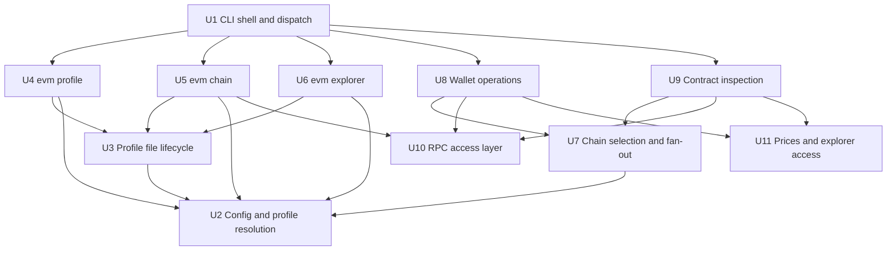

# Scope Report: evm-elf

Generated: 2026-08-01
Target: repository root (`/Users/camoseed/git/evm-elf`), commit `5b3ec31`
Baseline: the discovery pass was run at that commit and its saturation record is left as it
was; the units, their entry points and the tech stack describe the working tree, which has
since gained `src/lib/fs-errors.ts` and the test suite.
Purpose: establish the functional decomposition that
[the requirements specification](requirements-specification.md) traces against.

## Tech Stack

| Layer | What is used | Evidence |
| --- | --- | --- |
| Language | TypeScript 5.7, ES modules (`"type": "module"`), compiled with `tsc` to `dist/` | `package.json:23,38,44`, `tsconfig.json` |
| Runtime | Node.js >= 22 | `package.json:31-33` |
| Distribution | npm package `@camoseed/evm-elf`, single binary `evm` → `dist/index.js`, ships `dist` and `config` | `package.json:2,24-30` |
| CLI framework | commander 12 | `package.json:49`, `index.ts:12` |
| Chain access | ethers 6 (`JsonRpcProvider`, `Contract`, `Wallet`, `HDNodeWallet`, `Mnemonic`) | `package.json:51`, `src/lib/rpc.ts`, `src/lib/wallet.ts` |
| Configuration format | YAML, edited through the `yaml` document API to preserve comments | `package.json:52`, `src/lib/profile-file.ts:4-5` |
| Environment loading | dotenv | `package.json:50`, `src/lib/env.ts:93-100` |
| Terminal output | chalk | `package.json:48` |
| External services | JSON-RPC endpoints (per chain), CoinGecko `simple/price`, Etherscan v2, Blockscout, arbitrary Etherscan-compatible APIs | `src/lib/rpc.ts`, `src/lib/prices/coingecko.ts:8`, `src/lib/explorer/index.ts:40-43` |
| Automated tests | Vitest, 652 tests in 39 files across four projects; the 216 characterization tests in 14 files each spawn the built binary | `package.json:45-51`, `vitest.config.ts`, `test/` |
| CI | One workflow, publish-on-tag only | `.github/workflows/publish.yml` |

The absence of a test suite was the single most consequential fact for the specification, and it
is no longer true: `test/characterization/` was written after this pass and covers 94 of the
specification's 147 requirements. The method assignment did not move with it. Test is still
assigned to no requirement, now for a stated reason rather than for want of a suite — the
tests operate the built binary and observe its output, which is Demonstration as
[§1.4.4](requirements-specification.md#144-verification-methods) defines it, so the suite
automates a Demonstration rather than supplying a different method
([§4.1](requirements-specification.md#41-method-assignment)). Writing one was the top
recommendation of [the verification report](verification-report.md#recommendations), which
stands as the record of that commit.

## Functional Units

Eleven units. Entry points are the files a reader should open first.

| # | Unit | Description | Confidence | Entry points |
| --- | --- | --- | --- | --- |
| U1 | CLI shell and dispatch | Builds the root `evm` program, registers the five command groups, loads the environment once, and converts a rejected handler into exit `1` | High | `index.ts`, `src/cli/{wallet,contract,chain,explorer,profile}.ts` |
| U2 | Configuration and profile resolution | Locates the config directory, resolves which profile a command uses, parses and validates a profile, resolves `${VAR}` references, masks secrets for display | High | `src/lib/env.ts`, `src/lib/chains.ts`, `src/lib/mask.ts` |
| U3 | Profile file lifecycle | Creates, copies, deletes and atomically rewrites profile files and the `.default` pointer, preserving comments and key order, and reports a refusal in terms of the profile rather than the temporary file | High | `src/lib/profiles.ts`, `src/lib/profile-file.ts`, `src/lib/fs-errors.ts` |
| U4 | Profile management commands | `evm profile list \| create \| clone \| remove \| set-default` | High | `src/commands/profile/*.ts` |
| U5 | Chain configuration commands | `evm chain list \| set \| remove` — edits the `chains` section of one profile | High | `src/commands/chain/*.ts` |
| U6 | Explorer configuration commands | `evm explorer list \| set \| remove` — edits the `explorers` section of one profile | High | `src/commands/explorer/*.ts` |
| U7 | Chain selection and fan-out | Turns `-c` / `-xc` / neither into a chain list, then resolves each name to an endpoint without ever throwing | High | `src/lib/chains.ts:224-319` |
| U8 | Wallet operations | `evm wallet balance \| send \| set-nonce \| generate \| address`, plus private-key and address resolution | High | `src/commands/wallet/*.ts`, `src/lib/wallet.ts` |
| U9 | Contract inspection and upgrades | `evm contract owner \| proxy-info \| code \| transfer-ownership \| proxy-upgrade`, plus proxy detection primitives | High | `src/commands/contract/*.ts`, `src/lib/proxy.ts` |
| U10 | RPC access layer | Builds pinned, header-carrying JSON-RPC providers from a profile entry | High | `src/lib/rpc.ts` |
| U11 | Priced valuation and explorer access | Two pluggable outbound integrations: USD prices for `wallet balance`, explorer data for `contract proxy-info` | High | `src/lib/prices/*.ts`, `src/lib/explorer/*.ts` |

Every unit is High confidence. The reason is unusual and worth stating: this codebase
carries an approved
[verification report](verification-report.md) in which 148 of 152 documented behavioural
claims were confirmed against code, most of them at runtime. Unit boundaries were not
inferred from naming — they were read out of a corpus that has already been checked
against observed behaviour.

## Relationship Map



Shared resources, which is where the coupling actually bites:

- **`process.env`** is read by U2 (config directory, profile name, `${VAR}` references), U8
  (private keys by variable name) and U11 (`EVM_PRICE_SOURCE`, `COINGECKO_API_KEY`). It is
  populated once by U1 before parsing. That centralisation is recent: it is the fix for
  conflicts C1 and C8 of the verification report, which existed precisely because loading
  was per-command.
- **The profile file** is the single shared piece of state. U4 owns whole files, U5 owns the
  `chains` section, U6 owns the `explorers` section, and U2 is the only reader.
- **The bundled profile** (`config/default-profile.yaml`, 14 chains) is read on exactly three
  occasions — the first-run copy, `evm profile create`, and the metadata `evm chain set`
  fills in by chain ID — and is never merged into a live profile.

## Uncertain Areas

Four, all inherited from the verification report's open findings rather than discovered here.
They are carried into the specification's Open Questions section and are not restated as
requirements.

1. **`--exec` availability in the README overview** (A1). The shared-options block does not
   qualify `--exec` the way it qualifies `--private-key`, though only the four signing
   commands accept it.
2. **Explorer chain-coverage figures** (A2). "64 chains" and "120+ chains, key required since
   July 2026" are claims about the outside world with no counterpart in the code.
3. **Cross-chain codehash comparison preconditions** (A3). Documented unconditionally, skipped
   unless two chains in the run produced an implementation codehash.
4. **Chain-ID pinning guarantee** (A4). `docs/configuration.md:87` promises a wrong `chain_id`
   "fails loudly"; the guarantee currently belongs to ethers' `staticNetwork`, not to this
   codebase. The pin itself is now asserted — a fan-out read is observed asking a stub for
   nothing but the balance and the nonce — but nothing yet observes what a mismatch does.

One further area is uncertain in a different sense — not ambiguous, simply unreachable. At the
time of this pass that meant every behaviour needing a live public RPC endpoint, CoinGecko, or a
block explorer. A local stub has since taken most of it back: chain access, proxy detection, and
the Etherscan-dialect requests a chain's own `explorer_api` carries are all exercised offline.
What is still out of reach is CoinGecko's public endpoint, a block-explorer key, and a broadcast
transaction. The specification's `code-only` markings are wider than that, and
[§4.2](requirements-specification.md#42-verification-status) says which of them a stub now
reaches.

## Discovery Saturation

Sources worked in the priority order of `references/scope-discovery-sources.md`.

| Priority | Source | New units | Note |
| --- | --- | --- | --- |
| 1 | Entry points (CLI command definitions) | U1, U4, U5, U6, U8, U9 | `src/cli/*.ts` enumerate 5 groups and 21 subcommands exhaustively |
| 2 | Test files | — | None at `5b3ec31`; the later `test/characterization/` suite drives the CLI from outside and names no unit the other sources did not |
| 3 | User-facing components | — | Not applicable to a CLI; the table renderers belong to their commands |
| 4 | Module structure | U2, U3, U10, U11 | `src/lib/` separates the shared layers from the command handlers |
| 5 | Interface definitions | — | `src/types.ts` and `src/lib/explorer/types.ts` described existing units in more detail; no new capability |
| 6 | Dependency graph | — | Five runtime dependencies, each already attributed to a unit |
| 7 | Directory structure | U7 | Confirmed the command/lib split; `selectChains` in `src/lib/chains.ts` was promoted to its own unit because both command groups depend on it and nothing else does |
| 8 | Data flow | — | No middleware, queues, schedulers or background jobs |
| 9 | Documentation | — | Ten pages plus README described existing units in more detail; no new capability |
| 10 | Infrastructure | — | One publish workflow; no migrations, containers, or IaC |

**Saturation reached at priority 10.** Sources 8, 9 and 10 each yielded no new functional
unit, meeting the three-consecutive-sources rule. Source 7 was the last to add one.

## Key Files by Functional Unit

```
U1  CLI shell and dispatch
  index.ts                              # bootstrap, loadEnv, root program, global catch
  src/cli/wallet.ts                     # 5 subcommand definitions
  src/cli/contract.ts                   # 5 subcommand definitions
  src/cli/chain.ts                      # 3 subcommand definitions
  src/cli/explorer.ts                   # 3 subcommand definitions
  src/cli/profile.ts                    # 5 subcommand definitions

U2  Configuration and profile resolution
  src/lib/env.ts                        # config dir, .env loading, ${VAR}, default profile
  src/lib/chains.ts                     # profile path/parse/validate, selectChains, resolveChain
  src/lib/mask.ts                       # display masking for references and literals
  src/types.ts                          # profile and result shapes

U3  Profile file lifecycle
  src/lib/profiles.ts                   # create/clone/seed/remove, 0600, .default pointer
  src/lib/profile-file.ts               # YAML document edits, atomic write
  src/lib/fs-errors.ts                  # a refused write names the profile, not the temp file

U4  Profile management commands
  src/commands/profile/{list,create,clone,remove,set-default}.ts

U5  Chain configuration commands
  src/commands/chain/{list,set,remove}.ts

U6  Explorer configuration commands
  src/commands/explorer/{list,set,remove}.ts

U7  Chain selection and fan-out
  src/lib/chains.ts:224-319             # parseChainList, selectChains, resolveChain

U8  Wallet operations
  src/commands/wallet/{balance,send,set-nonce,generate,address}.ts
  src/lib/wallet.ts                     # key/address resolution, derivation

U9  Contract inspection and upgrades
  src/commands/contract/{owner,proxy-info,code,transfer-ownership,proxy-upgrade}.ts
  src/lib/proxy.ts                      # EIP-1967 slots, ABIs, clone patterns

U10 RPC access layer
  src/lib/rpc.ts                        # provider construction, URL|auth-key parsing

U11 Prices and explorer access
  src/lib/prices/{index,coingecko,types}.ts
  src/lib/explorer/{index,client,types}.ts

Shared configuration data
  config/default-profile.yaml           # 14 chains, one explorers entry
```

## Next

[Requirements specification](requirements-specification.md) — the ISO/IEC/IEEE 29148-style
requirements derived from these units and from the approved verification report.
